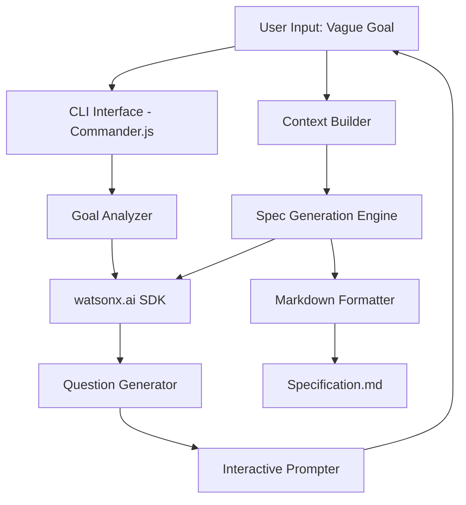
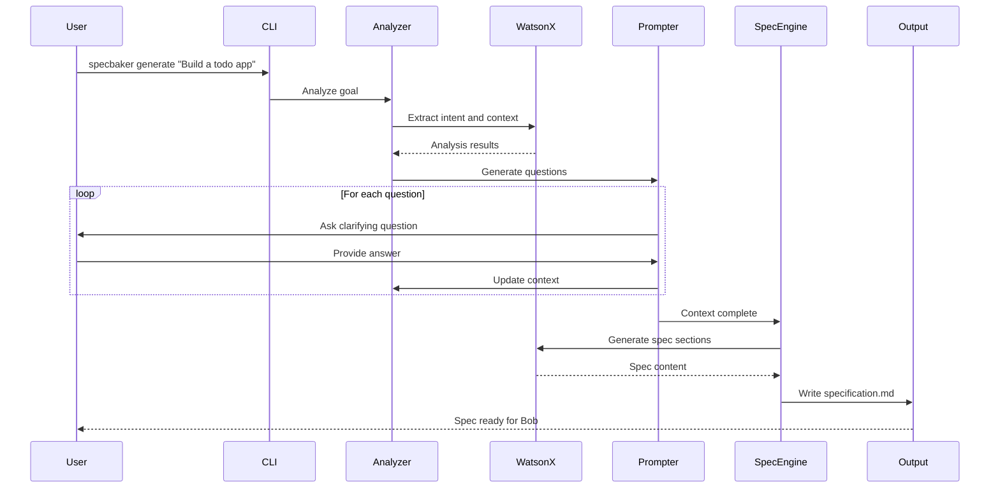

# SpecBaker Implementation Plan

## Project Overview

**SpecBaker** is a CLI tool that transforms vague software goals into structured, implementation-ready specifications using IBM watsonx.ai.

**Tech Stack:**
- **Runtime:** Node.js
- **CLI Framework:** Commander.js
- **AI Integration:** IBM watsonx.ai SDK
- **Output Format:** Markdown
- **Interaction Model:** Interactive CLI prompts

---

## Architecture

### High-Level System Architecture



### Core Modules

1. **CLI Interface** (`src/cli/index.js`)
   - Command parsing and routing
   - Entry point for all commands
   - Help and version information

2. **Configuration Manager** (`src/config/`)
   - API key management
   - User preferences
   - Environment variables

3. **Goal Analyzer** (`src/analyzer/goal-analyzer.js`)
   - Initial goal parsing
   - Context extraction
   - Ambiguity detection

4. **Question Generator** (`src/generator/question-generator.js`)
   - Dynamic question creation based on goal analysis
   - Question prioritization
   - Follow-up question logic

5. **Interactive Prompter** (`src/prompts/interactive-prompter.js`)
   - CLI prompt interface
   - User input validation
   - Answer collection and storage

6. **Context Builder** (`src/context/context-builder.js`)
   - Accumulates user responses
   - Tracks decisions
   - Maintains conversation state

7. **Spec Generation Engine** (`src/generator/spec-engine.js`)
   - Orchestrates spec creation
   - Calls watsonx.ai for content generation
   - Assembles all spec sections

8. **Markdown Formatter** (`src/formatter/markdown-formatter.js`)
   - Formats spec into markdown
   - Applies templates
   - Generates final output

9. **watsonx.ai Client** (`src/ai/watsonx-client.js`)
   - SDK wrapper
   - API authentication
   - Prompt engineering
   - Response parsing

---

## Workflow Diagram



---

## Project Structure

```
specbaker/
├── package.json
├── README.md
├── .env.example
├── .gitignore
├── bin/
│   └── specbaker.js              # CLI entry point
├── src/
│   ├── cli/
│   │   ├── index.js              # Main CLI setup
│   │   └── commands/
│   │       ├── generate.js       # Generate command
│   │       ├── config.js         # Config command
│   │       └── validate.js       # Validate command
│   ├── config/
│   │   ├── config-manager.js     # Configuration handling
│   │   └── defaults.js           # Default settings
│   ├── ai/
│   │   ├── watsonx-client.js     # watsonx.ai SDK wrapper
│   │   └── prompts/
│   │       ├── analysis.js       # Goal analysis prompts
│   │       ├── questions.js      # Question generation prompts
│   │       └── spec-generation.js # Spec generation prompts
│   ├── analyzer/
│   │   └── goal-analyzer.js      # Goal analysis logic
│   ├── generator/
│   │   ├── question-generator.js # Question generation
│   │   └── spec-engine.js        # Spec generation engine
│   ├── prompts/
│   │   └── interactive-prompter.js # CLI prompts
│   ├── context/
│   │   └── context-builder.js    # Context management
│   ├── formatter/
│   │   ├── markdown-formatter.js # Markdown output
│   │   └── templates/
│   │       └── spec-template.md  # Spec template
│   └── utils/
│       ├── logger.js             # Logging utility
│       └── validators.js         # Input validation
├── tests/
│   ├── unit/
│   └── integration/
└── examples/
    ├── sample-goal.txt
    └── sample-output.md
```

---

## Specification Output Structure

The generated markdown specification will include:

```markdown
# [Project Name] - Implementation Specification

## 1. Product Summary
- Goal statement
- Problem being solved
- Success criteria

## 2. User Roles
- Primary users
- Secondary users
- User personas

## 3. Access & Deployment
- How users access the product
- Deployment model
- Technical requirements

## 4. Core Requirements
- Functional requirements
- Non-functional requirements
- Constraints

## 5. Important Decisions
- Key architectural decisions
- Technology choices
- Trade-offs made

## 6. User Journey / Workflow
- Step-by-step user flows
- Key interactions
- Edge cases

## 7. Data Model
- Entities and relationships
- Key attributes
- Data constraints

## 8. UI Screen Outline
- Screen list
- Key components per screen
- Navigation flow

## 9. Test Scenarios
- Critical test cases
- Edge cases
- Acceptance criteria

## 10. Implementation Plan
- Development phases
- Priority order
- Dependencies

## 11. Bob-Ready Prompt
A complete, copy-paste ready prompt for IBM Bob to start implementation
```

---

## CLI Commands

### Main Command
```bash
specbaker generate [goal]
```

**Options:**
- `-o, --output <path>` - Output file path (default: `specification.md`)
- `-c, --config <path>` - Config file path
- `-v, --verbose` - Verbose output
- `--no-interactive` - Skip interactive prompts (use defaults)

### Configuration Command
```bash
specbaker config set <key> <value>
specbaker config get <key>
specbaker config list
```

### Validation Command
```bash
specbaker validate <spec-file>
```

---

## watsonx.ai Integration Strategy

### Authentication
- API key stored in environment variable or config file
- Project ID configuration
- Region selection

### Model Selection
- Primary: `ibm/granite-13b-chat-v2` or latest Granite model
- Fallback options for different use cases

### Prompt Engineering Strategy

**1. Goal Analysis Prompt:**
```
Analyze this software goal and identify:
- Core objective
- Target users
- Problem being solved
- Ambiguities that need clarification
- Missing information

Goal: {user_goal}
```

**2. Question Generation Prompt:**
```
Based on this goal analysis, generate 3-5 clarifying questions
that will help create a complete specification.

Analysis: {analysis_result}
Already answered: {answered_questions}

Generate questions about:
- User roles and personas
- Access methods
- Success criteria
- Technical constraints
- Priority features
```

**3. Spec Generation Prompt:**
```
Generate a detailed {section_name} section for this specification.

Context:
- Goal: {goal}
- User responses: {all_answers}
- Decisions made: {decisions}

Format as markdown. Be specific and actionable.
```

---

## Implementation Phases

### Phase 1: Foundation (Days 1-2)
- [x] Project setup and dependencies
- [x] CLI framework configuration
- [x] watsonx.ai SDK integration
- [x] Configuration management

### Phase 2: Core Logic (Days 3-4)
- [ ] Goal analyzer implementation
- [ ] Question generator
- [ ] Interactive prompter
- [ ] Context builder

### Phase 3: Spec Generation (Days 5-6)
- [ ] Spec engine implementation
- [ ] Markdown formatter
- [ ] Template system
- [ ] All spec sections

### Phase 4: Polish & Testing (Days 7-8)
- [ ] Error handling
- [ ] Input validation
- [ ] Unit tests
- [ ] Integration tests
- [ ] Documentation

### Phase 5: Demo Preparation (Day 9)
- [ ] Example scenarios
- [ ] Demo script
- [ ] Video/presentation materials

---

## Key Dependencies

```json
{
  "dependencies": {
    "commander": "^11.0.0",
    "inquirer": "^9.0.0",
    "@ibm-cloud/watsonx-ai": "latest",
    "dotenv": "^16.0.0",
    "chalk": "^5.0.0",
    "ora": "^7.0.0"
  },
  "devDependencies": {
    "jest": "^29.0.0",
    "eslint": "^8.0.0",
    "prettier": "^3.0.0"
  }
}
```

---

## Environment Variables

```bash
# .env.example
WATSONX_API_KEY=your_api_key_here
WATSONX_PROJECT_ID=your_project_id
WATSONX_REGION=us-south
WATSONX_MODEL=ibm/granite-13b-chat-v2
```

---

## Testing Strategy

### Unit Tests
- Goal analyzer logic
- Question generation
- Context building
- Markdown formatting

### Integration Tests
- End-to-end spec generation
- watsonx.ai API integration
- File output validation

### Manual Testing Scenarios
1. Simple web app goal
2. Complex enterprise system
3. Mobile app specification
4. API service specification

---

## Success Criteria

1. **Functional:**
   - Successfully generates complete specs from vague goals
   - Interactive prompts work smoothly
   - Output is Bob-ready

2. **Quality:**
   - Specs are clear and actionable
   - No ambiguity in requirements
   - Proper markdown formatting

3. **User Experience:**
   - Easy to install and configure
   - Intuitive CLI interface
   - Helpful error messages

4. **Hackathon Demo:**
   - Compelling demo scenario
   - Shows IBM Bob integration
   - Highlights watsonx.ai value

---

## Risk Mitigation

| Risk | Mitigation |
|------|------------|
| watsonx.ai API rate limits | Implement caching, batch requests |
| Poor question quality | Curate prompt templates, add examples |
| User abandons interactive flow | Save progress, allow resume |
| Generated spec too generic | Add domain-specific templates |
| Integration complexity | Start with mock responses, add real API later |

---

## Next Steps

1. Review and approve this plan
2. Set up development environment
3. Begin Phase 1 implementation
4. Iterate based on testing feedback
