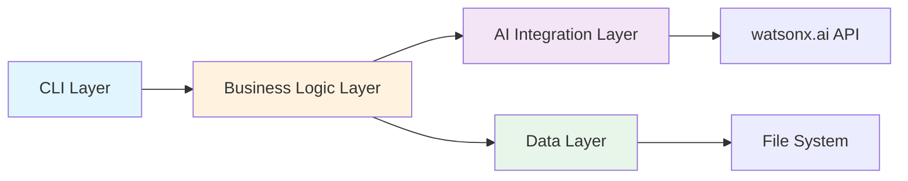
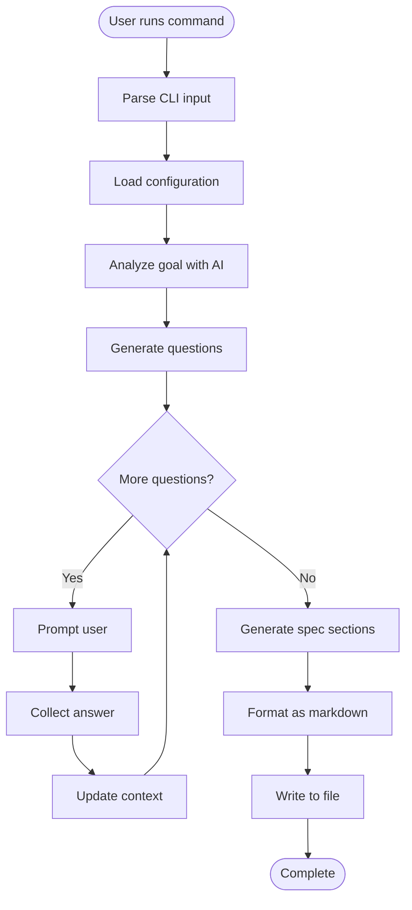
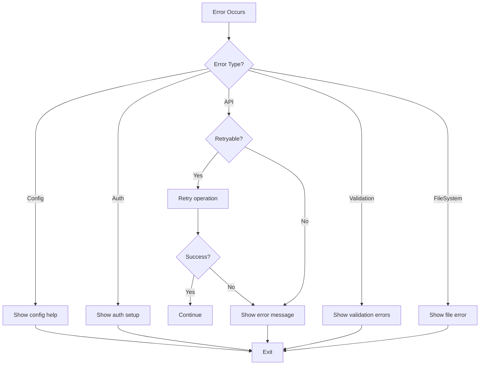

# SpecBaker Technical Specification

## 1. System Architecture

### 1.1 Component Overview

SpecBaker follows a modular architecture with clear separation of concerns:



### 1.2 Data Flow



---

## 2. Module Specifications

### 2.1 CLI Interface Module

**File:** `src/cli/index.js`

**Responsibilities:**
- Parse command-line arguments
- Route to appropriate command handlers
- Display help and version information
- Handle global options

**Key Functions:**
```javascript
// Initialize CLI with Commander.js
function initializeCLI()

// Register all commands
function registerCommands(program)

// Handle errors gracefully
function handleError(error)
```

**Commands:**
- `generate [goal]` - Main spec generation command
- `config <action> [key] [value]` - Configuration management
- `validate <file>` - Validate existing spec
- `version` - Show version
- `help` - Show help

---

### 2.2 Configuration Manager

**File:** `src/config/config-manager.js`

**Responsibilities:**
- Load configuration from multiple sources
- Manage API credentials securely
- Provide default values
- Validate configuration

**Configuration Sources (Priority Order):**
1. Command-line flags
2. Environment variables
3. Config file (`~/.specbaker/config.json`)
4. Default values

**Configuration Schema:**
```javascript
{
  watsonx: {
    apiKey: string,
    projectId: string,
    region: string,
    model: string,
    maxTokens: number,
    temperature: number
  },
  output: {
    defaultPath: string,
    format: 'markdown',
    includeTimestamp: boolean
  },
  prompts: {
    maxQuestions: number,
    questionDepth: 'basic' | 'detailed' | 'comprehensive'
  }
}
```

**Key Functions:**
```javascript
class ConfigManager {
  load()                    // Load config from all sources
  get(key)                  // Get config value
  set(key, value)           // Set config value
  validate()                // Validate configuration
  save()                    // Save to config file
}
```

---

### 2.3 watsonx.ai Client

**File:** `src/ai/watsonx-client.js`

**Responsibilities:**
- Authenticate with watsonx.ai
- Send prompts and receive responses
- Handle API errors and retries
- Manage token usage

**Key Functions:**
```javascript
class WatsonXClient {
  constructor(config)
  
  // Authenticate and initialize
  async initialize()
  
  // Send a prompt and get response
  async generateText(prompt, options)
  
  // Analyze goal
  async analyzeGoal(goalText)
  
  // Generate questions
  async generateQuestions(context)
  
  // Generate spec section
  async generateSection(sectionName, context)
  
  // Handle errors and retries
  async withRetry(fn, maxRetries)
}
```

**Prompt Templates:**
Located in `src/ai/prompts/`

1. **analysis.js** - Goal analysis prompts
2. **questions.js** - Question generation prompts
3. **spec-generation.js** - Spec section prompts

**Error Handling:**
- Network errors → Retry with exponential backoff
- Authentication errors → Clear error message with setup instructions
- Rate limiting → Wait and retry
- Invalid responses → Fallback to default templates

---

### 2.4 Goal Analyzer

**File:** `src/analyzer/goal-analyzer.js`

**Responsibilities:**
- Parse initial goal statement
- Extract key information
- Identify ambiguities
- Determine question priorities

**Analysis Output:**
```javascript
{
  goal: string,              // Original goal
  intent: string,            // What user wants to achieve
  domain: string,            // Software domain (web, mobile, api, etc.)
  complexity: string,        // simple | moderate | complex
  extractedInfo: {
    users: string[],         // Mentioned user types
    features: string[],      // Mentioned features
    constraints: string[]    // Mentioned constraints
  },
  ambiguities: string[],     // Things that need clarification
  suggestedQuestions: string[]
}
```

**Key Functions:**
```javascript
class GoalAnalyzer {
  constructor(watsonxClient)
  
  // Main analysis function
  async analyze(goalText)
  
  // Extract structured information
  extractInformation(goalText)
  
  // Identify what's missing
  identifyGaps(extractedInfo)
  
  // Prioritize questions
  prioritizeQuestions(gaps)
}
```

---

### 2.5 Question Generator

**File:** `src/generator/question-generator.js`

**Responsibilities:**
- Generate relevant questions based on analysis
- Adapt questions based on previous answers
- Determine when enough information is gathered

**Question Categories:**
1. **User & Audience** - Who will use this?
2. **Access & Deployment** - How will users access it?
3. **Core Functionality** - What should it do?
4. **Success Criteria** - How do we measure success?
5. **Constraints** - What are the limitations?
6. **Priority** - What's most important?

**Key Functions:**
```javascript
class QuestionGenerator {
  constructor(watsonxClient)
  
  // Generate initial questions
  async generateInitialQuestions(analysis)
  
  // Generate follow-up questions
  async generateFollowUpQuestions(context, previousAnswers)
  
  // Check if we have enough information
  isContextComplete(context)
  
  // Get next question to ask
  getNextQuestion(questions, answeredQuestions)
}
```

**Question Format:**
```javascript
{
  id: string,
  category: string,
  text: string,
  priority: number,
  dependsOn: string[],      // IDs of questions that must be answered first
  suggestedAnswers: string[] // Optional suggestions
}
```

---

### 2.6 Interactive Prompter

**File:** `src/prompts/interactive-prompter.js`

**Responsibilities:**
- Display questions to user
- Collect and validate answers
- Provide helpful context
- Allow skipping or going back

**Uses:** `inquirer` library for rich CLI prompts

**Key Functions:**
```javascript
class InteractivePrompter {
  // Ask a single question
  async askQuestion(question)
  
  // Ask multiple questions in sequence
  async askQuestions(questions)
  
  // Confirm with user
  async confirm(message)
  
  // Show progress
  showProgress(current, total)
  
  // Display summary of answers
  displaySummary(answers)
}
```

**Prompt Types:**
- Text input (for open-ended questions)
- Multiple choice (for predefined options)
- Confirm (yes/no questions)
- List (select from options)

---

### 2.7 Context Builder

**File:** `src/context/context-builder.js`

**Responsibilities:**
- Accumulate information from user responses
- Track decisions made
- Maintain conversation history
- Provide context for spec generation

**Context Structure:**
```javascript
{
  goal: string,
  analysis: object,
  questions: Question[],
  answers: Map<questionId, answer>,
  decisions: Decision[],
  metadata: {
    startTime: Date,
    lastUpdated: Date,
    version: string
  }
}
```

**Key Functions:**
```javascript
class ContextBuilder {
  constructor()
  
  // Initialize with goal analysis
  initialize(goal, analysis)
  
  // Add a question-answer pair
  addAnswer(questionId, answer)
  
  // Record a decision
  addDecision(decision)
  
  // Get full context for spec generation
  getContext()
  
  // Save context to file (for resume)
  save(filepath)
  
  // Load context from file
  static load(filepath)
}
```

---

### 2.8 Spec Generation Engine

**File:** `src/generator/spec-engine.js`

**Responsibilities:**
- Orchestrate spec generation process
- Generate each section using AI
- Ensure consistency across sections
- Handle section dependencies

**Spec Sections (in order):**
1. Product Summary
2. User Roles
3. Access & Deployment
4. Core Requirements
5. Important Decisions
6. User Journey / Workflow
7. Data Model
8. UI Screen Outline
9. Test Scenarios
10. Implementation Plan
11. Bob-Ready Prompt

**Key Functions:**
```javascript
class SpecEngine {
  constructor(watsonxClient, context)
  
  // Generate complete specification
  async generateSpec()
  
  // Generate a single section
  async generateSection(sectionName)
  
  // Validate section content
  validateSection(sectionName, content)
  
  // Get section dependencies
  getSectionDependencies(sectionName)
}
```

**Section Generation Strategy:**
- Each section uses context + previous sections
- Sections are generated sequentially
- Each section is validated before proceeding
- Failed sections can be regenerated

---

### 2.9 Markdown Formatter

**File:** `src/formatter/markdown-formatter.js`

**Responsibilities:**
- Format spec content as markdown
- Apply consistent styling
- Add table of contents
- Include metadata

**Key Functions:**
```javascript
class MarkdownFormatter {
  // Format complete spec
  format(spec)
  
  // Format individual section
  formatSection(sectionName, content)
  
  // Generate table of contents
  generateTOC(spec)
  
  // Add metadata header
  addMetadata(spec, context)
  
  // Validate markdown syntax
  validate(markdown)
}
```

**Markdown Features:**
- Proper heading hierarchy
- Code blocks with syntax highlighting
- Tables for structured data
- Lists for requirements
- Blockquotes for important notes
- Horizontal rules for section separation

---

## 3. Error Handling Strategy

### 3.1 Error Types

```javascript
class SpecBakerError extends Error {
  constructor(message, code, details) {
    super(message)
    this.code = code
    this.details = details
  }
}

// Specific error types
class ConfigurationError extends SpecBakerError {}
class AuthenticationError extends SpecBakerError {}
class APIError extends SpecBakerError {}
class ValidationError extends SpecBakerError {}
class FileSystemError extends SpecBakerError {}
```

### 3.2 Error Handling Flow



### 3.3 User-Friendly Error Messages

```javascript
const ERROR_MESSAGES = {
  'AUTH_FAILED': {
    message: 'Authentication failed',
    help: 'Please check your API key in ~/.specbaker/config.json or set WATSONX_API_KEY environment variable',
    docs: 'https://docs.specbaker.dev/setup'
  },
  'RATE_LIMIT': {
    message: 'API rate limit exceeded',
    help: 'Waiting 60 seconds before retrying...',
    docs: 'https://docs.specbaker.dev/rate-limits'
  },
  // ... more error messages
}
```

---

## 4. Testing Strategy

### 4.1 Unit Tests

**Test Coverage Goals:** >80%

**Key Test Files:**
```
tests/unit/
├── config-manager.test.js
├── goal-analyzer.test.js
├── question-generator.test.js
├── context-builder.test.js
├── spec-engine.test.js
└── markdown-formatter.test.js
```

**Testing Approach:**
- Mock watsonx.ai API responses
- Test each module in isolation
- Test error conditions
- Test edge cases

### 4.2 Integration Tests

**Test Scenarios:**
```
tests/integration/
├── end-to-end.test.js          # Full workflow
├── watsonx-integration.test.js # Real API calls (optional)
└── file-operations.test.js     # File I/O
```

### 4.3 Manual Testing Checklist

- [ ] Simple web app goal
- [ ] Complex enterprise system
- [ ] Mobile app specification
- [ ] API service specification
- [ ] Invalid input handling
- [ ] Network failure scenarios
- [ ] Resume interrupted session

---

## 5. Performance Considerations

### 5.1 Optimization Strategies

1. **Caching:**
   - Cache API responses for identical prompts
   - Cache analysis results
   - TTL: 1 hour

2. **Batching:**
   - Batch multiple section generations when possible
   - Reduce API calls

3. **Streaming:**
   - Stream long responses to show progress
   - Don't wait for complete response

4. **Parallel Processing:**
   - Generate independent sections in parallel
   - Use Promise.all() for concurrent operations

### 5.2 Resource Limits

```javascript
const LIMITS = {
  MAX_GOAL_LENGTH: 5000,        // characters
  MAX_ANSWER_LENGTH: 2000,      // characters
  MAX_QUESTIONS: 20,            // per session
  MAX_RETRIES: 3,               // API retries
  TIMEOUT: 30000,               // 30 seconds per API call
  MAX_SPEC_SIZE: 100000         // 100KB output file
}
```

---

## 6. Security Considerations

### 6.1 API Key Management

- Never log API keys
- Store in secure config file with restricted permissions
- Support environment variables
- Clear error messages without exposing keys

### 6.2 Input Validation

- Sanitize all user inputs
- Validate file paths (prevent directory traversal)
- Limit input lengths
- Escape special characters in markdown

### 6.3 Output Safety

- Validate generated content
- Sanitize markdown output
- Check file permissions before writing
- Prevent overwriting without confirmation

---

## 7. Logging and Debugging

### 7.1 Log Levels

```javascript
const LOG_LEVELS = {
  ERROR: 0,   // Errors only
  WARN: 1,    // Warnings and errors
  INFO: 2,    // General information
  DEBUG: 3,   // Detailed debugging
  TRACE: 4    // Very detailed (API calls, etc.)
}
```

### 7.2 Log Output

**Normal Mode:**
- Minimal output
- Progress indicators
- Success/error messages

**Verbose Mode (`--verbose`):**
- Detailed operation logs
- API call information
- Timing information

**Debug Mode (`--debug`):**
- Full request/response logs
- Internal state dumps
- Stack traces

---

## 8. Extensibility

### 8.1 Plugin System (Future)

Allow custom:
- Question generators
- Spec templates
- Output formatters
- AI providers

### 8.2 Template System

Support custom spec templates:
```
~/.specbaker/templates/
├── default.md
├── web-app.md
├── mobile-app.md
└── api-service.md
```

### 8.3 Hooks (Future)

```javascript
// Pre/post hooks for customization
hooks: {
  beforeAnalysis: async (goal) => {},
  afterAnalysis: async (analysis) => {},
  beforeGeneration: async (context) => {},
  afterGeneration: async (spec) => {}
}
```

---

## 9. Deployment & Distribution

### 9.1 NPM Package

```json
{
  "name": "specbaker",
  "version": "1.0.0",
  "bin": {
    "specbaker": "./bin/specbaker.js"
  },
  "files": [
    "bin/",
    "src/",
    "README.md",
    "LICENSE"
  ]
}
```

### 9.2 Installation

```bash
# Global installation
npm install -g specbaker

# Local installation
npm install specbaker

# From source
git clone https://github.com/yourusername/specbaker.git
cd specbaker
npm install
npm link
```

### 9.3 First-Time Setup

```bash
# Interactive setup
specbaker config setup

# Manual setup
specbaker config set watsonx.apiKey YOUR_API_KEY
specbaker config set watsonx.projectId YOUR_PROJECT_ID
```

---

## 10. Documentation Requirements

### 10.1 User Documentation

- **README.md** - Quick start guide
- **SETUP.md** - Detailed setup instructions
- **USAGE.md** - Command reference
- **EXAMPLES.md** - Example scenarios
- **FAQ.md** - Common questions

### 10.2 Developer Documentation

- **CONTRIBUTING.md** - Contribution guidelines
- **ARCHITECTURE.md** - System architecture
- **API.md** - Internal API reference
- **TESTING.md** - Testing guide

### 10.3 Code Documentation

- JSDoc comments for all public functions
- Inline comments for complex logic
- README in each major directory

---

## 11. Success Metrics

### 11.1 Functional Metrics

- Spec generation success rate: >95%
- Average generation time: <2 minutes
- User satisfaction with questions: >4/5
- Spec completeness score: >90%

### 11.2 Quality Metrics

- Code coverage: >80%
- Zero critical bugs
- Clear error messages
- Comprehensive documentation

### 11.3 Hackathon Metrics

- Demo completion: 100%
- Audience engagement: High
- IBM Bob integration: Seamless
- watsonx.ai showcase: Clear

---

## 12. Timeline & Milestones

### Week 1: Foundation
- **Day 1-2:** Project setup, CLI framework, config management
- **Day 3-4:** watsonx.ai integration, basic prompts
- **Day 5:** Goal analyzer, question generator

### Week 2: Core Features
- **Day 6-7:** Interactive prompter, context builder
- **Day 8-9:** Spec engine, markdown formatter
- **Day 10:** Integration and testing

### Week 3: Polish & Demo
- **Day 11-12:** Error handling, validation, edge cases
- **Day 13-14:** Documentation, examples
- **Day 15:** Demo preparation, final testing

---

## 13. Open Questions & Decisions Needed

1. **Model Selection:** Which watsonx.ai model performs best for this use case?
2. **Question Depth:** How many questions is optimal? (Currently: 5-10)
3. **Caching Strategy:** Should we cache API responses? For how long?
4. **Resume Feature:** Should we support resuming interrupted sessions?
5. **Multi-language:** Should specs be generated in multiple languages?

---

## Appendix A: Example API Calls

### Goal Analysis
```javascript
const response = await watsonxClient.generateText({
  prompt: `Analyze this software goal: "${goal}"
  
  Provide:
  1. Core objective
  2. Target users
  3. Key features mentioned
  4. Ambiguities to clarify
  
  Format as JSON.`,
  maxTokens: 500,
  temperature: 0.3
})
```

### Question Generation
```javascript
const response = await watsonxClient.generateText({
  prompt: `Based on this context, generate 5 clarifying questions:
  
  Goal: ${context.goal}
  Analysis: ${context.analysis}
  
  Questions should cover:
  - User roles
  - Access methods
  - Success criteria
  - Technical constraints
  
  Format as JSON array.`,
  maxTokens: 800,
  temperature: 0.5
})
```

### Spec Section Generation
```javascript
const response = await watsonxClient.generateText({
  prompt: `Generate the "Core Requirements" section:
  
  Context:
  ${JSON.stringify(context, null, 2)}
  
  Format as markdown with:
  - Functional requirements
  - Non-functional requirements
  - Constraints
  
  Be specific and actionable.`,
  maxTokens: 1500,
  temperature: 0.4
})
```
