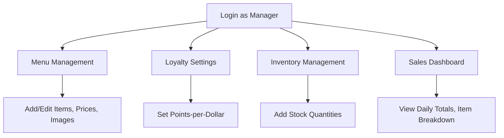
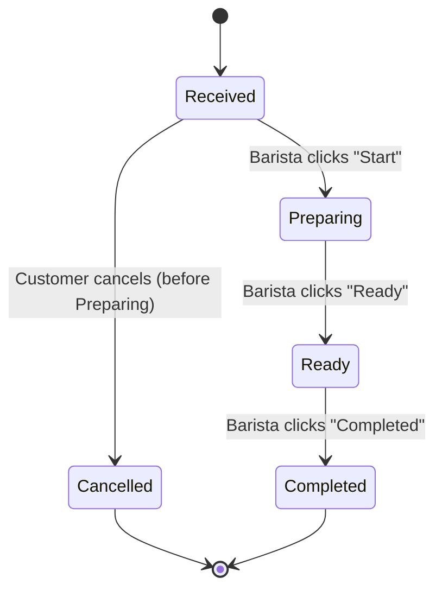
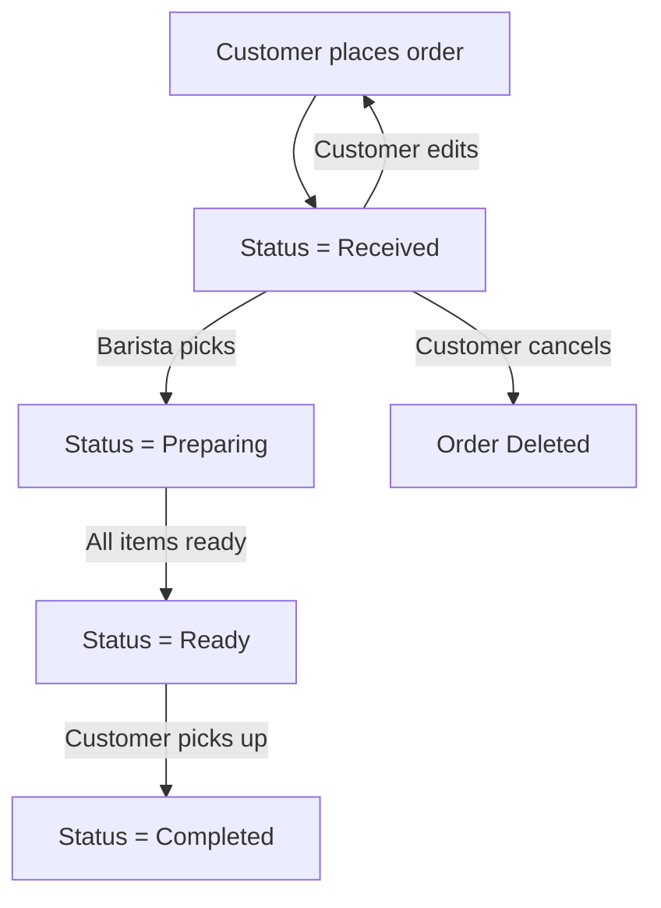

# Software Specification

> Generated by SpecBaker 🎂
> Powered by IBM watsonx.ai

**Generated:** 2026-05-16

**Original Goal:**

> Coffee shop application

**Project Complexity:** Moderate
**Domain:** General

---


## Table of Contents

1. [userRoles](#userroles)
2. [accessDeployment](#accessdeployment)
3. [productSummary](#productsummary)
4. [importantDecisions](#importantdecisions)
5. [coreRequirements](#corerequirements)
6. [userJourney](#userjourney)
7. [dataModel](#datamodel)
8. [uiScreens](#uiscreens)
9. [testScenarios](#testscenarios)
10. [implementationPlan](#implementationplan)
11. [bobReadyPrompt](#bobreadyprompt)

# Coffee‑Shop Application – **User Roles & Permissions Specification**

> **Purpose** – Define every actor that will interact with the MVP (web + mobile) and the exact rights, responsibilities, and limits for each role. This serves as the reference for UI design, API‑access control, and test‑case creation.

---

## 1. Role Overview

| Category | Role | Primary Goal | Typical Devices |
|----------|------|--------------|-----------------|
| **Primary** | **Customer** | Browse menu, place & pay for orders, view order status, see loyalty balance & order history. | Mobile app (iOS/Android) & Web browser (responsive). |
| **Primary** | **Barista** | Receive orders, update order status, deduct inventory, mark orders ready/completed. | Tablet/desktop POS view (web). |
| **Primary** | **Store Manager** | Configure menu & pricing, set loyalty rules, manage staff, add inventory stock, view sales analytics. | Desktop web admin console. |
| **Secondary** | **System Administrator** (optional for deployment) | Manage user accounts, security policies, data backups, monitor system health. | Desktop web console. |
| **Secondary** | **Support Agent** (future) | Answer customer inquiries, handle refunds, view audit logs. | Desktop web console (future phase). |

> **Note:** Shift‑scheduling, advanced analytics, and external POS integration are **deferred** to later releases and therefore not part of any role’s current responsibilities.

---

## 2. Personas (practical, human‑readable)

| Persona | Role | Description | Key Behaviours |
|---------|------|-------------|----------------|
| **Emma – “Morning Regular”** | Customer | 28‑year‑old graphic designer who orders a latte & croissant on her commute. Uses the mobile app daily, checks loyalty points, and occasionally modifies an order before preparation. | • Opens app → browses menu → adds items → pays with saved card (Stripe) • Cancels order if she’s running late (before “Preparing”). |
| **Luis – “Barista‑Joe”** | Barista | 22‑year‑old part‑time barista. Uses a tablet at the counter to see incoming orders, updates status, and records ingredient usage. | • Accepts order → changes status to *Preparing* → deducts inventory automatically • Marks *Ready* when the drink is done. |
| **Maya – “Store Manager Maya”** | Store Manager | 35‑year‑old owner‑operator. Controls menu items, sets prices, defines “Earn 1 point per $1” loyalty rule, adds stock after deliveries, and reviews daily sales. | • Logs into admin console → adds seasonal drink → updates price → uploads new inventory count. |
| **Tom – “SysAdmin Tom”** (future) | System Administrator | 40‑year‑old IT specialist. Manages user provisioning, SSL certificates, and monitors uptime. | • Creates new barista accounts → revokes access when staff leaves. |

---

## 3. Permissions Matrix

| Permission / Action | Customer | Barista | Store Manager | System Administrator |
|---------------------|----------|---------|---------------|-----------------------|
| **View Menu** | ✅ | ✅ | ✅ | ✅ |
| **Create Order** | ✅ | — | — | — |
| **Cancel / Modify Order** (while status = *Received*) | ✅ (own orders) | — | — | — |
| **View Own Order History** | ✅ | — | — | — |
| **View Loyalty Balance** | ✅ | — | — | — |
| **Earn Loyalty Points** (auto) | ✅ (system) | — | — | — |
| **Redeem Loyalty Points** (future) | ❓ (not in MVP) | — | — | — |
| **View Real‑time Order Status** | ✅ (own orders) | ✅ (all orders) | ✅ (all orders) | ✅ (all orders) |
| **Update Order Status** (Received → Preparing → Ready → Completed) | — | ✅ (all steps) | — | — |
| **Deduct Inventory (auto on order)** | — | ✅ (system‑triggered) | — | — |
| **Add / Update Inventory Stock** | — | — | ✅ (store manager) | — |
| **Create / Edit Menu Items** | — | — | ✅ (store manager) | — |
| **Set Loyalty Program Rules** | — | — | ✅ (store manager) | — |
| **View Sales Analytics Dashboard** | — | — | ✅ (store manager) | — |
| **Manage Staff Accounts (create, enable/disable)** | — | — | ✅ (store manager) | ✅ (override) |
| **System Configuration (DB backup, SSL, logs)** | — | — | — | ✅ |
| **Access Audit Log** | — | — | ✅ (view) | ✅ (full) |

> **✅** = allowed, **—** = not applicable, **❓** = open question (future feature).

---

## 4. Role‑Based Limitations

| Role | What they **cannot** do (MVP) |
|------|-------------------------------|
| **Customer** | Access any staff‑only screens, edit menu, view other customers’ orders, change inventory, see analytics. |
| **Barista** | Change menu or loyalty rules, add stock, view sales analytics beyond order list, manage staff accounts. |
| **Store Manager** | Directly process payments (handled by Stripe UI), modify order status (only barista), delete orders. |
| **System Administrator** | Perform any business‑logic actions (e.g., create orders) – only technical/system tasks. |

---

## 5. Assumptions

| # | Assumption |
|---|------------|
| A1 | Loyalty points are earned automatically at a flat **1 point per $1** spent; balance is displayed in the customer UI. |
| A2 | Payment processing uses **Stripe** for card payments and a simple **cash‑receipt** flow for in‑store cash (no external cash gateway). |
| A3 | Inventory items are simple ingredient counts (e.g., “Espresso shots”, “Milk ml”). No complex BOM required for MVP. |
| A4 | All staff (Barista, Store Manager) authenticate via email + password; MFA is **not** required for MVP. |
| A5 | The system runs on a single‑tenant cloud instance; multi‑tenant tenancy is out of scope. |
| A6 | “Order cancellation/modification” is only permitted while the order status is **Received**. Once a barista clicks **Preparing**, the order becomes immutable. |
| A7 | The “System Administrator” role exists for deployment/ops but is not exposed to end‑users; only internal staff will have it. |

---

## 6. Open Questions

| # | Question |
|---|----------|
| Q1 | Should customers be able to **redeem** loyalty points for discounts in the MVP, or is the balance view sufficient? |
| Q2 | Will there be a **guest checkout** (order without creating a customer account) and, if so, how are loyalty points handled? |
| Q3 | Are there any **regional tax** rules that affect the payment flow (e.g., sales tax calculation) that need to be baked into the order process now? |
| Q4 | What is the expected **session timeout** for staff devices (e.g., auto‑logout after inactivity)? |
| Q5 | Should baristas have the ability to **re‑open** a “Completed” order for refunds or corrections? |

---

## 7. Remarks & Considerations

| # | Topic |
|---|-------|
| R1 | **Security** – All API endpoints must enforce role‑based access control (RBAC). Use JWT tokens with role claims. |
| R2 | **Audit Trail** – Every status change, inventory deduction, and menu edit must be logged with user ID, timestamp, and previous value for compliance. |
| R3 | **Scalability** – The role‑check logic should be stateless (e.g., middleware) to allow horizontal scaling of web servers. |
| R4 | **UX** – The UI should hide unavailable actions based on role (e.g., “Add Stock” button invisible to Barista). |
| R5 | **Testing** – Create automated integration tests for each role covering allowed and disallowed actions. |
| R6 | **Future‑proofing** – Design the permission model as an extensible enum (e.g., `Permission.ORDER_CANCEL`) so new roles (e.g., “Shift Supervisor”) can be added without code changes. |

---

## 8. Visual Summary

```mermaid
graph TD
    Customer -->|places| Order
    Order -->|status updates by| Barista
    Barista -->|deducts| Inventory
    StoreManager -->|adds/edits| Menu
    StoreManager -->|adds| Inventory
    StoreManager -->|sets| LoyaltyRules
    StoreManager -->|views| Analytics
    SysAdmin -->|manages| Users
    SysAdmin -->|maintains| System
    classDef primary fill:#e3f2fd,stroke:#2196f3,stroke-width:2px;
    classDef secondary fill:#f3e5f5,stroke:#9c27b0,stroke-width:2px;
    Customer,Barista,StoreManager class primary;
    SysAdmin class secondary;
```

*The diagram shows the flow of responsibilities and which role interacts with which core entity.*

---

### TL;DR – What the Development Team Must Implement

1. **RBAC middleware** that maps JWT role claims to the permission matrix above.
2. **UI components** that render/disable actions based on the logged‑in role.
3. **Backend services** for:
   - Order creation, cancellation (only while `Received`).
   - Order status transitions (Barista‑only).
   - Automatic inventory deduction on order creation.
   - Inventory addition (Store Manager).
   - Menu CRUD (Store Manager).
   - Loyalty point accrual & balance view (Customer).
   - Loyalty rule configuration (Store Manager).
4. **Audit logging** for every privileged operation.
5. **Test suites** covering positive/negative permission scenarios for each role.

With this specification, the engineering team can build the MVP’s role‑based access layer, UI gating, and related business logic confidently. 🚀

# Access & Deployment Specification
*Coffee‑Shop Application – MVP (Menu, Order, Payment, Loyalty)*

---

## 1. Access Methods
| Actor | Access Channel | Description |
|-------|----------------|-------------|
| **Customer** | **Web** – responsive SPA (browser) <br> **Mobile** – native iOS & Android app | Browse menu, place/cancel orders, view real‑time status, pay, view loyalty balance & order history. |
| **Barista** | **Web** – staff portal (tablet/desktop) | Receive new orders, update status, deduct inventory, view order details. |
| **Store Manager** | **Web** – staff portal (desktop) | All barista capabilities **plus** inventory restock, menu & loyalty configuration, sales reports. |
| **API Consumers** (future integrations) | **REST/GraphQL API** (protected) | Not required for MVP but provisioned for later phases. |

*All client apps communicate with a single back‑end service via HTTPS.*

---

## 2. Deployment Model
| Layer | Recommended Option | Rationale |
|-------|--------------------|-----------|
| **Production** | **Public cloud (e.g., AWS, Azure, GCP)** – managed Kubernetes (EKS/AKS/GKE) or managed container service (Fargate, Cloud Run). | Auto‑scaling, high‑availability, PCI‑DSS‑compatible networking, easy CI/CD. |
| **Staging / QA** | Same cloud provider, separate VPC / namespace. | Mirrors prod for realistic testing. |
| **Development** | Local Docker containers (docker‑compose) or dev‑cloud sandbox. | Fast iteration, parity with prod stack. |
| **Database** | Managed PostgreSQL (RDS/Aurora/CloudSQL). | ACID guarantees for orders & loyalty points. |
| **Static Assets** | CDN (e.g., CloudFront, Azure CDN) for web bundle & mobile OTA updates. | Low latency globally. |

> **Remark:** If the coffee‑shop chain has strict data‑residency policies, a **hybrid** model (cloud + on‑premise DB replica) may be required – raise as an open question.

---

## 3. Runtime & Hosting Expectations
| Component | Runtime | Hosting |
|-----------|---------|---------|
| **Front‑end (Web)** | React 18 + Vite/Next.js (SSR optional) | CDN + edge cache |
| **Mobile Apps** | React Native (iOS 13+, Android 8+) | App Store / Play Store |
| **Back‑end API** | Node.js 20 (LTS) + Express.js | Container (Docker) on K8s |
| **Message Queue** (order status push) | Redis Streams / RabbitMQ (optional) | Cloud‑managed service |
| **Cache** | Redis (session & loyalty cache) | Cloud‑managed |
| **CI/CD** | GitHub Actions / GitLab CI | Deploy to K8s / Docker Hub |

---

## 4. Technical Requirements
| Category | Requirement |
|----------|-------------|
| **Language / Framework** | Node.js (TypeScript) for API, React/React‑Native (TS) for UI |
| **Database** | PostgreSQL 15+, with migrations (Prisma / TypeORM) |
| **Payment Integration** | Stripe SDK (PCI‑DSS SAQ‑D compliant) – tokenisation only, no card data stored |
| **Authentication** | OAuth2 / OpenID Connect (Auth0, Cognito, or self‑hosted Keycloak) – JWT access tokens (short‑lived) + refresh tokens |
| **Authorization** | RBAC (Customer, Barista, Manager) enforced at API gateway & service layer |
| **Real‑time Updates** | WebSocket (Socket.io) or Server‑Sent Events for order status push |
| **Logging & Monitoring** | Structured JSON logs → CloudWatch / Stackdriver, metrics via Prometheus + Grafana |
| **Error Tracking** | Sentry (frontend & backend) |
| **Testing** | Unit (Jest), Integration (Supertest), E2E (Cypress for web, Detox for mobile) |
| **Compliance** | PCI‑DSS (payment), GDPR (customer data) – data encryption at rest & in transit |

---

## 5. Platform Support & Compatibility
| Platform | Minimum Version / Spec |
|----------|------------------------|
| **Web Browsers** | Chrome 92+, Edge 92+, Safari 14+, Firefox 90+ (desktop & mobile) |
| **iOS** | 13.0+ (React Native) |
| **Android** | 8.0 (API 26) + |
| **Tablet (Barista portal)** | Chrome/Edge latest, screen ≥ 10″, portrait mode |
| **Screen Resolutions** | Responsive layout – 320 px – 2560 px width |

> **Assumption:** No legacy IE support required.

---

## 6. Authentication & Access Control
1. **Sign‑up / Sign‑in** – Email + password (hashed with Argon2) or social login (Google/Apple) optional for future.
2. **JWT Claims** – `sub`, `role` (`customer`, `barista`, `manager`), `exp`, `iat`.
3. **Role Permissions**
   - *Customer*: view menu, place/modify/cancel order (pre‑preparation), view order status, loyalty balance, order history.
   - *Barista*: all customer actions + receive orders, update status (Received → Preparing → Ready → Completed), deduct inventory.
   - *Manager*: all barista actions + add inventory, configure menu & loyalty rules, view sales analytics.
4. **Session Management** – Refresh token rotation, revocation endpoint for logout / compromised credentials.
5. **MFA** – Optional for manager accounts (open question).

---

## 7. Network Requirements
| Requirement | Detail |
|-------------|--------|
| **Transport** | HTTPS (TLS 1.2+), HSTS enabled |
| **Latency** | ≤ 150 ms for API responses (target) |
| **Bandwidth** | ≤ 2 Mbps per client (sufficient for JSON + small images) |
| **Firewall** | API only exposed on port 443; internal services on private VPC subnets |
| **Rate Limiting** | 100 req/min per IP for public endpoints, stricter for payment endpoints |
| **Offline** | No offline ordering required for MVP (open question). |

---

## 8. Environment Requirements
| Environment | Description | Key Configurations |
|-------------|-------------|--------------------|
| **Development** | Local Docker compose; hot‑reload enabled. | `.env.dev` – mock Stripe keys, dev DB. |
| **Staging** | Near‑prod replica; uses sandbox Stripe keys. | Feature flags off, logging to staging sink. |
| **Production** | Fully hardened; live Stripe keys, real DB. | Secrets via cloud secret manager, monitoring alerts. |
| **CI Pipeline** | Lint → Unit → Integration → Build → Deploy (canary) | Automated security scans (Snyk). |

---

## 9. Assumptions
| # | Assumption |
|---|------------|
| A1 | The coffee‑shop does **not** need on‑premise POS integration for MVP; all POS functionality is built into the new app. |
| A2 | Payment processing will be limited to **Stripe** for cards and **cash** (recorded manually). |
| A3 | Loyalty points are a simple integer balance stored per customer; no tiered rewards in MVP. |
| A4 | No push‑notification service is required for order status (real‑time UI updates suffice). |
| A5 | The app will be hosted in a single cloud region (e.g., us‑east‑1) initially. |
| A6 | All staff will have corporate email accounts for authentication (no SSO integration needed now). |

---

## 10. Open Questions
| # | Question |
|---|----------|
| Q1 | Do we need to support **offline order placement** (e.g., in‑store kiosk with intermittent Wi‑Fi)? |
| Q2 | Will the manager role require **multi‑factor authentication** (MFA) for added security? |
| Q3 | Are there any **data residency** constraints that would force a specific cloud region or hybrid deployment? |
| Q4 | Should the **mobile app** support background fetch to keep order status up‑to‑date when the app is not active? |
| Q5 | What is the expected **maximum concurrent users** at peak hours (helps size autoscaling policies)? |
| Q6 | Will the coffee shop use **custom domain** for the web app (e.g., `order.myshop.com`)? |

---

## 11. Remarks & Risks
- **PCI‑DSS Compliance** – Ensure no raw card data ever touches our servers; use Stripe Elements/tokenisation only.
- **Scalability** – Real‑time status pushes can generate many WebSocket connections; provision Redis Pub/Sub or managed WebSocket service accordingly.
- **Security** – Enforce least‑privilege IAM for cloud resources; rotate secrets regularly.
- **Performance** – Cache static menu data (JSON + images) at CDN edge; invalidate cache on menu updates.
- **Observability** – Set up alerts for order‑status latency > 5 seconds or payment failures > 0.5 % of transactions.

---

## 12. Visual Overview (Mermaid)

```mermaid
flowchart LR
    subgraph Client[Client Apps]
        CWeb[Web SPA (Customer)]
        CMobile[Mobile App (Customer)]
        BWeb[Web Portal (Barista)]
        MWeb[Web Portal (Manager)]
    end

    subgraph API[Backend API]
        Auth[Auth Service]
        Order[Order Service]
        Payment[Payment Service (Stripe)]
        Loyalty[Loyalty Service]
        Inventory[Inventory Service]
        Menu[Menu Service]
    end

    subgraph Infra[Infrastructure]
        DB[(PostgreSQL DB)]
        Cache[(Redis Cache)]
        WS[(WebSocket / SSE)]
        CDN[(CDN)]
        Stripe[(Stripe Cloud)]
    end

    CWeb -->|HTTPS| Auth
    CMobile -->|HTTPS| Auth
    BWeb -->|HTTPS| Auth
    MWeb -->|HTTPS| Auth

    Auth --> Order
    Auth --> Loyalty
    Auth --> Menu
    Auth --> Inventory

    Order --> DB
    Loyalty --> DB
    Menu --> DB
    Inventory --> DB

    Order --> WS
    WS --> CWeb
    WS --> CMobile
    WS --> BWeb

    Payment --> Stripe
    Payment --> DB

    CDN --> CWeb
    CDN --> CMobile
```

*The diagram shows the primary communication paths for the MVP.*

---

**End of Access & Deployment Specification**.

# ☕ Coffee‑Shop Application – MVP Specification

---

## 1. Product Summary

| Item | Description |
|------|-------------|
| **Goal** | Deliver a cross‑platform (Web + iOS/Android) ordering app that lets customers browse the menu, place orders, pay (card / cash), and earn loyalty points, while giving baristas a simple POS to manage orders and inventory. |
| **Problem** | Small‑to‑medium coffee shops need a low‑cost, fast‑to‑market digital channel for self‑service ordering and loyalty without re‑using legacy POS systems. |
| **Target Users** | • **Customers** – walk‑in or pre‑order via phone/tablet, view order history & loyalty balance.<br>• **Baristas** – receive orders, update status, deduct ingredient stock.<br>• **Store Managers** – configure menu & loyalty rules, add inventory, view sales summary. |
| **Core Use‑Cases** | 1. **Browse Menu** – view items, prices, descriptions, images.<br>2. **Create Order** – add items, edit cart, apply loyalty points (view‑only balance).<br>3. **Pay** – pay with credit/debit (Stripe) or cash (in‑store).<br>4. **Track Order** – real‑time status updates (Received → Preparing → Ready → Completed).<br>5. **Cancel / Modify** – allowed until status changes to *Preparing*.<br>6. **Loyalty** – earn points per purchase, view balance, see earned points in receipt.<br>7. **Staff POS** – barista updates order status, system auto‑deducts inventory.<br>8. **Manager Controls** – edit menu, set prices, define loyalty accrual rate, add inventory stock, view basic sales totals. |
| **Success Criteria** | • Web and native mobile apps released on schedule.<br>• ≥ 95 % of orders processed without error.<br>• Loyalty points correctly credited for ≥ 99 % of purchases.<br>• Barista can update order status within ≤ 2 seconds.<br>• Customer can cancel/modify before *Preparing* in ≥ 98 % of cases.<br>• No critical security findings in PCI‑DSS review for Stripe integration. |
| **Key Value Propositions** | • Faster checkout & reduced queue times.<br>• Simple loyalty program that drives repeat visits.<br>• No dependency on existing POS – standalone, easy to adopt.<br>• Real‑time visibility for customers improves experience. |
| **Scope Summary (MVP)** | **Included**: <br>• Menu browsing<br>• Order placement & cart editing<br>• Payment processing (Stripe card + cash entry)<br>• Loyalty points (earn‑only, balance view)<br>• Real‑time order‑status display<br>• Order cancellation/modification before preparation<br>• Barista order‑status UI + automatic inventory deduction<br>• Manager UI for menu & loyalty rule configuration, inventory addition, sales summary<br>**Excluded / Deferred**: <br>• Shift scheduling / staff roster management<br>• Advanced sales analytics (beyond simple totals)<br>• Inventory forecasting<br>• Push notifications (optional, can be added later) |
| **Assumptions** | 1. **Device Access** – Customers will have a modern browser or iOS ≥ 13 / Android ≥ 8 device.<br>2. **Internet** – Order placement and status require an active internet connection; offline mode is out of scope.<br>3. **Cash Payments** – Handled by staff entry; no hardware integration required.<br>4. **Loyalty Rules** – Simple “1 point per $1 spent” model; no tiered rewards in MVP.<br>5. **Inventory** – Only ingredient quantities needed for deduction; no batch/expiry tracking.<br>6. **Security** – Stripe handles PCI compliance; the app will store only a tokenized customer identifier for loyalty. |
| **Open Questions** | 1. **Maximum menu size** – Any limit on number of items or categories?<br>2. **Tax handling** – Should tax be calculated client‑side or server‑side, and which rates apply?<br>3. **Currency** – Single currency (USD) assumed? <br>4. **Customer authentication** – Will customers create accounts, or is a “guest” checkout with optional loyalty enrollment sufficient?<br>5. **Reporting granularity** – What exact sales figures are needed on the manager dashboard (daily totals, per‑item breakdown, etc.)? |
| **Remarks** | • **Scalability** – Design API statelessly; use a relational DB (e.g., PostgreSQL) with proper indexing for inventory & orders.<br>• **Performance** – Aim for ≤ 200 ms API response for status polling.<br>• **UX** – Keep the order‑status flow simple; use color‑coded badges (Received = gray, Preparing = orange, Ready = green, Completed = blue).<br>• **Testing** – Include unit tests for loyalty calculation, integration tests for Stripe, and end‑to‑end UI tests for order flow.<br>• **Compliance** – Store only minimal PII; follow GDPR/CCPA opt‑out mechanisms if applicable. |

---

## 2. Functional Specification

### 2.1. User Roles & Permissions

| Role | Permissions |
|------|-------------|
| **Customer** | • Browse menu<br>• Create/modify/cancel order (until *Preparing*)<br>• Pay (card via Stripe or cash entry)<br>• View real‑time order status<br>• View order history & loyalty balance |
| **Barista** | • Receive new orders (list view)<br>• Update order status through all stages<br>• System auto‑deducts inventory on *Received* → *Preparing* transition<br>• View current inventory levels (read‑only) |
| **Store Manager** | • All Customer & Barista permissions<br>• Add / edit / delete menu items, categories, prices, images<br>• Define loyalty accrual rate (points per $)<br>• Add inventory stock (increase quantities)<br>• View sales summary (total sales, orders per day, loyalty points earned) |

### 2.2. Core Flows

#### 2.2.1. Customer Order Flow

```mermaid
flowchart TD
    A[Open App] --> B[Browse Menu]
    B --> C[Add items to Cart]
    C --> D{Ready to Checkout?}
    D -->|Yes| E[Enter Payment]
    E -->|Card| F[Stripe Tokenization]
    E -->|Cash| G[Cash Flag]
    F --> H[Submit Order]
    G --> H
    H --> I[Order Created – status=Received]
    I --> J[Show Order Summary + Loyalty Earned]
    J --> K[Real‑time Status Polling]
    K --> L{Status Changes}
    L -->|Preparing| M[Allow Cancel? No]
    L -->|Ready| N[Notify Customer (UI change)]
    L -->|Completed| O[Show Completed screen]
```

#### 2.2.2. Barista Order Management

```mermaid
flowchart TD
    B1[Login as Barista] --> B2[Open POS Dashboard]
    B2 --> B3[New Orders List (status=Received)]
    B3 --> B4[Select Order → View Details]
    B4 --> B5[Press “Start Preparing”]
    B5 --> B6[System deducts inventory]
    B6 --> B7[Status → Preparing]
    B7 --> B8[When Ready → Press “Ready”]
    B8 --> B9[Status → Ready]
    B9 --> B10[When Served → Press “Completed”]
    B10 --> B11[Status → Completed]
```

#### 2.2.3. Manager Configuration



### 2.3. Data Model (high‑level)

| Entity | Key Fields |
|--------|------------|
| **User** | `id`, `email`, `hashed_password`, `role` (customer/barista/manager), `loyalty_points` |
| **MenuItem** | `id`, `name`, `description`, `price_cents`, `image_url`, `category_id`, `active` |
| **Category** | `id`, `name` |
| **Order** | `id`, `user_id`, `status` (enum), `total_cents`, `created_at`, `updated_at`, `payment_method` (card/cash), `stripe_charge_id` |
| **OrderItem** | `id`, `order_id`, `menu_item_id`, `quantity`, `price_cents` |
| **InventoryItem** | `id`, `name`, `quantity_units` |
| **OrderInventoryLog** | `id`, `order_id`, `inventory_item_id`, `delta` (negative on deduction) |
| **LoyaltyTransaction** | `id`, `user_id`, `order_id`, `points_earned`, `timestamp` |
| **SalesSummary** (view) | `date`, `total_sales_cents`, `orders_count`, `points_earned` |

### 2.4. Business Rules

1. **Loyalty Accrual** – For every **$1** (100 cents) of net order amount, award **1 point**. Points are added **after** successful payment.
2. **Order Cancellation** – Allowed only while order status = *Received*. Cancellation refunds card via Stripe or marks cash order as “Cancelled”. Inventory deduction is rolled back.
3. **Inventory Deduction** – When a barista moves order to *Preparing*, the system subtracts required ingredient quantities (pre‑defined per MenuItem). If insufficient stock, barista receives a warning and cannot set status to *Preparing*.
4. **Price Changes** – New prices apply only to orders placed **after** the change; existing orders retain original price.
5. **Cash Payments** – No external gateway; staff marks order as “Cash Paid” before status can advance past *Received*.

---

## 3. Non‑Functional Requirements

| Category | Requirement |
|----------|-------------|
| **Performance** | API latency ≤ 200 ms for order‑status queries; UI updates ≤ 1 s after barista status change. |
| **Scalability** | Design for up to 5 000 concurrent users; horizontal scaling of stateless API servers behind a load balancer. |
| **Security** | - Use HTTPS everywhere.<br>- Store only Stripe token, never raw card data.<br>- JWT‑based authentication with short‑lived access tokens (15 min) and refresh tokens (7 days). |
| **Reliability** | - Order creation must be atomic (DB transaction + Stripe charge).<br>- Retry mechanism for transient Stripe failures (max 3 attempts). |
| **Usability** | - Mobile UI must be operable with one hand (large tap targets).<br>- Color contrast ≥ 4.5:1 for status badges. |
| **Maintainability** | - Backend in Node.js (Express) or Python (FastAPI) with clean MVC separation.<br>- Frontend in React (Web) + React Native (Mobile) sharing component library. |
| **Compliance** | - PCI‑DSS compliance via Stripe.<br>- GDPR/CCPA: provide “Delete My Data” endpoint for customers. |

---

## 4. Acceptance Criteria (Testable)

| # | Scenario | Given | When | Then |
|---|----------|-------|------|------|
| 1 | **Menu browsing** | App opened | Customer navigates to *Menu* page | List of active items with name, price, image displayed |
| 2 | **Add to cart** | Menu displayed | Customer taps “Add” on an item | Item appears in cart with quantity = 1 |
| 3 | **Modify cart** | Item in cart | Customer changes quantity or removes item | Cart reflects new quantity / removal |
| 4 | **Place order (card)** | Cart ready, customer logged in | Customer selects “Pay with Card” → enters card → confirms | Stripe charge succeeds, order created with status *Received*, loyalty points awarded |
| 5 | **Place order (cash)** | Cart ready, customer logged in | Customer selects “Pay with Cash” → confirms | Order created with status *Received*, flagged as cash |
| 6 | **Cancel before preparation** | Order status = *Received* | Customer taps “Cancel Order” | Order status = *Cancelled*, inventory restored, no charge (or refund if card) |
| 7 | **Barista updates status** | Order in *Received* | Barista clicks “Start Preparing” | Order status = *Preparing*, inventory deducted |
| 8 | **Real‑time status view** | Order in *Preparing* | Customer’s order‑status screen polls every 5 s | UI shows “Preparing” badge |
| 9 | **Loyalty balance** | Customer has 120 points | Customer opens “Loyalty” screen | Balance displayed as “120 pts” |
| 10 | **Menu edit (manager)** | Manager logged in | Manager adds new item “Cold Brew” with price $3.50 | Item appears in menu for customers immediately |
| 11 | **Inventory addition (manager)** | Manager logged in | Manager adds 20 units of “Espresso Beans” | Inventory quantity updates to previous + 20 |
| 12 | **Insufficient inventory** | Order contains “Latte” requiring 2 units of milk, but only 1 unit left | Barista attempts “Start Preparing” | System blocks transition, shows “Insufficient inventory: Milk” error |

---

## 5. Visual Overview

### 5.1. High‑Level Architecture

```mermaid
graph LR
    subgraph Frontend
        Web[Web SPA (React)]
        Mobile[Mobile App (React Native)]
    end
    subgraph Backend
        API[REST API (Node/Express or FastAPI)]
        DB[(PostgreSQL)]
        Stripe[Stripe Payment Gateway]
    end
    Web --> API
    Mobile --> API
    API --> DB
    API --> Stripe
    DB -->|Orders, Users, Inventory| API
```

### 5.2. Order‑Status State Machine



---

## 6. Next Steps

1. **Clarify Open Questions** (tax, currency, authentication flow).
2. **Finalize UI mockups** for menu, cart, POS dashboard, manager screens.
3. **Set up Stripe sandbox** and define webhook handling for payment events.
4. **Create sprint backlog** – split into:
   - Core API & DB schema
   - Web & Mobile UI components (shared library)
   - POS & Manager dashboards
   - Loyalty engine & inventory deduction logic
   - Integration & end‑to‑end testing

---

*Prepared by the Systems Analyst – 16 May 2026*

# Coffee‑Shop Application – MVP Specification
**Version:** 1.0.0 (Clarified)
**Target Release:** First public launch (stand‑alone POS)

---

## 1. Overview

A cross‑platform (Web + iOS/Android) app that lets customers browse the menu, place orders, pay (card / cash), and view a simple loyalty balance. Baristas and store managers use the same app (different UI/permissions) to manage orders, inventory, and menu configuration.

The MVP **excludes** shift scheduling, advanced analytics, and external system integrations. All POS‑related data lives in the app’s own backend.

---

## 2. Scope (MVP)

| Feature | Included in MVP | Future Phase |
|---------|----------------|--------------|
| Menu browsing | ✅ | – |
| Order placement | ✅ | – |
| Payment processing (card via Stripe, cash) | ✅ | – |
| Loyalty / rewards (earn points, view balance) | ✅ | – |
| Real‑time order status (Received → Preparing → Ready → Completed) | ✅ | – |
| Order modification / cancellation (pre‑preparation) | ✅ | – |
| Order history (customer) | ✅ | – |
| Barista UI (order list, status updates) | ✅ | – |
| Store‑manager UI (menu & loyalty config, inventory add) | ✅ | – |
| Inventory deduction (automatic) | ✅ | – |
| Inventory addition (manual) | ✅ (manager only) | – |
| Sales analytics dashboard | ❌ | ✅ |
| Shift scheduling | ❌ | ✅ |
| External POS / inventory integration | ❌ | ✅ |

---

## 3. User Roles & Permissions

| Role | Permissions (MVP) |
|------|-------------------|
| **Customer** | Browse menu, create/modify/cancel order (while status = *Received*), pay (card or cash), view order history, view loyalty balance, receive push/web notifications of status changes. |
| **Barista** | View incoming orders, update order status through all stages, deduct inventory automatically, view current inventory levels (read‑only). |
| **Store Manager** | All Barista permissions **plus**: add/edit/remove menu items, set prices, configure loyalty rules (points per $1, redemption thresholds), manually add inventory stock, view basic sales summary (total orders, revenue). |

---

## 4. Functional Requirements

### 4.1 Customer‑Facing

1. **Menu Browsing**
   - List categories → items (name, description, price, image, availability).
   - Filter by availability (out‑of‑stock items hidden).

2. **Order Placement**
   - Build a cart, adjust quantities, see subtotal.
   - Submit order → status = *Received*.

3. **Order Modification / Cancellation**
   - Available only while order status = *Received*.
   - UI shows “Edit” and “Cancel” buttons.

4. **Payment**
   - **Card**: Stripe Elements (Web) / Stripe SDK (mobile).
   - **Cash**: “Mark as Paid – Cash” option for barista; customer sees “Pay with cash at store”.

5. **Loyalty**
   - Earn **1 point per $1** (rounded down).
   - Points added automatically after successful payment.
   - Balance displayed on home screen and order receipt.

6. **Order Status Tracking**
   - Real‑time push/websocket updates: Received → Preparing → Ready → Completed.
   - Visual progress bar + textual status.

7. **Order History**
   - List past orders (date, items, total, status, loyalty points earned).

### 4.2 Staff‑Facing

1. **Order Dashboard**
   - Queue view sorted by time, filter by status.
   - Tap order → detail view + “Change status” dropdown.

2. **Inventory Management**
   - **Deduction**: automatic when order moves to *Preparing* (recipe‑based).
   - **Addition**: Manager can open “Add Stock” modal, select ingredient, quantity, optional supplier note.

3. **Menu Management** (Manager)
   - CRUD UI for categories & items.
   - Set price, description, image, and “available” toggle.

4. **Loyalty Settings** (Manager)
   - Set points‑per‑dollar ratio, optional redemption thresholds (future).

5. **Cash Payment Confirmation** (Barista)
   - After cash is received, press “Mark as Paid – Cash”.

### 4.3 System

- **Real‑time communication** via WebSocket (or Firebase Realtime DB) for status updates.
- **Data persistence** in a relational DB (PostgreSQL) with ACID guarantees for inventory deductions.
- **Authentication**:
  - Customers – email/password + optional social login (Google/Apple).
  - Staff – email/password + role claim (Barista / Manager).
- **Authorization** enforced on every API endpoint (RBAC).

---

## 5. Non‑Functional Requirements

| Category | Requirement |
|----------|-------------|
| **Performance** | Order status update latency ≤ 2 s for 95 % of updates. |
| **Scalability** | Design for up to 5 k concurrent users (single store) with horizontal scaling of API servers. |
| **Security** | PCI‑DSS compliant Stripe integration, TLS 1.2+, JWT access tokens (short‑lived, refresh). |
| **Reliability** | DB transactions for order creation & inventory deduction; retry logic for Stripe payments. |
| **Usability** | Mobile UI follows Material Design (Android) / Human Interface Guidelines (iOS). Web UI responsive (Bootstrap 5). |
| **Maintainability** | Clean architecture: UI → Service → Repository layers; unit‑tested business logic (≥ 80 % coverage). |
| **Observability** | Centralized logging (ELK), health‑check endpoints, basic metrics (Prometheus). |
| **Compliance** | GDPR‑ready: ability to export/delete user data on request. |

---

## 6. Workflow Diagrams

### 6.1 Order Lifecycle (Customer ↔ Barista)



### 6.2 Loyalty Point Flow

```mermaid
flowchart LR
    P[Payment Success] --> Q[Calculate points (floor(total/1))]
    Q --> R[Add points to Customer.account]
    R --> S[Show updated balance]
```

---

## 7. Data Model (Key Entities)

| Entity | Core Attributes |
|--------|-----------------|
| **User** | id, email, passwordHash, role (customer/barista/manager), loyaltyPoints, createdAt |
| **MenuCategory** | id, name, displayOrder |
| **MenuItem** | id, categoryId, name, description, priceCents, imageUrl, isAvailable |
| **Ingredient** | id, name, unit (g/ml), stockQty |
| **RecipeItem** | menuItemId, ingredientId, qtyRequired |
| **Order** | id, userId, status, totalCents, createdAt, updatedAt |
| **OrderLine** | orderId, menuItemId, qty, priceCents |
| **Payment** | id, orderId, provider (stripe/cash), providerTxnId, amountCents, status |
| **LoyaltyTransaction** | id, userId, orderId, pointsEarned, createdAt |

*All monetary values stored as integer cents to avoid floating‑point errors.*

---

## 8. API Endpoints (REST‑ish)

| Method | Path | Auth | Description |
|--------|------|------|-------------|
| `POST` | `/api/auth/login` | – | Returns JWT |
| `POST` | `/api/auth/register` | – | Customer registration |
| `GET` | `/api/menu` | – | Public menu list |
| `POST` | `/api/orders` | Customer | Create order (cart) |
| `PATCH` | `/api/orders/{id}` | Customer | Edit/cancel (only if status=Received) |
| `GET` | `/api/orders/{id}/status` | Customer/Barista | Current status |
| `GET` | `/api/orders/history` | Customer | Past orders |
| `POST` | `/api/payments` | Customer | Stripe token or cash flag |
| `GET` | `/api/loyalty` | Customer | Points balance |
| `GET` | `/api/staff/orders?status=` | Barista/Manager | Queue view |
| `PATCH` | `/api/staff/orders/{id}/status` | Barista | Update status |
| `GET` | `/api/inventory` | Barista/Manager | View stock |
| `POST` | `/api/inventory/add` | Manager | Add stock |
| `GET` | `/api/menu/manage` | Manager | CRUD list |
| `POST/PUT/DELETE` | `/api/menu/items` | Manager | Manage items |
| `GET` | `/api/loyalty/rules` | Manager | View config |
| `PUT` | `/api/loyalty/rules` | Manager | Update points ratio |

All mutating endpoints require a valid JWT with appropriate role claim.

---

## 9. Security & Compliance

1. **Authentication** – JWT signed with RS256, 15 min expiry, refresh token flow.
2. **Authorization** – Middleware checks role claim against a permission matrix.
3. **PCI‑DSS** – Card data never touches our servers; Stripe Elements handles tokenization.
4. **Data Protection** – All traffic TLS 1.2+, passwords hashed with Argon2id.
5. **GDPR** – `/api/users/{id}` DELETE endpoint to erase personal data (except anonymized order stats).

---

## 10. Scalability & Maintainability

- **Stateless API servers** behind a load balancer → easy horizontal scaling.
- **Database**: PostgreSQL with read replicas for reporting (future).
- **Real‑time**: Use a managed Pub/Sub (e.g., Firebase Cloud Messaging for push + WebSocket server for in‑app updates).
- **Feature Flags** (e.g., loyalty) to toggle on/off without redeploy.
- **Modular codebase**: `core`, `customer`, `staff`, `payments`, `loyalty` modules.

---

## 11. Testing Strategy

| Test Type | Scope |
|-----------|-------|
| Unit | Business logic (order creation, inventory deduction, loyalty calc). |
| Integration | API endpoints with in‑memory DB, Stripe mock. |
| E2E (Cypress / Detox) | Customer flow (browse → order → pay → status), Barista flow (status updates). |
| Load | Simulate 5 k concurrent users on order creation & status updates. |
| Security | OWASP ZAP scan, token tampering tests. |
| Regression | Automated nightly suite. |

---

## 12. Deployment & Operations

- **CI/CD**: GitHub Actions → Docker image → Kubernetes (or managed service like GKE/EKS).
- **Environment**: `dev`, `staging`, `prod`.
- **Secrets**: Stripe keys, JWT private key stored in Vault / KMS.
- **Monitoring**: Prometheus + Grafana dashboards for request latency, error rates, inventory levels.

---

## 13. Important Decisions (Decision Records)

| # | Decision | Rationale | Alternatives & Trade‑offs | Status |
|---|----------|-----------|----------------------------|--------|
| **D1** | **Cross‑platform (Web + iOS/Android) using React + React Native** | Single codebase for UI, faster MVP delivery, shared business logic. | Native Swift/Kotlin (better performance, higher cost) – rejected for MVP. | ✅ Confirmed |
| **D2** | **Backend: Node.js (NestJS) + PostgreSQL** | Strong TypeScript ecosystem, aligns with React stack, mature ORM (TypeORM/Prisma). | Python/Django (more batteries) – would require extra dev expertise. | ✅ Confirmed |
| **D3** | **Real‑time updates via WebSocket (Socket.io) + optional FCM/APNs for push** | Low latency, works on both web & mobile, no vendor lock‑in. | Polling (simpler) – higher latency, more load. | ✅ Confirmed |
| **D4** | **Payment provider: Stripe** | Easy PCI‑DSS compliance, good SDKs, supports both web & mobile. | PayPal, Square – similar but Stripe chosen for developer familiarity. | ✅ Confirmed |
| **D5** | **Loyalty points stored as integer on User record** | Simplicity, immediate read/write, no separate ledger needed for MVP. | Full transaction ledger (audit) – adds complexity, postponed to later phase. | ✅ Confirmed |
| **D6** | **Inventory deduction performed at “Preparing” status** | Guarantees stock is reserved only when barista starts work, avoids premature depletion. | Deduct at order creation – could lead to false out‑of‑stock. | ✅ Confirmed |
| **D7** | **JWT with short‑lived access token + refresh token** | Balances security (revocation) and UX (no frequent logins). | Session cookies – more server state, less mobile‑friendly. | ✅ Confirmed |
| **D8** | **Feature flag for loyalty program** | Allows turning off loyalty without code change if business decides later. | Hard‑coded – would need redeploy. | ✅ Confirmed |
| **D9** | **Use Docker containers for all services** | Consistency across dev/prod, simplifies scaling. | Bare‑metal VMs – higher ops overhead. | ✅ Confirmed |
| **D10** | **Defer shift scheduling to future release** | Reduces MVP scope, allows focus on core POS flow. | Include now – would increase UI/DB complexity. | ✅ Confirmed |

### Decisions Still Open

| # | Decision | Open Question |
|---|----------|---------------|
| **D11** | **Analytics storage** – Should we store raw event logs now for future analytics? | *Do we need a separate analytics DB now or can we add later?* |
| **D12** | **Social login providers** – Which (Google, Apple, Facebook) are required for MVP? | *User preference not yet confirmed.* |

---

## 14. Assumptions

- **A1** – All stores operate in a single currency (USD).
- **A2** – Inventory items are simple (no batch/expiry tracking).
- **A3** – Cash payments are recorded manually by barista; no cash‑handling hardware integration.
- **A4** – Loyalty points are non‑transferable and have no expiration.
- **A5** – The app will be hosted in a cloud region with low latency to the target market (e.g., AWS us‑east‑1).

---

## 15. Open Questions

1. **Payment methods** – Will Apple Pay / Google Pay be required at launch?
2. **Social login** – Which providers should be enabled for customer registration?
3. **Maximum concurrent orders** – Expected peak order volume per store (helps size DB & WebSocket servers).
4. **Branding assets** – Do we have a design system (colors, fonts) ready, or should we adopt a default Material palette?

---

## 16. Remarks

- **UX**: Keep the order‑creation flow under 3 screens to minimize friction.
- **Accessibility**: Ensure WCAG 2.1 AA compliance for web (contrast, ARIA labels).
- **Testing**: Mock Stripe in CI; use a sandbox account for manual QA.
- **Data Migration**: Not needed for MVP (stand‑alone).

---

*Prepared by the Systems Analyst – ready for hand‑off to the development team.*

# Coffee‑Shop Application – MVP Specification
*(Web + Mobile, standalone POS, core features only)*

---

## 1. Scope Overview

| Area | Decision (MVP) |
|------|----------------|
| **Platforms** | Web (responsive) + Native mobile (iOS / Android) – same feature set. |
| **Core Features** | Menu browsing, order placement, payment processing (card + cash), loyalty program (points earn & balance view), real‑time order‑status tracking, basic inventory deduction (no UI for stock‑add), staff roles (Customer, Barista, Store‑Manager). |
| **Deferred** | Shift scheduling, full inventory‑management UI, sales‑analytics dashboard, advanced reporting. |
| **Integration** | Stripe for card payments; cash handled locally. No external POS or ERP integration for MVP. |

---

## 2. Functional Requirements

| # | Requirement | Description | Acceptance Criteria |
|---|-------------|-------------|---------------------|
| **FR‑1** | **User Authentication & Authorization** | Customers sign‑up / login with email + password or social OAuth. Staff log in with email + password and are assigned a role (Barista, Store‑Manager). | • Successful login returns a JWT valid for 24 h.<br>• Role‑based API endpoints reject unauthorized roles (e.g., Customer cannot call `/orders/status`). |
| **FR‑2** | **Menu Browsing** | Public endpoint `/menu` returns active categories, items, prices, description, image, and required ingredients. Mobile & web UI displays list with filters (category, availability). | • UI shows all active items within 2 s.<br>• Items marked “out‑of‑stock” are hidden. |
| **FR‑3** | **Order Placement** | Authenticated Customer creates an order: selects items, quantity, optional notes, and submits. System validates stock, reserves ingredients, creates order with status **Received**. | • Order appears in Customer “My Orders” with status **Received**.<br>• Barista view shows new order instantly (via WebSocket). |
| **FR‑4** | **Order Modification / Cancellation** | Before the order status changes to **Preparing**, Customer may edit quantities, add/remove items, or cancel the whole order. | • UI shows “Edit” & “Cancel” buttons only while status = Received.<br>• After edit, status remains **Received** and inventory reservation is updated. |
| **FR‑5** | **Real‑time Order‑Status Updates** | Barista updates status through `/orders/:id/status` (Received → Preparing → Ready → Completed). Changes are pushed to Customer UI via WebSocket/Server‑Sent Events. | • Customer sees status change within 1 s of Barista action.<br>• Status flow cannot skip steps (e.g., cannot go from Received → Ready). |
| **FR‑6** | **Payment Processing – Card** | After order is placed, Customer chooses **Card** → Stripe Checkout Session is created. On successful payment, order is marked **Paid** and proceeds to **Preparing** automatically. | • Card payment succeeds → order status = Preparing.<br>• Failed payment returns error message; order stays **Received** and can be retried or cancelled. |
| **FR‑7** | **Payment Processing – Cash** | Customer selects **Cash** at checkout. System records payment method = cash, marks order as **Paid** instantly (staff will collect cash in‑store). | • Cash orders move to **Preparing** without external API call. |
| **FR‑8** | **Loyalty Points Earn & Balance** | For every **$1** spent (rounded down), Customer earns 1 point. Points are added after payment succeeds. Customer can view current balance on profile and in order receipt. | • After a $12.75 purchase, balance increases by 12 points.<br>• Balance displayed to ±1 point accuracy. |
| **FR‑9** | **Order History** | Customer can view a paginated list of past orders with date, items, total, payment method, and loyalty points earned/redeemed. | • History loads ≤ 2 s for first page (10 orders). |
| **FR‑10** | **Menu & Loyalty Configuration (Store‑Manager)** | Store‑Manager can CRUD menu items (name, description, price, image, ingredient list, availability) and set loyalty conversion rate (points per $). | • Changes are reflected in the public menu within 5 s.<br>• Only users with role *Store‑Manager* can access `/admin/*` endpoints. |
| **FR‑11** | **Inventory Deduction (Automatic)** | When an order is placed, the system deducts required ingredient quantities from stock. If any ingredient would go negative, the order is rejected with “Out of stock” error. | • Stock levels are updated atomically with order creation.<br>• Manager can view current stock via a read‑only endpoint (future UI). |
| **FR‑12** | **Barista UI – Order Queue** | Barista sees a live list of orders sorted by status (Received → Preparing → Ready). Can tap an order to change its status. | • UI updates in real time without page refresh.<br>• Status button disabled when transition is illegal. |
| **FR‑13** | **Notifications (Optional MVP)** | When order status becomes **Ready**, Customer receives an in‑app push notification (mobile) or toast (web). | • Notification appears ≤ 3 s after status change. |

---

## 3. Non‑Functional Requirements

| Category | Requirement |
|----------|-------------|
| **Performance** | • API response ≤ 200 ms for read‑only calls (menu, order list).<br>• Order placement ≤ 1 s (excluding external Stripe latency). |
| **Scalability** | • Design for ≥ 5 000 concurrent users (peak morning). Use stateless services behind a load balancer; horizontal scaling of Node.js workers. |
| **Reliability / Availability** | • 99.5 % uptime SLA for the API.<br>• All order‑state changes persisted in PostgreSQL with ACID guarantees.<br>• WebSocket fallback to long‑polling if connection drops. |
| **Security** | • HTTPS everywhere (TLS 1.2+).<br>• PCI‑DSS compliance for card data – never store raw card numbers; use Stripe tokenization.<br>• Passwords hashed with Argon2id.<br>• JWT signed with RSA‑256, short expiration (15 min) + refresh token. |
| **Usability** | • Mobile UI follows Material Design (Android) & Human Interface Guidelines (iOS).<br>• Web UI responsive down to 320 px width.<br>• Accessible (WCAG 2.1 AA) – proper contrast, focus order, ARIA labels. |
| **Maintainability** | • Backend: Node.js + Express, layered architecture (controllers → services → repositories).<br>• Frontend: React (web) & React‑Native (mobile) with shared component library.<br>• 80 % unit‑test coverage, CI pipeline runs lint, tests, security scan. |
| **Observability** | • Structured JSON logs (request‑id correlation).<br>• Metrics: request latency, error rates, order‑throughput via Prometheus.<br>• Alerts on payment failures > 1 % or order‑status lag > 5 s. |

---

## 4. Technical Constraints

| Constraint | Detail |
|------------|--------|
| **Backend** | Node.js ≥ 18, Express ≥ 4.18, PostgreSQL 13+, Redis (for session store & WebSocket pub/sub). |
| **Frontend** | React 18 (web) with Vite, React‑Native ≥ 0.73 (Expo managed workflow). |
| **Payments** | Stripe API v2022‑11‑15 (PaymentIntent + Checkout). |
| **Hosting** | Cloud provider (AWS, Azure, GCP) – use managed RDS for PostgreSQL, Elastic Beanstalk/ECS for API, S3 + CloudFront for static assets. |
| **CI/CD** | GitHub Actions; Docker containers for backend & frontend builds. |
| **Internationalization** | MVP in English only; architecture must allow future i18n. |

---

## 5. Integration Requirements

| Integration | Direction | Data Flow |
|-------------|-----------|-----------|
| **Stripe** | Outbound (payment) | Create PaymentIntent → receive client secret → confirm on client → webhook `payment_intent.succeeded` updates order status. |
| **Push Notification Service** (optional) | Outbound | Mobile app registers FCM/APNs token → backend stores token → on status **Ready**, send push via Firebase/APNs. |
| **WebSocket Server** | Bi‑directional | Backend publishes order‑status events → all subscribed clients (Barista UI, Customer UI) receive updates. |
| **Email Service** (future) | Outbound | Order receipt & loyalty balance email (not required for MVP). |

---

## 6. Data Model (Key Entities)

```mermaid
classDiagram
    class User {
        <<entity>>
        id: UUID
        email: string
        passwordHash: string
        role: enum{Customer,Barista,StoreManager}
        loyaltyPoints: int
    }
    class MenuItem {
        id: UUID
        name: string
        description: string
        price: decimal
        imageUrl: string
        isActive: bool
    }
    class Ingredient {
        id: UUID
        name: string
        stockQty: decimal
    }
    class MenuItemIngredient {
        menuItemId: UUID
        ingredientId: UUID
        qtyRequired: decimal
    }
    class Order {
        id: UUID
        customerId: UUID
        totalAmount: decimal
        paymentMethod: enum{Card,Cash}
        paymentStatus: enum{Pending,Paid,Failed}
        status: enum{Received,Preparing,Ready,Completed}
        createdAt: datetime
    }
    class OrderItem {
        id: UUID
        orderId: UUID
        menuItemId: UUID
        qty: int
        unitPrice: decimal
    }
    class LoyaltyTransaction {
        id: UUID
        userId: UUID
        orderId: UUID
        pointsEarned: int
        timestamp: datetime
    }

    User "1" --> "0..*" Order : places
    Order "1" --> "0..*" OrderItem : contains
    MenuItem "1" --> "0..*" MenuItemIngredient : uses
    Ingredient "1" --> "0..*" MenuItemIngredient : partOf
    Order "1" --> "0..1" LoyaltyTransaction : generates
```

*All tables have `created_at`, `updated_at` timestamps and soft‑delete flag (`is_deleted`).*

---

## 7. Validation Rules

| Rule | Where Applied | Description |
|------|----------------|-------------|
| **VR‑1** | Order placement | All selected `MenuItem`s must be `isActive = true`. |
| **VR‑2** | Order placement | For each ingredient, `stockQty >= qtyRequired * orderQty`. If not, reject with `OUT_OF_STOCK`. |
| **VR‑3** | Payment | Card payments must provide a valid Stripe token; cash payments require no token. |
| **VR‑4** | Loyalty | Points earned = floor(`totalAmount`). Must be non‑negative. |
| **VR‑5** | Status transition | Allowed transitions: Received → Preparing → Ready → Completed. Any other transition returns `INVALID_STATUS_TRANSITION`. |
| **VR‑6** | Menu edit (Manager) | Price must be > 0, name unique within active items. |
| **VR‑7** | User registration | Email must be RFC‑5322 compliant, password ≥ 8 characters, contain upper, lower, digit, special. |

---

## 8. Error Handling Requirements

| Situation | HTTP Status | Response Body (JSON) | Remarks |
|-----------|-------------|----------------------|---------|
| Authentication failure | 401 | `{ "error":"INVALID_CREDENTIALS" }` | No detail on which field failed. |
| Authorization violation | 403 | `{ "error":"FORBIDDEN", "requiredRole":"StoreManager" }` | |
| Validation error (e.g., out‑of‑stock) | 400 | `{ "error":"OUT_OF_STOCK", "items":[{ "id":"...", "availableQty":0 }] }` | |
| Stripe payment declined | 402 | `{ "error":"PAYMENT_DECLINED", "details":"<stripe‑message>" }` | |
| Concurrency conflict (status already changed) | 409 | `{ "error":"STATUS_CONFLICT", "currentStatus":"Preparing" }` | |
| Unexpected server error | 500 | `{ "error":"INTERNAL_SERVER_ERROR", "traceId":"..." }` | Log `traceId` for debugging. |
| WebSocket disconnect | N/A | Client attempts reconnection with exponential back‑off (max 5 attempts). | |

---

## 9. Acceptance Criteria (Major Requirements)

### 9.1 Order Lifecycle
1. **Given** a logged‑in Customer, **when** they add items to the cart and click *Place Order*, **then** an Order is created with status **Received** and inventory is reserved.
2. **Given** the order is still **Received**, **when** the Customer edits the cart, **then** the order updates without changing status.
3. **Given** the Customer cancels before **Preparing**, **then** the order is deleted and inventory restored.
4. **Given** payment succeeds (Card or Cash), **when** the Barista clicks *Start Preparing*, **then** status changes to **Preparing** and the Customer UI shows the new status instantly.
5. **Given** the Barista clicks *Ready*, **then** status becomes **Ready** and a push/toast notification is sent.
6. **Given** the Barista clicks *Complete*, **then** status becomes **Completed** and the order is immutable thereafter.

### 9.2 Loyalty Points
1. **When** a payment is marked **Paid**, **then** loyalty points = floor(`totalAmount`) are added to the Customer’s balance.
2. **When** the Customer opens *Profile → Loyalty*, **then** the current balance is displayed correctly.

### 9.3 Payment Integration
1. **When** a Card payment is initiated, **then** a Stripe Checkout Session is created and the client receives a `client_secret`.
2. **When** Stripe webhook `payment_intent.succeeded` arrives, **then** the order’s `paymentStatus` becomes **Paid** and status automatically moves to **Preparing**.

### 9.4 Role‑Based Access
1. **Barista** can update order status and view the order queue but cannot edit the menu.
2. **Store‑Manager** can CRUD menu items and set loyalty conversion rate; cannot modify order status of orders they did not create (still allowed to update status).
3. **Customer** can only view their own orders and loyalty balance.

### 9.5 Performance & Reliability
1. **Load Test**: 5 000 concurrent users placing orders results in ≤ 2 s average response time, < 1 % error rate.
2. **Recovery**: Simulated DB crash and restart – no order data loss; in‑flight payments are idempotently handled via Stripe webhook retries.

---

## 10. Assumptions

| # | Assumption |
|---|------------|
| **A‑1** | Cash payments are collected manually; the system only records the method as “Cash”. |
| **A‑2** | Loyalty points are only earned (no redemption) in MVP. |
| **A‑3** | Ingredient stock is managed only by the system automatically (deduction) and manually by Store‑Manager via a future UI; no real‑time low‑stock alerts needed now. |
| **A‑4** | Push notifications are optional for MVP; if not implemented, the web toast fallback satisfies the “real‑time status” requirement. |
| **A‑5** | The app will be deployed in a single region; multi‑region latency is out of scope for MVP. |
| **A‑6** | No third‑party loyalty provider; points are stored in the same PostgreSQL DB. |

---

## 11. Open Questions

| # | Question |
|---|----------|
| **Q‑1** | Will the Store‑Manager need bulk import/export of menu items (CSV) in the MVP? |
| **Q‑2** | Should the Customer be able to apply a discount code or coupon? |
| **Q‑3** | Is there a requirement for receipts to be emailed automatically after order completion? |
| **Q‑4** | What is the expected maximum number of concurrent Barista users (e.g., multiple stores sharing the same backend)? |
| **Q‑5** | Are there any branding assets (logo, color palette) that must be hard‑coded now? |

---

## 12. Remarks / Risks

* **Payment Compliance** – Even though only Stripe is used, ensure PCI‑DSS scope is limited by never touching raw card data.
* **Inventory Race Conditions** – Use a DB transaction that locks ingredient rows (`SELECT … FOR UPDATE`) when reserving stock to avoid overselling.
* **WebSocket Scaling** – Deploy a Redis Pub/Sub layer to broadcast status updates across multiple API instances.
* **Offline Cash Orders** – If the device loses connectivity after a cash order is placed, the app should queue the order locally and sync when back online.
* **Testing** – Include end‑to‑end tests covering the full order flow, including Stripe webhook simulation.

---

*Prepared by: Systems Analyst – Coffee‑Shop MVP*
*Date: 2026‑05‑16*

# Coffee‑Shop Application – MVP Specification
*(Web + Mobile, standalone POS)*

---

## 1. Scope – What is in‑scope for the first release

| Feature | MVP Inclusion | Description |
|---------|---------------|-------------|
| **Menu browsing** | ✅ | Customers view categories, items, prices, allergens, and images. |
| **Order placement** | ✅ | Add items to a cart, edit quantity, apply loyalty points, submit order. |
| **Payment processing** | ✅ | Credit/Debit via Stripe, cash‑on‑pickup (recorded only). |
| **Loyalty / rewards** | ✅ | Earn 1 point per $1 spent, view balance & history. No redemption logic yet. |
| **Real‑time order status** | ✅ | “Received → Preparing → Ready → Completed” shown to customer & staff. |
| **Inventory deduction** | ✅ (automatic) | When an order is placed, required ingredient quantities are sub‑tracted. |
| **Menu & loyalty admin** | ✅ (store‑manager only) | Add / edit / delete items, set prices, configure points‑per‑dollar. |
| **Barista UI** | ✅ | View incoming orders, update status, view ingredient stock. |
| **Cash payment capture** | ✅ (internal flag) | Staff marks order as “Cash paid” – no external gateway call. |
| **Order cancellation / modification** | ✅ (only before *Preparing*) | Customer can edit or cancel; barista sees a “Cancel” button until status changes. |
| **Analytics, shift scheduling, advanced inventory, multi‑store** | ❌ (future phases) | |

> **Assumption** – “Standalone solution” means no sync with an existing external POS; all data lives in the app’s own database.

---

## 2. User Roles & Permissions

| Role | Permissions (MVP) |
|------|-------------------|
| **Customer** | Browse menu, place order, view order history, view loyalty balance, see live order status, cancel/modify while status = *Received*. |
| **Barista** | View pending orders, update order status (all steps), deduct inventory automatically, mark cash‑paid orders, cancel/modify orders before *Preparing*. |
| **Store Manager** | All barista permissions **plus**: edit menu items, set prices, configure loyalty rules, add inventory stock, view basic sales summary. |
| **System** | Process Stripe payments, send push/email notifications, persist data, enforce business rules. |

> **Remark** – All staff users authenticate via email + password; role is assigned by the manager in the admin UI.

---

## 3. Business Rules (MVP)

1. **Loyalty accrual** – 1 point per $1 of *paid* order total (rounded down). Points are added **after** successful payment (card or cash).
2. **Inventory check** – An order can be placed **only** if every required ingredient has sufficient stock. If not, the UI shows “Out of stock” for that item.
3. **Cancellation window** – Customer may cancel/modify while order status = *Received*. Once barista clicks *Preparing*, the order is locked.
4. **Cash orders** – No Stripe call; staff must mark “Cash paid” before moving to *Preparing*.
5. **Status flow** – Fixed linear flow: Received → Preparing → Ready → Completed. No backward jumps.
6. **Order number** – Auto‑generated sequential per store, prefixed with “ORD‑”.

---

## 4. Core System Interactions

| Actor | Action | System Response | External Service |
|-------|--------|----------------|------------------|
| Customer (mobile/web) | Select items → “Checkout” | Cart summary, loyalty‑point preview | – |
| Customer | Submit payment (card) | Call Stripe → `payment_intent` created → on success, order saved with status *Received* | Stripe API |
| Customer | Choose “Cash” | Order saved with status *Received*, flag `cash_pending = true` | – |
| Barista | Open “New Orders” screen | List of orders with status *Received* | – |
| Barista | Click “Start Preparing” | Status → *Preparing*, inventory deducted | – |
| Barista | Click “Ready” → “Completed” | Status updates, push notification to customer | – |
| Manager | Open “Menu Admin” | CRUD UI for items, ingredients, prices | – |
| Manager | Add stock | Inventory quantity increased | – |
| System | Send push/email on status change | Notification payload (order id, new status) | Firebase Cloud Messaging / SMTP (implementation‑agnostic) |

---

## 5. User Journey / Workflow

### 5.1 Customer – Browse & Order (Happy Path)

```
1. Launch app → Home screen (featured items)
2. Tap “Menu” → Category list → Item list
3. Select item → Detail view → Choose size/add‑ons → “Add to cart”
4. Repeat 2‑3 or go to Cart
5. Cart screen → Review items → “Apply loyalty points” (optional)
6. Tap “Checkout”
   ├─ 6a. Choose payment method:
   │     • Card → Enter card details → Submit → Stripe → OK
   │     • Cash → Show “Pay at store” notice → OK
7. System validates inventory:
   ├─ If any ingredient insufficient → Show “Item X out of stock”, abort checkout.
   └─ Else → Create Order (status = Received), generate order number.
8. Loyalty points earned = floor(total / 1) → added to customer profile.
9. Show “Order placed” screen with order number & live status bar.
10. Push notification: “Your order #ORD‑123 is Received.”
11. Customer can:
    • View order status (auto‑refresh every 5 s)
    • Tap “Cancel” (available while status = Received)
```

#### Alternative Paths & Edge Cases

| Step | Alternative / Edge | System Behaviour |
|------|--------------------|------------------|
| 5    | Customer tries to apply more points than balance | Show error “Insufficient points” and keep current balance. |
| 6a   | Stripe declines card | Show error “Payment declined – try another card”; order stays in *Pending Payment* state, not persisted. |
| 7    | Inventory becomes insufficient after checkout (race condition) | Order creation fails, show “Item out of stock – please modify cart”. |
| 10   | Push notification fails (no network) | UI still polls status; retry push in background. |
| 11   | Customer taps “Cancel” after barista started *Preparing* | Cancel button disabled; show “Cannot cancel – order already being prepared”. |

#### Failure Scenarios

| Failure | Trigger | User Impact | Recovery |
|---------|---------|-------------|----------|
| Network loss during payment | No internet | Payment page times‑out → show “Connection error, retry?” | Retry button; order not created. |
| Stripe service outage | API returns 5xx | Show “Payment service unavailable – try later” | Queue order locally, retry when service restores. |
| Inventory DB write error | DB transaction fails | Show generic “System error – please contact staff” | Log error, rollback transaction, alert admin. |

---

### 5.2 Barista – Process Orders (Happy Path)

```
1. Barista logs in → Dashboard → “New Orders” list (status = Received)
2. Tap an order → Order detail (items, ingredients, customer notes)
3. Verify cash payment flag:
   ├─ If cash & not marked paid → Tap “Mark Cash Paid” → status stays Received
4. Tap “Start Preparing” → System:
   ├─ Updates status → Preparing
   ├─ Deducts required ingredient quantities (atomic DB transaction)
   └─ Sends push to customer (“Preparing”)
5. When drink/food ready → Tap “Ready” → Status → Ready → Push “Ready for pickup”
6. When customer picks up → Tap “Completed” → Status → Completed → Push “Completed”
7. Order disappears from “New Orders” view.
```

#### Edge Cases

| Situation | Barista Action | System Reaction |
|-----------|----------------|-----------------|
| Cash order not yet marked paid | Barista forgets → tries “Start Preparing” | System blocks, shows “Cash payment pending”. |
| Ingredient stock goes negative due to concurrent orders | Deduction transaction fails | Show “Insufficient stock – cannot start preparing”, order remains Received. |
| Barista accidentally taps “Ready” before actual ready | Customer receives premature notification | Customer can still wait; barista can add note “Delay” (future feature). |

---

### 5.3 Store Manager – Admin Tasks (Happy Path)

```
1. Manager logs in → Admin Dashboard
2. Menu Management:
   a. Tap “Menu” → List items → “Add Item” / “Edit” / “Delete”
   b. Set price, description, image, ingredient list, allergens.
   c. Save → System validates (price > 0, ingredients exist) → DB update.
3. Loyalty Settings:
   a. Tap “Loyalty” → Set points per $ (default 1) → Save.
4. Inventory Management:
   a. Tap “Inventory” → List ingredients with current qty.
   b. “Add Stock” → Enter quantity, optional supplier note → Save → DB + qty.
5. View Sales Summary (basic):
   a. Tap “Analytics” → Show total sales, orders per day, loyalty points earned.
```

#### Edge Cases

| Issue | Manager Action | System Response |
|-------|----------------|-----------------|
| Duplicate item name | Attempt to add → Validation error “Item already exists”. |
| Negative stock addition | Enter -5 → Validation error “Quantity must be positive”. |
| Loyalty points per $ set to 0 | Save → Validation error “Points per $ must be ≥ 1”. |

---

## 6. Data Model (simplified)

```
User { id, email, passwordHash, role, loyaltyPoints, createdAt }
MenuItem { id, name, description, price, imageUrl, category, ingredients[] }
Ingredient { id, name, unit, stockQty }
Order {
    id, orderNumber, userId, status, paymentMethod, paidAmount,
    loyaltyPointsEarned, createdAt, updatedAt,
    items: [{ menuItemId, qty, priceAtOrder }]
}
OrderStatusLog { orderId, status, timestamp, updatedByUserId }
```

> **Open Question** – Do we need multi‑store support (storeId) in the data model for future phases?

---

## 7. External Services

| Service | Purpose | Integration Detail |
|---------|---------|--------------------|
| **Stripe** | Card payment capture | Use **PaymentIntent** API; client secret passed to mobile/web SDK; webhook `payment_intent.succeeded` updates order status to *Paid* (internal flag). |
| **Push Notification** | Real‑time status updates | Firebase Cloud Messaging (FCM) for mobile, Web Push API for browsers. |
| **Email (optional)** | Order receipt & status (future) | SMTP or SendGrid – not required for MVP. |

---

## 8. Non‑Functional Remarks

| Area | Requirement / Remark |
|------|----------------------|
| **Security** | Store passwords with bcrypt; PCI‑DSS compliance for Stripe (no card data stored). |
| **Scalability** | Stateless API servers behind a load balancer; DB can be PostgreSQL with read replicas for analytics (future). |
| **Performance** | Order status polling fallback ≤ 5 s; push preferred. |
| **Accessibility** | WCAG 2.1 AA compliance for web UI (color contrast, keyboard navigation). |
| **Offline** | Mobile app must show cached menu; order placement disabled offline. |
| **Testing** | Unit tests for business rules, integration tests for Stripe webhook, end‑to‑end UI tests (Cypress / Detox). |

---

## 9. Acceptance Criteria (MVP)

1. **Cross‑platform** – Same core functionality works on latest Chrome/Edge and iOS / Android native wrappers (React Native / Flutter).
2. **Menu browsing** – Customers can view all active items with correct price & image.
3. **Order placement** – Cart flow creates an order, validates inventory, and records payment status.
4. **Payment** – Card payments processed via Stripe; cash orders recorded correctly.
5. **Loyalty** – Points are earned on every successful payment and displayed in the customer profile.
6. **Real‑time status** – Barista updates are reflected on the customer screen within 5 s (push preferred).
7. **Cancellation** – Customer can cancel/modify while order status = Received; UI disables after Preparing.
8. **Inventory deduction** – Ingredient stock is reduced atomically when barista starts Preparing; manager can add stock.
9. **Admin UI** – Manager can CRUD menu items and set loyalty points per dollar.
10. **Roles** – Access control enforces the permissions matrix above.
11. **Error handling** – All failure scenarios display user‑friendly messages and do not corrupt data.

---

## 10. Visual Overview

### 10.1 High‑level Flow (Customer)

```
[Home] → [Menu] → [Item Detail] → [Add to Cart] → [Cart] → [Checkout]
   │                                                   │
   ├─► Card → Stripe → Success ──► [Create Order] ──► [Live Status]
   └─► Cash → [Create Order (cash flag)] ──► [Live Status]
```

### 10.2 Order Status Lifecycle (Barista ↔ Customer)

```
Customer:   Received ──► Preparing ──► Ready ──► Completed
               ▲            ▲            ▲            ▲
               │            │            │            │
Barista:  (Cancel)   (Start)   (Mark Ready) (Mark Completed)
```

### 10.3 Admin → Inventory → Order Interaction

```
[Manager] → Add Stock → Inventory DB ↑
                                 │
[Barista] → Start Preparing → Deduct Ingredients → Inventory DB ↓
```

---

## 11. Open Questions

| # | Question |
|---|----------|
| 1 | Will the app support multiple physical store locations in later releases (requires `storeId` on most entities)? |
| 2 | Should the loyalty program allow point redemption in the MVP, or is “view‑only” sufficient? |
| 3 | Are there any regulatory requirements for cash handling (e.g., receipt printing) that need to be considered now? |
| 4 | What is the expected SLA for push notification delivery (e.g., 95 % within 3 s)? |

---

*Prepared by: Systems Analyst – Requirements Clarification Session*
*Date: 2026‑05‑16*

# Coffee‑Shop Application – MVP Specification
*(Web + Mobile, standalone POS)*

---

## 1. Overview

The MVP delivers a **customer‑facing ordering experience** (web & native mobile) and a **staff‑facing POS** that runs independently of any existing systems. Core capabilities are:

| Feature | MVP inclusion |
|---------|---------------|
| Menu browsing | ✅ |
| Order placement | ✅ |
| Payment processing (card + cash) | ✅ |
| Loyalty / rewards (points earned & balance view) | ✅ |
| Real‑time order‑status tracking (Received → Preparing → Ready → Completed) | ✅ |
| Inventory deduction (automatic) & manual stock‑add (manager) | ✅ |
| Sales‑summary dashboard (basic totals) | ✅ |
| Staff shift scheduling | ❌ *deferred* |

All other features (advanced analytics, marketing, integrations) are out‑of‑scope for the first release but should be designed for easy future extension.

---

## 2. Functional Requirements

### 2.1 User Roles

| Role | Permissions (MVP) |
|------|-------------------|
| **Customer** | • Browse menu (categories, item details, allergens, price)  <br>• Create & edit cart  <br>• Place order (select payment method)  <br>• Cancel / modify order **while status = Received**  <br>• View live order status  <br>• View order history (date, items, total, status)  <br>• View loyalty points balance and earned points per order |
| **Barista** | • View incoming orders queue  <br>• Update order status through all four stages  <br>• Auto‑deduct inventory when order moves to **Preparing**  <br>• View current inventory levels (read‑only) |
| **Store Manager** | • All Barista permissions  <br>• Add / edit / delete menu items, categories, prices, availability  <br>• Configure loyalty program rules (points per $1, redemption thresholds)  <br>• Manually increase inventory (restock)  <br>• View sales‑summary dashboard (daily, weekly, monthly totals) |
| **System (internal)** | • Process payments via Stripe (card) and record cash receipts  <br>• Send push / in‑app notifications for status changes |

### 2.2 Core Flows

#### 2.2.1 Customer – Browse & Order

1. **Open app → Home** shows featured items & navigation to categories.
2. **Select item → Detail view** (description, price, allergens, “Add to cart”).
3. **Cart** – edit quantity, remove items.
4. **Checkout** – choose **Card (Stripe)** or **Cash**.
5. **Confirm** → Order created with status **Received**; order ID shown.
6. **Live status page** polls (or uses WebSocket) to display progression.
7. **Before “Preparing”** – UI shows **Cancel** / **Edit** buttons; after that they disappear.

#### 2.2.2 Barista – Order Fulfilment

1. **Login → Orders screen** (list sorted by status, newest first).
2. Tap an order → **Detail view** (items, modifiers, notes).
3. Press **“Start Preparing”** → status → **Preparing** (inventory auto‑deduct).
4. Press **“Ready”** → status → **Ready** (push notification to customer).
5. Press **“Complete”** → status → **Completed** (order archived after 30 days).

#### 2.2.3 Manager – Menu & Loyalty

- **Menu Management**: CRUD on categories & items, upload image URL, set `available` flag.
- **Loyalty Settings**: Define `points_per_dollar`, optional `tier` thresholds.
- **Inventory**: Add stock entries (item, quantity, supplier, date).
- **Sales Dashboard**: Show total sales, number of orders, average ticket, loyalty points awarded.

### 2.3 Business Rules

| Rule | Description |
|------|-------------|
| **Payment** | Card payments processed through Stripe; cash payments recorded as “Cash” and marked as *paid* at order completion. |
| **Loyalty accrual** | 1 point per $1 (rounded down) of **paid** order total. Points added when order reaches **Completed**. |
| **Loyalty redemption** | *Not in MVP* – points are only displayed, not redeemable. |
| **Inventory deduction** | When order status changes to **Preparing**, subtract required ingredient quantities (recipe mapping). If insufficient stock, barista receives a warning and cannot move to Preparing. |
| **Order cancellation** | Allowed only while status = **Received**. Refund logic: if paid by card, issue Stripe refund; if cash, mark as “Refunded – cash”. |
| **Data retention** | Orders kept 90 days, then archived (read‑only). Inventory adjustments retained indefinitely. |
| **Concurrency** | Only one staff member may edit a given order status at a time (optimistic lock with version field). |

---

## 3. Non‑Functional Requirements

| Category | Requirement |
|----------|-------------|
| **Performance** | UI response ≤ 200 ms for menu browsing; order status updates ≤ 2 s (WebSocket). |
| **Scalability** | Design for up to 5 k concurrent users; use stateless API servers behind a load balancer. |
| **Security** | • OAuth 2.0 / JWT for authentication. <br>• PCI‑DSS compliance for Stripe integration (no card data stored). <br>• Role‑based access control (RBAC) enforced at API layer. |
| **Reliability** | 99.5 % uptime; automatic DB backups nightly; graceful degradation (offline mode for menu browsing, but order placement disabled). |
| **Accessibility** | WCAG 2.1 AA compliance for web UI; native mobile follows platform accessibility guidelines. |
| **Internationalisation** | All user‑visible strings externalised; default language English. |
| **Logging & Monitoring** | Centralised logs (order events, payment events, errors); health‑check endpoint. |
| **Data Privacy** | GDPR‑compatible: customers can request data export / deletion. |

---

## 4. Acceptance Criteria (MVP)

1. **Cross‑platform** – Same core functionality works on Chrome (desktop) and iOS/Android native apps.
2. **Menu** – Manager can create at least 3 categories and 10 items; customers see accurate prices & images.
3. **Order flow** – Customer can place, modify, cancel (pre‑preparation) an order; barista can progress through all 4 statuses; status visible live to customer.
4. **Payments** – Card payments succeed via Stripe sandbox; cash orders marked “Paid – cash”. Refunds work for cancelled card orders.
5. **Loyalty** – Points accrue correctly after order completion; balance displayed on customer profile and order receipt.
6. **Inventory** – When an order moves to Preparing, required ingredient quantities are deducted; insufficient stock blocks status change with warning.
7. **Dashboard** – Manager sees total sales, order count, and points awarded for the selected date range.
8. **Security** – Only authorized roles can access respective endpoints; JWT expires after 1 h, refresh token flow works.
9. **Tests** – ≥ 80 % unit test coverage; end‑to‑end tests for the full order lifecycle.

---

## 5. Data Model

### 5.1 Entity Overview

| Entity | Description |
|--------|-------------|
| **User** | Authentication record; linked to a **CustomerProfile** or **StaffProfile**. |
| **CustomerProfile** | Stores loyalty balance, order history reference. |
| **StaffProfile** | Stores role (`Barista`, `Manager`). |
| **Category** | Menu grouping (e.g., “Coffee”, “Pastries”). |
| **MenuItem** | Item sold; includes price, description, image URL, `available` flag. |
| **RecipeIngredient** | Mapping of a `MenuItem` → required `Ingredient` & quantity. |
| **Ingredient** | Inventory stock‑keeping unit (SKU). |
| **InventoryTransaction** | Stock movement (deduction or addition). |
| **Order** | Customer order header (status, totals, timestamps). |
| **OrderLine** | Individual item within an order (quantity, price, notes). |
| **Payment** | Record of payment method, provider transaction ID, amount, status. |
| **LoyaltyTransaction** | Points earned (or later redeemed). |
| **SalesSummary** | Materialised view for dashboard (daily aggregates). |

### 5.2 Tables & Key Attributes

#### 5.2.1 `users`

| Column | Type | Required | Constraints |
|--------|------|----------|-------------|
| `id` | UUID | ✅ | PK |
| `email` | VARCHAR(255) | ✅ | UNIQUE, VALID_EMAIL |
| `password_hash` | VARCHAR(255) | ✅ | |
| `role` | ENUM('customer','barista','manager') | ✅ | |
| `created_at` | TIMESTAMP | ✅ | DEFAULT now() |
| `updated_at` | TIMESTAMP | ✅ | |

#### 5.2.2 `customer_profiles`

| Column | Type | Required | Constraints |
|--------|------|----------|-------------|
| `user_id` | UUID | ✅ | PK, FK → users(id) |
| `loyalty_points` | INTEGER | ✅ | DEFAULT 0, CHECK ≥0 |
| `phone` | VARCHAR(20) | optional | |
| `preferred_name` | VARCHAR(100) | optional | |

#### 5.2.3 `staff_profiles`

| Column | Type | Required | Constraints |
|--------|------|----------|-------------|
| `user_id` | UUID | ✅ | PK, FK → users(id) |
| `role` | ENUM('barista','manager') | ✅ | |

#### 5.2.4 `categories`

| Column | Type | Required | Constraints |
|--------|------|----------|-------------|
| `id` | UUID | ✅ | PK |
| `name` | VARCHAR(100) | ✅ | UNIQUE |
| `display_order` | INTEGER | optional | DEFAULT 0 |
| `created_by` | UUID | ✅ | FK → users(id) |
| `created_at` | TIMESTAMP | ✅ | DEFAULT now() |

#### 5.2.5 `menu_items`

| Column | Type | Required | Constraints |
|--------|------|----------|-------------|
| `id` | UUID | ✅ | PK |
| `category_id` | UUID | ✅ | FK → categories(id) |
| `name` | VARCHAR(150) | ✅ | |
| `description` | TEXT | optional | |
| `price_cents` | INTEGER | ✅ | CHECK ≥0 |
| `image_url` | VARCHAR(255) | optional | |
| `available` | BOOLEAN | ✅ | DEFAULT true |
| `created_by` | UUID | ✅ | FK → users(id) |
| `created_at` | TIMESTAMP | ✅ | DEFAULT now() |

#### 5.2.6 `ingredients`

| Column | Type | Required | Constraints |
|--------|------|----------|-------------|
| `id` | UUID | ✅ | PK |
| `name` | VARCHAR(100) | ✅ | UNIQUE |
| `unit` | VARCHAR(20) | ✅ | e.g., “g”, “ml”, “pcs” |
| `created_at` | TIMESTAMP | ✅ | DEFAULT now() |

#### 5.2.7 `recipe_ingredients`

| Column | Type | Required | Constraints |
|--------|------|----------|-------------|
| `menu_item_id` | UUID | ✅ | PK, FK → menu_items(id) |
| `ingredient_id` | UUID | ✅ | PK, FK → ingredients(id) |
| `quantity` | DECIMAL(10,3) | ✅ | CHECK >0 |

#### 5.2.8 `inventory_transactions`

| Column | Type | Required | Constraints |
|--------|------|----------|-------------|
| `id` | UUID | ✅ | PK |
| `ingredient_id` | UUID | ✅ | FK → ingredients(id) |
| `type` | ENUM('add','deduct') | ✅ | |
| `quantity` | DECIMAL(10,3) | ✅ | CHECK >0 |
| `reference` | VARCHAR(150) | optional | e.g., “Restock #123”, “Order #456” |
| `created_by` | UUID | ✅ | FK → users(id) |
| `created_at` | TIMESTAMP | ✅ | DEFAULT now() |

#### 5.2.9 `orders`

| Column | Type | Required | Constraints |
|--------|------|----------|-------------|
| `id` | UUID | ✅ | PK |
| `customer_id` | UUID | ✅ | FK → users(id) (role=customer) |
| `status` | ENUM('Received','Preparing','Ready','Completed','Cancelled') | ✅ | DEFAULT 'Received' |
| `total_cents` | INTEGER | ✅ | CHECK ≥0 |
| `loyalty_points_earned` | INTEGER | optional | DEFAULT 0 |
| `created_at` | TIMESTAMP | ✅ | DEFAULT now() |
| `updated_at` | TIMESTAMP | ✅ | |
| `version` | INTEGER | ✅ | DEFAULT 0 (optimistic lock) |

#### 5.2.10 `order_lines`

| Column | Type | Required | Constraints |
|--------|------|----------|-------------|
| `id` | UUID | ✅ | PK |
| `order_id` | UUID | ✅ | FK → orders(id) |
| `menu_item_id` | UUID | ✅ | FK → menu_items(id) |
| `quantity` | INTEGER | ✅ | CHECK >0 |
| `unit_price_cents` | INTEGER | ✅ | CHECK ≥0 |
| `notes` | TEXT | optional | |

#### 5.2.11 `payments`

| Column | Type | Required | Constraints |
|--------|------|----------|-------------|
| `id` | UUID | ✅ | PK |
| `order_id` | UUID | ✅ | FK → orders(id) |
| `method` | ENUM('card','cash') | ✅ | |
| `provider_txn_id` | VARCHAR(255) | optional | populated for card (Stripe) |
| `amount_cents` | INTEGER | ✅ | CHECK ≥0 |
| `status` | ENUM('pending','succeeded','failed','refunded') | ✅ | DEFAULT 'pending' |
| `processed_at` | TIMESTAMP | optional | |

#### 5.2.12 `loyalty_transactions`

| Column | Type | Required | Constraints |
|--------|------|----------|-------------|
| `id` | UUID | ✅ | PK |
| `customer_id` | UUID | ✅ | FK → users(id) |
| `order_id` | UUID | optional | FK → orders(id) |
| `points` | INTEGER | ✅ | CHECK >0 |
| `type` | ENUM('earn','redeem') | ✅ | |
| `created_at` | TIMESTAMP | ✅ | DEFAULT now() |

#### 5.2.13 `sales_summaries` (materialised view)

| Column | Type | Description |
|--------|------|-------------|
| `date` | DATE | Day |
| `total_sales_cents` | BIGINT | Sum of `orders.total_cents` where status = Completed |
| `order_count` | INTEGER | Count of completed orders |
| `points_awarded` | INTEGER | Sum of `loyalty_transactions.points` where type='earn' |

### 5.3 Relationships

- **User** 1‑1 **CustomerProfile** (if role = customer)
- **User** 1‑1 **StaffProfile** (if role = barista/manager)
- **Category** 1‑M **MenuItem**
- **MenuItem** M‑M **Ingredient** via **RecipeIngredient**
- **Ingredient** 1‑M **InventoryTransaction**
- **Order** M‑1 **User** (customer)
- **Order** 1‑M **OrderLine**
- **Order** 1‑1 **Payment** (one payment per order)
- **Order** 1‑M **LoyaltyTransaction** (earn only)
- **User** (manager) creates/updates **Category**, **MenuItem**, **Ingredient**, **InventoryTransaction**, **SalesSummary** (read‑only).

### 5.4 Indexes & Keys

| Table | Index | Columns | Type |
|-------|-------|---------|------|
| users | `idx_users_email` | email | UNIQUE |
| menu_items | `idx_menu_items_category` | category_id | BTREE |
| orders | `idx_orders_customer_status` | customer_id, status | BTREE |
| orders | `idx_orders_created_at` | created_at | BTREE |
| inventory_transactions | `idx_inv_txn_ingredient` | ingredient_id | BTREE |
| sales_summaries | `pk_sales_summaries` | date | PRIMARY KEY |
| loyalty_transactions | `idx_loyalty_customer` | customer_id | BTREE |

### 5.5 Data Constraints & Validation

- **Price** stored as integer cents to avoid floating‑point errors.
- **Email** must match RFC‑5322 pattern.
- **Order status transition** enforced server‑side: `Received → Preparing → Ready → Completed` or `Received → Cancelled`.
- **Inventory deduction**: before moving to *Preparing*, verify `available_quantity >= required_quantity` for every ingredient; otherwise reject with error `INSUFFICIENT_STOCK`.
- **Loyalty points** cannot be negative; earned points calculated as `floor(total_cents / 100)`.
- **Payment amount** must equal `order.total_cents`.

### 5.6 Ownership & Permissions

| Entity | Owner (who can write) | Readable by |
|--------|----------------------|-------------|
| `menu_items`, `categories` | Manager (`role=manager`) | All authenticated users (read) |
| `ingredients`, `inventory_transactions` | Manager (add) / Barista (deduct) | Manager, Barista |
| `orders`, `order_lines` | Customer (create) | Customer (own), Barista, Manager |
| `payments` | System (Stripe callback) | Manager (audit) |
| `loyalty_transactions` | System (on order completion) | Customer (own), Manager |
| `sales_summaries` | System (daily job) | Manager |

### 5.7 Data Lifecycle

| Entity | Creation | Update | Archive / Delete |
|--------|----------|--------|------------------|
| `users` | Registration / admin invite | Profile changes | Soft‑delete (flag `deleted_at`) for GDPR erasure |
| `orders` | On checkout | Status changes, cancellations | Archive after 90 days (move to `orders_archive` table) |
| `inventory_transactions` | On stock add/deduct | – | Never deleted (audit) |
| `payments` | On payment initiation | Status updates (succeeded/failed) | Retain per PCI‑DSS (7 years) |
| `sales_summaries` | Daily materialisation | – | Re‑computed, old rows kept indefinitely |

---

## 6. Assumptions

| # | Assumption |
|---|------------|
| A1 | “Cash payments” are recorded manually by the barista at order completion; no cash‑handling hardware integration is required. |
| A2 | Loyalty points are **earned only** in MVP; redemption will be added in a future release. |
| A3 | The app will use a **single tenant** model (one coffee‑shop brand). Multi‑tenant support is out of scope. |
| A4 | Push notifications are delivered via Firebase Cloud Messaging (Android) and APNs (iOS); the spec does not cover the notification service implementation details. |
| A5 | All images are stored as URLs pointing to a CDN; the app does not handle file uploads directly. |
| A6 | Stripe test mode is used for development; production keys will be swapped via environment config. |
| A7 | The sales dashboard shows only aggregate totals; no drill‑down to individual orders is required now. |

## 7. Open Questions

| # | Question |
|---|----------|
| Q1 | Should customers be able to pre‑order for a specific future time (e.g., “pick‑up at 10 am”) or is only “order now” needed? |
| Q2 | Will the app support multiple store locations in the future, and if so, should location be added to the data model now? |
| Q3 | Are there any tax rules (e.g., sales tax) that need to be applied to order totals? |
| Q4 | What is the expected maximum size of a menu (items, categories) for performance planning? |
| Q5 | Should the system retain a history of **price changes** for reporting (e.g., price at time of order) – currently price is stored on `order_lines` as `unit_price_cents`. |

---

## 8. Remarks

- **Event‑driven design**: Use domain events (`OrderCreated`, `OrderStatusChanged`, `PaymentSucceeded`, `InventoryAdjusted`) to decouple UI updates, notifications, and analytics.
- **API versioning**: Start with `/api/v1/`; keep backward compatibility for future extensions.
- **Testing**: Include unit tests for business rules (status transitions, inventory checks) and integration tests for Stripe webhook handling.
- **Future extensibility**: Keep the `loyalty_transactions` table generic to support future redemption types; design the `menu_items` table to allow optional `recipe_id` for complex recipes later.

---

*Prepared by: Systems Analyst – Coffee‑Shop MVP*
*Date: 2026‑05‑16*

# Coffee‑Shop Application – MVP Specification
**Goal:** Deliver a cross‑platform (Web + iOS/Android) coffee‑shop app that lets customers browse the menu, place orders, pay (card + cash), and earn/view loyalty points while giving baristas and managers the tools they need to run the shop.

---

## 1. Scope Summary (MVP)

| Feature | Included in MVP | Future Phase |
|---------|----------------|--------------|
| **Customer** | Menu browsing, order placement, payment processing, loyalty points (earn & view), real‑time order status, order history | Order‑status tracking enhancements, push notifications, QR‑code order pickup, advanced analytics |
| **Staff** | Barista UI – receive orders, update status, deduct inventory, view loyalty balances | Store‑manager UI – add stock, manage menu, configure loyalty rules, shift scheduling, sales dashboards |
| **Integrations** | Stripe (card), cash‑only UI, internal POS (stand‑alone) | External ERP/POS, third‑party loyalty providers |
| **Platforms** | Responsive Web + native mobile (React‑Native / Flutter) | Desktop POS terminals, kiosk mode |

---

## 2. Core Business Rules (MVP)

| Rule | Description |
|------|-------------|
| **Order flow** | `Received → Preparing → Ready → Completed`. Barista updates each step. |
| **Cancel/Modify** | Customer can edit or cancel **only** while order status = *Received*. |
| **Loyalty** | 1 point per $1 spent (rounded down). Points auto‑credited after successful payment. Balance shown on checkout and in “My Loyalty”. |
| **Inventory deduction** | When order is placed, required ingredient quantities are reserved; when barista marks *Preparing*, inventory is permanently deducted. |
| **Roles** | *Customer*, *Barista*, *Store Manager*. Permissions defined in Section 4. |
| **Payments** | Card via Stripe (PCI‑DSS compliant) **or** cash (staff marks “Cash Paid”). No in‑app cash handling – just a flag. |
| **Data persistence** | All data stored in a cloud‑hosted relational DB (e.g., PostgreSQL). Offline mode not required for MVP. |

---

## 3. User Roles & Permissions (MVP)

| Role | Allowed UI Elements | Actions |
|------|--------------------|---------|
| **Customer** | Browse menu, add to cart, checkout, view loyalty balance, view order history, view live order status, cancel/modify *Received* orders, edit profile. | Place order, pay, earn points, view past orders. |
| **Barista** | Order Management screen, status buttons, inventory deduction view, loyalty lookup for a specific order. | Accept order, change status, view required ingredients, mark cash paid, view customer loyalty balance. |
| **Store Manager** | Menu Management, Inventory Management (add stock), Loyalty Settings, Staff Management (future), Sales Dashboard (future). | Add/remove menu items, set prices, add inventory, configure loyalty point rules, view overall sales (basic). |

---

## 4. UI Screen Outline (Implementation‑Ready)

> **Notation** – Each screen description contains:
> 1. **Purpose** – why the screen exists.
> 2. **Key components** – UI widgets.
> 3. **Primary actions** – what the user can do.
> 4. **Navigation flow** – where the user comes from / goes to.
> 5. **Wireframe (textual)** – layout sketch.
> 6. **States** – empty, loading, error, success.
> 7. **Responsive / Permission differences**.

### 4.1. Public Screens (Customer)

| # | Screen | Purpose | Key Components | Primary Actions | Navigation |
|---|--------|---------|----------------|-----------------|------------|
| 1 | **Landing / Home** | Introduce brand, prompt login / guest browse. | Hero image, “Login / Sign‑up” button, “Browse as Guest” CTA, brief tagline. | Tap Login, Sign‑up, or Browse. | Entry point → (Login) → Dashboard **or** → (Guest) → Menu. |
| 2 | **Login / Sign‑up** | Authenticate or create account. | Email/Phone field, password, social‑login (optional), “Forgot?” link, “Create Account”. | Submit credentials, switch to Sign‑up. | From Landing → Home (after success) → Menu. |
| 3 | **Menu List** | Show categories & items. | Category tabs, item cards (photo, name, price, “Add” button), search bar, filter (e.g., “Hot”, “Cold”). | Scroll, search, tap item → Item Detail, add to cart. | From Home, Order History, or Loyalty screen. |
| 4 | **Item Detail** | Show full description, customizations. | Large image, description, price, option selectors (size, milk, extra shots), “Add to Cart” button, “Back”. | Choose options, add to cart, go back. | From Menu List → back to Menu. |
| 5 | **Cart / Review Order** | Summarise selected items, apply loyalty points. | List of line items (qty, price, edit/remove), subtotal, loyalty points earned preview, “Proceed to Checkout”. | Edit qty, remove, continue. | From any Add‑to‑Cart → Checkout. |
| 6 | **Checkout – Payment** | Capture payment method & confirm. | Payment selector (Card, Cash), Stripe card element, “Pay Now” button, order summary, loyalty balance display. | Enter card, confirm payment, or select Cash (staff will confirm later). | From Cart → Order Confirmation. |
| 7 | **Order Confirmation** | Show order number, estimated time, loyalty points earned. | Order #, summary, “Track Order” button, “Return to Menu”. | Tap “Track Order”. | After successful payment. |
| 8 | **Live Order Status** | Real‑time progress for the current order. | Status timeline (Received → Preparing → Ready → Completed) with highlighted current step, ETA, “Cancel/Modify” (if still Received). | Cancel/Modify (if allowed), refresh. | From Confirmation → Home (via “Track Order”). |
| 9 | **Order History** | List past orders with details. | List view (date, total, status), each row expandable to show items, loyalty points earned, “Reorder” button. | View details, reorder. | From Profile / Home menu. |
|10| **My Loyalty** | Show points balance & redemption rules. | Balance badge, points‑earned chart, brief rules, “Redeem” placeholder (future). | View balance. | From Home drawer or Profile. |
|11| **Profile / Settings** | Manage personal data, logout. | Name, email, password change, notification toggle, logout button. | Edit fields, logout. | From Home drawer. |

#### 4.1.1. Wireframe (text) – **Menu List**

```
+---------------------------------------------------+
| < Back | CoffeeShop (logo) |  ☰ (drawer)          |
+---------------------------------------------------+
| Search bar ..................................... |
+---------------------------------------------------+
| [Hot]   [Cold]   [Food]   [Seasonal] (tabs)       |
+---------------------------------------------------+
|  ┌─────────────────────────────────────────────┐ |
|  │  [Img]  Latte                               │ |
|  │  $4.50   Small / Medium / Large              │ |
|  │  +Add                                        │ |
|  └─────────────────────────────────────────────┘ |
|  (repeat for each item)                         |
+---------------------------------------------------+
| Footer: Home | Orders | Loyalty | Profile       |
+---------------------------------------------------+
```

#### 4.1.2. States

| State | Visual Cue |
|-------|------------|
| **Loading** | Skeleton cards for items, spinner in header. |
| **Empty** (no menu items) | “Menu is empty – please check back later.” centered text. |
| **Error** (fetch fail) | Red banner “Unable to load menu. Retry.” with retry button. |
| **Success** | Normal list displayed. |

#### 4.1.3. Responsive / Permission

* **Mobile** – single‑column, bottom navigation bar.
* **Web** – two‑column layout possible (categories on left, items on right).
* **Guest** – same UI but “My Loyalty” and “Order History” hidden; “Login” CTA appears in drawer.

---

### 4.2. Staff Screens (Barista & Manager)

| # | Screen | Purpose | Key Components | Primary Actions | Navigation |
|---|--------|---------|----------------|-----------------|------------|
| B1 | **Staff Login** | Secure entry for barista/manager. | Username, password, role selector (optional), “Forgot”. | Authenticate. | Entry → Staff Dashboard. |
| B2 | **Barista Dashboard** | Quick view of pending orders. | Order queue list (order #, items, time placed), filter “All / Preparing / Ready”, “Refresh”. | Tap order → Order Detail. | From Staff Login. |
| B3 | **Order Detail (Barista)** | Update status, view ingredients, mark cash paid. | Header (order #, customer name), item list, required ingredients list, status buttons (Received→Preparing→Ready→Completed), “Cash Paid” toggle, “Add Note”. | Change status, toggle cash flag, add note. | From Dashboard → back to Dashboard. |
| B4 | **Inventory Management (Manager)** | Add stock, view current levels. | List of ingredients (name, current qty, unit), “Add Stock” button opens modal, low‑stock warning badge. | Increase qty, view low‑stock alerts. | From Manager Menu → Inventory. |
| B5 | **Menu Management (Manager)** | CRUD menu items. | Table of items (name, price, category, active toggle), “Add New Item” button, edit icon per row. | Add, edit, delete, enable/disable items. | From Manager Menu → Menu. |
| B6 | **Loyalty Settings (Manager)** | Define point‑per‑dollar ratio, redemption thresholds. | Form fields: “Points per $”, “Round rule”, “Expiration days”, “Save”. | Update rules. | From Manager Menu → Loyalty. |
| B7 | **Manager Dashboard (future)** | Sales summary, analytics. | Placeholder – not in MVP. | — | — |

#### 4.2.1. Wireframe (text) – **Barista Dashboard**

```
+---------------------------------------------------+
| Barista Dashboard                                 |
+---------------------------------------------------+
| Filter: [All ▼]   Refresh ⟳                       |
+---------------------------------------------------+
|  #1024  |  John Doe   |  2 items  |  12:04 PM   |
|  Status: Received                                 |
+---------------------------------------------------+
|  #1023  |  Jane Smith |  1 item   |  11:58 AM   |
|  Status: Preparing                               |
+---------------------------------------------------+
|  (tap any row → Order Detail)                     |
+---------------------------------------------------+
| Footer: Home | Inventory | Menu | Settings       |
+---------------------------------------------------+
```

#### 4.2.2. States

| State | Visual Cue |
|-------|------------|
| **Loading** | Full‑screen spinner. |
| **Empty Queue** | “No pending orders.” centered. |
| **Error** | Red banner “Failed to load orders. Retry.” |
| **Success** | List displayed, real‑time refresh every 5 s (WebSocket). |

#### 4.2.3. Responsive / Permission

* **Web** – dashboard shows a wider table; mobile collapses each order into an accordion.
* **Permission differences** – Manager sees extra tabs (Inventory, Menu, Loyalty) in the drawer; Barista sees only Dashboard and Settings.

---

## 5. Navigation Flow (High‑Level)

```
[Landing] → (Login) → [Customer Home] ──► [Menu] → [Item Detail] → [Cart] → [Checkout] → [Confirmation] → [Live Status]
          │                               │                                            │
          └─► (Guest) ────────────────────►───────────────────────────────────────────────┘

[Home] → Drawer → [Order History] / [My Loyalty] / [Profile]

[Staff Login] → [Barista Dashboard] → (tap) → [Order Detail] → (status updates) → back
               │
               └─► Drawer → [Inventory] / [Menu] / [Loyalty Settings] (Manager only)
```

*All screens support a **Back** navigation (hardware back on mobile, browser back on web).*

---

## 6. Data Model (Brief)

| Entity | Core Fields (MVP) |
|--------|-------------------|
| **User** | id, email, passwordHash, role (customer/barista/manager), loyaltyPoints |
| **MenuItem** | id, name, description, price, category, imageUrl, isActive |
| **Order** | id, userId, status, totalAmount, createdAt, updatedAt, paymentMethod (card/cash), loyaltyPointsEarned |
| **OrderItem** | id, orderId, menuItemId, qty, customizationJSON |
| **Ingredient** | id, name, unit, quantityOnHand |
| **OrderIngredient** | orderId, ingredientId, qtyRequired (computed) |
| **Payment** | id, orderId, provider (Stripe), providerTxnId, amount, status |
| **LoyaltyRule** | pointsPerDollar, rounding, expirationDays |

*All timestamps in UTC. All monetary values stored as integer cents.*

---

## 7. Assumptions

| # | Assumption |
|---|------------|
| A1 | Stripe will be used for card processing; a test account is available. |
| A2 | Cash payments are recorded by the barista via a simple toggle – no receipt generation needed. |
| A3 | Users must create an account to earn loyalty points; guest checkout is allowed but points are not awarded. |
| A4 | Real‑time order status updates will be pushed via WebSocket (or long‑polling) – infrastructure for this is in place. |
| A5 | Minimum supported screen widths: 320 px (mobile) and 1024 px (desktop). |
| A6 | No multi‑language support in MVP. |
| A7 | All images are hosted on a CDN; placeholder images used during development. |
| A8 | Inventory items are limited to simple countable units (e.g., “ml of milk”). No batch/expiry tracking. |

---

## 8. Open Questions

| # | Question |
|---|----------|
| Q1 | Will the app support “reorder” (one‑click repeat of a past order) in MVP, or is that future? |
| Q2 | Should push notifications be sent when an order reaches *Ready* (mobile only)? |
| Q3 | What is the expected SLA for payment failures (e.g., retry logic, user messaging)? |
| Q4 | Are there any branding guidelines (colors, fonts, logo assets) that must be adhered to? |
| Q5 | Will the manager need role‑based access control beyond the three static roles (e.g., assistant manager)? |
| Q6 | Should the loyalty points be redeemable for discounts in MVP, or just displayed? |

---

## 9. Remarks & Technical Considerations

| Area | Concern / Recommendation |
|------|---------------------------|
| **Security** | - Use HTTPS everywhere. <br>- Store only tokenized card data via Stripe; never keep raw PAN. <br>- Passwords hashed with bcrypt (or Argon2). |
| **Scalability** | - Design API as RESTful with pagination for order lists. <br>- Use a message queue (e.g., RabbitMQ) for order status events if traffic grows. |
| **Performance** | - Lazy‑load menu images. <br>- Cache static menu data on client for a few minutes to reduce API calls. |
| **Testing** | - Unit tests for business rules (loyalty calc, inventory deduction). <br>- End‑to‑end tests for checkout flow (Cypress / Detox). |
| **Analytics** | - Instrument basic events (page view, order placed) with Google Analytics / Mixpanel for future insights. |
| **Accessibility** | - Ensure all interactive elements have ARIA labels. <br>- Contrast ratio ≥ 4.5:1. |
| **Internationalization** | - Store all user‑visible strings in a resource file; easy to add locales later. |
| **Error Handling** | - Centralized error toast component. <br>- For payment failures, show clear “Card declined” message with retry option. |
| **Deployment** | - CI/CD pipeline with separate staging & production environments. <br>- Feature flag for loyalty program (in case we need to toggle it off). |

---

## 10. Visual Summary (Screen Map)

```
Customer Flow
-------------
[Landing] → [Login] → [Home]
   │                │
   └─► Guest ──────► [Menu] → [Item Detail] → [Cart] → [Checkout] → [Confirmation] → [Live Status]
   │                │
   └─► Authenticated → Drawer:
        ├─ [Order History]
        ├─ [My Loyalty]
        └─ [Profile]

Staff Flow
----------
[Staff Login] → [Barista Dashboard] → [Order Detail] (status updates)
   │
   └─► Drawer (Manager):
        ├─ [Inventory Management]
        ├─ [Menu Management]
        └─ [Loyalty Settings]
```

---

**End of Specification** – All sections are ready for design hand‑off, API definition, and sprint planning.

# Coffee‑Shop Application – MVP Specification
*Version 1.0 – Clarified & Implementation‑Ready*

---

## 1. Overview
A cross‑platform (Web + iOS/Android) coffee‑shop app that lets customers browse the menu, place orders, pay (card / cash), and view a live order status. Staff (Barista & Store Manager) can manage orders, inventory, menu, and a simple loyalty program. The solution is **stand‑alone** – it contains its own POS‑like capabilities and does **not** integrate with any external inventory or ERP system in the first release.

---

## 2. Scope – MVP (Must‑Have)

| Feature | Description | Included in MVP? |
|---------|-------------|------------------|
| **Menu browsing** | Hierarchical list of categories → items with description, price, image, optional modifiers (size, extra shot). | ✅ |
| **Order placement** | Cart, checkout, order‑type (in‑store pickup). | ✅ |
| **Payment processing** | Card via Stripe, cash (recorded as “Cash‑Paid”). | ✅ |
| **Loyalty / rewards** | Earn 1 point per $1 spent, view balance, redeem (future). | ✅ |
| **Live order status** | Customer sees status flow: *Received → Preparing → Ready → Completed*. | ✅ |
| **Order modification / cancellation** | Allowed **only** while status = *Received*. | ✅ |
| **Barista UI** | View incoming orders, update status, deduct inventory automatically. | ✅ |
| **Store‑manager UI** | Manage menu, set loyalty rules, add inventory stock. | ✅ |
| **Inventory deduction** | Auto‑deduct ingredient quantities when order is placed. | ✅ |
| **Analytics (basic)** | Daily sales total, number of orders (optional – can be a simple admin view). | ✅ (lightweight) |
| **Shift scheduling** | **Deferred** to later phase. | ❌ |
| **Advanced analytics, sales dashboards, multi‑store support** | Deferred. | ❌ |

---

## 3. User Roles & Permissions

| Role | Permissions |
|------|-------------|
| **Customer** | • Browse menu<br>• Create/modify/cancel order (while *Received*)<br>• Pay (card or cash)<br>• View real‑time order status<br>• View order history<br>• View loyalty point balance |
| **Barista** | • See all pending orders<br>• Update order status at each step (Received → Preparing → Ready → Completed)<br>• Inventory deduction is automatic on order placement (no manual action required) |
| **Store Manager** | • All Barista permissions<br>• Add / edit / remove menu items, categories, prices, modifiers<br>• Set loyalty program parameters (points per $1, expiration – optional)<br>• Add inventory stock (increase quantities) |
| **System / Admin** (future) | • User management, data export, etc. (out of scope now) |

---

## 4. Core Business Rules

1. **Order Flow** – Status transitions are linear and can only move forward.
   - *Received → Preparing → Ready → Completed*
2. **Modification / Cancellation** – Allowed **only** while order status = *Received*. Once status changes to *Preparing* the order is locked.
3. **Loyalty Points** – Earned **after** successful payment. 1 point = $1 spent (rounded down). Points are added to the customer’s balance and displayed in the app.
4. **Cash Payments** – Recorded as “Cash” in the transaction log; no external gateway call.
5. **Inventory** – Each menu item has a Bill‑of‑Materials (ingredients + quantities). When an order is placed, the system deducts the required quantities. If any ingredient falls below a configurable *reorder threshold*, a low‑stock flag is raised (visible to manager).
6. **Payment Validation** – Card payments must be authorized via Stripe before order status changes to *Preparing*. Cash payments are accepted instantly.

---

## 5. Functional Requirements

### 5.1 Customer‑Facing Features

| ID | Requirement | Acceptance Criteria |
|----|-------------|---------------------|
| C‑001 | **Menu Browsing** – Show categories, items, images, prices, and optional modifiers. | All items load within 2 s; modifiers selectable; price updates in real time. |
| C‑002 | **Cart & Checkout** – Add items, adjust quantity/modifiers, view subtotal. | Cart reflects correct totals; user can proceed to payment. |
| C‑003 | **Payment** – Choose Card (Stripe) or Cash. | Card flow returns success token; cash flow records “Cash”. |
| C‑004 | **Order Confirmation** – Show order number, estimated ready time, and status “Received”. | Confirmation screen appears instantly after payment. |
| C‑005 | **Live Order Status** – Push updates to customer UI as status changes. | Status updates appear within 3 s of barista action. |
| C‑006 | **Order Modification / Cancellation** – Allowed while status = Received. | Cancel/modify button disabled after status changes. |
| C‑007 | **Order History** – List past orders with date, items, total, and loyalty points earned. | History loads correctly; points match payments. |
| C‑008 | **Loyalty Balance** – Show current points on dashboard. | Points equal sum of all completed orders (rounded). |

### 5.2 Barista UI

| ID | Requirement | Acceptance Criteria |
|----|-------------|---------------------|
| B‑001 | **Order Queue** – List of *Received* orders sorted by time. | New orders appear at top within 2 s. |
| B‑002 | **Status Update Buttons** – Move order through the four stages. | Each button updates status and triggers push to customer. |
| B‑003 | **Ingredient Auto‑Deduction** – On order placement, inventory is reduced. | Inventory quantities reflect deduction instantly; low‑stock flag appears if below threshold. |

### 5.3 Store‑Manager UI

| ID | Requirement | Acceptance Criteria |
|----|-------------|---------------------|
| M‑001 | **Menu Management** – CRUD for categories & items, set prices, upload images, define modifiers. | Changes persist; customers see updates within 5 s. |
| M‑002 | **Loyalty Settings** – Define points‑per‑dollar, optional expiration. | New settings affect subsequent orders. |
| M‑003 **Inventory Stocking** – Add stock quantities for ingredients. | Stock levels update instantly; low‑stock alerts cleared when replenished. |
| M‑004 **Basic Analytics Dashboard** – Show total sales, number of orders, top‑selling items for the current day. | Numbers match transaction logs; refreshes on demand. |

### 5.4 System & Non‑Functional

| ID | Requirement | Acceptance Criteria |
|----|-------------|---------------------|
| N‑001 | **Responsive UI** – Web works on desktop & tablets; mobile app on iOS/Android 12+. | No horizontal scroll; UI elements adapt. |
| N‑002 | **Performance** – Page load ≤ 2 s; status push ≤ 3 s. | Measured with Lighthouse/Chrome DevTools. |
| N‑003 | **Security** – HTTPS everywhere; Stripe tokenization; PCI‑DSS compliance; JWT auth for API. | No plain‑text card data stored; auth tokens expire after 1 h. |
| N‑004 | **Scalability** – Support up to 500 concurrent customers and 50 simultaneous barista sessions. | Load test passes with < 2 s response time. |
| N‑005 | **Data Persistence** – PostgreSQL (or equivalent) for orders, users, inventory, loyalty. Daily backups. | Backup script runs nightly; restore test succeeds. |
| N‑006 | **Offline Handling** – Mobile app queues order if network lost; syncs when back online. | Order placed offline appears in barista queue after reconnection. |

---

## 6. Data Model (high‑level)

```
User (id, email, password_hash, role, loyalty_points)
MenuCategory (id, name, order)
MenuItem (id, category_id, name, description, price, image_url)
Modifier (id, item_id, name, price_delta)
Ingredient (id, name, unit, reorder_threshold, quantity_on_hand)
BillOfMaterials (item_id, ingredient_id, qty_required)
Order (id, user_id, status, total_amount, payment_method, created_at, updated_at)
OrderItem (id, order_id, menu_item_id, quantity, price_at_purchase)
OrderItemModifier (id, order_item_id, modifier_id)
Payment (id, order_id, provider, provider_txn_id, amount, status)
```

---

## 7. Workflow Diagram (Mermaid)

```mermaid
flowchart TD
    A[Customer opens app] --> B[Browse Menu]
    B --> C[Add to Cart]
    C --> D[Checkout]
    D --> E{Payment Method}
    E -->|Card| F[Stripe Authorization]
    E -->|Cash| G[Record Cash]
    F --> H[Payment Success]
    G --> H
    H --> I[Create Order (status=Received)]
    I --> J[Push status to Barista UI]
    J --> K[Barista sets status to Preparing]
    K --> L[Auto‑deduct inventory]
    L --> M[Barista sets status to Ready]
    M --> N[Barista sets status to Completed]
    N --> O[Push final status to Customer]
    O --> P[Earn Loyalty Points]
```

---

## 8. Assumptions

| # | Assumption |
|---|------------|
| A‑1 | Stripe is the only card‑payment gateway used in MVP. |
| A‑2 | Cash payments are recorded only for reporting; no cash‑handling hardware integration. |
| A‑3 | Loyalty points are non‑transferable and have no expiration in MVP. |
| A‑4 | Inventory items are simple (no batch/lot tracking). |
| A‑5 | The app will be hosted on a cloud VM with PostgreSQL and Node.js/Express backend (or equivalent). |
| A‑6 | Push notifications for status updates will use Firebase Cloud Messaging (FCM) for mobile and WebSocket for web. |

## 9. Open Questions

| # | Question |
|---|----------|
| Q‑1 | Will the manager need role‑based access control beyond “Store Manager” (e.g., assistant manager)? |
| Q‑2 | Should the loyalty program support redemption (e.g., free drink) in the MVP or be added later? |
| Q‑3 | What is the expected maximum number of menu items and modifiers? (affects UI design). |
| Q‑4 | Is there a requirement for multi‑language support? |
| Q‑5 | Will the analytics dashboard need export (CSV) capability? |

---

## 10. Remarks / Risks

* **Payment compliance** – Ensure no card data is stored; use Stripe Elements.
* **Real‑time updates** – Choose a reliable push mechanism (FCM + WebSocket) and handle reconnection gracefully.
* **Inventory consistency** – Race conditions when multiple baristas process orders simultaneously; use DB transaction isolation (SERIALIZABLE or SELECT FOR UPDATE).
* **Offline order queue** – Must guarantee exactly‑once delivery after reconnection; implement UUID for each pending order.

---

# 11. Test Scenarios

> **Notation** – Each test case includes: **Steps**, **Expected Result**, and **Pass/Fail** criteria.

## 11.1 Critical Test Cases (Core Features)

| TC‑ID | Feature | Description | Steps | Expected Result |
|------|---------|-------------|-------|-----------------|
| TC‑001 | Menu Browsing | Load full menu on web & mobile | 1. Open app → 2. Navigate to *Menu* | All categories & items displayed within 2 s; images load; prices correct |
| TC‑002 | Add to Cart | Add item with modifier | 1. Select “Latte” → 2. Choose size “Large (+$0.50)” → 3. Add to cart | Cart shows “Latte – Large”, quantity 1, subtotal = base + modifier |
| TC‑003 | Payment – Card | Complete order with Stripe | 1. Checkout → 2. Choose Card → 3. Enter test card 4242 4242 4242 4242 → 4. Submit | Stripe returns success token; order status changes to *Preparing*; loyalty points added |
| TC‑004 | Payment – Cash | Complete order with cash | 1. Checkout → 2. Choose Cash → 3. Confirm | Order status changes to *Preparing* instantly; payment record shows method = Cash |
| TC‑005 | Live Status Push | Barista updates status, customer sees it | 1. Customer places order → 2. Barista clicks “Preparing” → 3. Observe customer UI | Customer status updates to “Preparing” within 3 s |
| TC‑006 | Order Cancellation (Allowed) | Cancel before preparation | 1. Place order → 2. Immediately tap “Cancel” → 3. Confirm | Order removed from queue; status = “Cancelled”; no inventory deducted; no loyalty points awarded |
| TC‑007 | Order Cancellation (Forbidden) | Attempt cancel after preparation started | 1. Place order → 2. Barista sets status to “Preparing” → 3. Customer taps “Cancel” | Cancel button disabled; order remains; inventory already deducted |
| TC‑008 | Loyalty Points Accrual | Verify points after payment | 1. Complete $12.75 order (card) → 2. View loyalty balance | Balance increased by 12 points (rounded down) |
| TC‑009 | Inventory Deduction | Ensure ingredients reduce on order | 1. Check ingredient “Espresso Beans” qty = 100g → 2. Order 1 “Espresso” (requires 10g) → 3. Observe inventory | Qty becomes 90g; low‑stock flag appears if < threshold |
| TC‑010 | Menu Management (Manager) | Add new item and verify visibility | 1. Manager logs in → 2. Add “Cold Brew” $3.00 → 3. Logout → 4. Customer opens menu | “Cold Brew” appears in correct category within 5 s |

## 11.2 Edge Cases

| TC‑ID | Edge Case | Steps | Expected Result |
|------|-----------|-------|-----------------|
| TC‑011 | Zero‑quantity modifier | Add “Extra Shot” with qty 0 | Modifier not applied; price unchanged |
| TC‑012 | Simultaneous orders depleting inventory | Two baristas process two orders requiring same ingredient, only enough for one | Second order fails with “Out of stock” warning; inventory never goes negative |
| TC‑013 | Network loss during payment | Customer loses connectivity after entering card details | Payment aborts, UI shows “Connection lost”; order not created |
| TC‑014 | Duplicate order submission (double‑tap) | Double‑tap “Place Order” button | Backend enforces idempotency; only one order created |
| TC‑015 | Large order (20+ items) | Add 25 items to cart, checkout | Order processes within 5 s; UI remains responsive; total correct |

## 11.3 Acceptance Criteria (per major feature)

| Feature | Acceptance Criteria |
|---------|---------------------|
| **Menu Browsing** | All active items are visible, prices match DB, loading ≤ 2 s on 3G. |
| **Order Placement** | Cart persists across app restarts; order number generated uniquely; payment required before status change. |
| **Payment** | Card payments succeed via Stripe sandbox; cash payments recorded; no card data stored. |
| **Loyalty** | Points = floor(total USD) per completed order; balance displayed on dashboard; points persist after app reinstall. |
| **Live Status** | Status updates delivered ≤ 3 s; UI reflects correct color/icon per stage. |
| **Barista UI** | Orders appear in queue instantly; status buttons only allow forward transition; inventory auto‑deduction runs in a DB transaction. |
| **Manager UI** | CRUD operations reflect instantly for all users; low‑stock alerts visible. |
| **Analytics Dashboard** | Daily sales total matches sum of completed orders; refresh button updates numbers. |

## 11.4 Performance Test Scenarios

| TC‑ID | Scenario | Load | Metric | Pass Threshold |
|------|----------|------|--------|----------------|
| PT‑001 | Concurrent customers browsing menu | 500 users | Avg page load time | ≤ 2 s |
| PT‑002 | Order surge – 100 orders placed within 1 min | 100 orders | Backend response time for order creation | ≤ 1 s |
| PT‑003 | Status push under load | 50 baristas updating status | Push latency | ≤ 3 s |
| PT‑004 | Mobile offline queue sync | 20 devices offline for 5 min, then reconnect | Sync time | ≤ 5 s for all pending orders |

## 11.5 Security Test Scenarios

| TC‑ID | Test | Steps | Expected Result |
|------|------|-------|-----------------|
| SEC‑001 | **SQL Injection** on login | Attempt `' OR '1'='1` in email field | Login fails; no DB error disclosed |
| SEC‑002 | **XSS** in menu description | Insert `` as description (manager) | Script not executed; HTML escaped |
| SEC‑003 | **PCI‑DSS** – Card data handling | Inspect network traffic during card entry | No raw PAN transmitted; only Stripe token |
| SEC‑004 | **Auth token expiration** | Use JWT after 1 h | API returns 401 Unauthorized |
| SEC‑005 | **Role enforcement** | Customer tries to access `/manager/menu` endpoint | 403 Forbidden |

## 11.6 Integration Test Scenarios

| TC‑ID | Integration | Steps | Expected Result |
|------|-------------|-------|-----------------|
| INT‑001 | Stripe API | Submit test payment → Verify webhook callback updates order status | Order moves to *Preparing* after successful webhook |
| INT‑002 | Push Notification Service (FCM) | Barista updates status → Verify FCM message received on mobile device | Notification arrives, UI updates accordingly |
| INT‑003 | Database transaction | Place order while inventory low → Verify transaction rolls back if insufficient stock | Order rejected, no partial deduction |

## 11.7 User Acceptance Test (UAT) Scenarios

| TC‑ID | Scenario | Actor | Goal |
|------|----------|-------|------|
| UAT‑001 | End‑to‑end purchase | Customer (iOS) | Browse, order, pay with card, see status, earn points |
| UAT‑002 | Barista workflow | Barista (Web) | Accept order, update status through all stages, see inventory auto‑deduction |
| UAT‑003 | Manager menu edit | Store Manager (Web) | Add new drink, change price, verify customer sees update instantly |
| UAT‑004 | Cash order handling | Customer (Android) | Pay cash, order completes, loyalty points added, receipt generated |

## 11.8 Negative Test Cases

| TC‑ID | Negative Test | Steps | Expected Result |
|------|---------------|-------|-----------------|
| NEG‑001 | Invalid card number | Use 1234 5678 9012 3456 | Stripe returns error; UI shows “Card declined” |
| NEG‑002 | Empty cart checkout | Tap “Checkout” with no items | Checkout button disabled / error “Cart is empty” |
| NEG‑003 | Unauthorized menu edit | Customer attempts POST `/manager/menu` | 403 Forbidden |
| NEG‑004 | Over‑stock addition | Manager adds negative quantity to inventory | Validation error “Quantity must be positive” |
| NEG‑005 | Duplicate loyalty points | Simulate payment webhook replay | System detects duplicate txn_id, does not add points again |

## 11.9 Regression Test Considerations

- Verify that any UI change does **not** break the real‑time status push (TC‑005).
- After adding new menu items, ensure existing orders still process correctly (TC‑009).
- When updating Stripe API version, re‑run payment flow tests (SEC‑001, TC‑003).
- Any change to inventory schema must be validated against order creation and deduction logic.

---

**End of Specification**

*Prepared by: Systems Analyst*
*Date: 2026‑05‑16*

# Coffee‑Shop Application – MVP Specification
*Version 1.0 – Prepared for Development Team*

---

## 1. Overview

The MVP is a **stand‑alone** coffee‑shop system that runs on **Web** (responsive) and **Mobile** (iOS / Android) platforms.
Core capabilities:

| Feature | Included in MVP |
|---------|-----------------|
| Menu browsing | ✅ |
| Order placement | ✅ |
| Payment processing (card + cash) | ✅ |
| Loyalty / rewards (points & balance view) | ✅ |
| Real‑time order status (Received → Preparing → Ready → Completed) | ✅ |
| Order cancellation / modification (until “Preparing”) | ✅ |
| Staff UI for barista & store manager (POS, inventory deduction, stock addition, menu & loyalty config) | ✅ |
| **Deferred** (future phases) | Order‑status tracking for staff dashboards, full inventory management UI, sales analytics, staff‑shift scheduling |

---

## 2. Scope & Boundaries

| Boundary | Detail |
|----------|--------|
| **Platforms** | Web (React) + Mobile (React‑Native) – shared codebase where possible. |
| **Integration** | No external POS / inventory integration. All data stored in the app’s own backend. |
| **Payments** | Stripe (card) + cash‑on‑site flag. No Apple/Google Pay in MVP. |
| **Roles** | *Customer*, *Barista*, *Store Manager*. |
| **Data Residency** | All data persisted in a cloud‑hosted PostgreSQL (or equivalent) database. |
| **Compliance** | PCI‑DSS compliance for Stripe; GDPR‑style privacy notice for customer data. |

---

## 3. Functional Requirements

### 3.1 Customer‑Facing

| ID | Requirement | Acceptance Criteria |
|----|-------------|----------------------|
| C‑01 | Browse menu (categories, item description, price, image) | Items load within 2 s, searchable, filterable by category. |
| C‑02 | Add items to cart, adjust quantity | Cart updates instantly; total price reflects selections. |
| C‑03 | Place order (select pickup time “ASAP” or future slot) | Order receives a unique order‑ID; status = **Received**. |
| C‑04 | Pay with card (Stripe) or mark as cash | Card flow returns a successful token; cash orders are flagged “Cash”. |
| C‑05 | View loyalty points balance & earn points (1 pt per $1) | After payment, points are added; balance shown on “Loyalty” screen. |
| C‑06 | View order history (date, items, amount, points earned) | List paginated, each entry expandable. |
| C‑07 | See live order status (Received → Preparing → Ready → Completed) | UI updates via WebSocket/Push within 5 s of status change. |
| C‑08 | Cancel / modify order **before** status = Preparing | Cancel button disappears after “Preparing”; modifications allowed (add/remove items, change quantity). |
| C‑09 | Receive push notification when order status changes to **Ready** | Notification payload includes order‑ID and store name. |

### 3.2 Staff‑Facing

| ID | Requirement | Acceptance Criteria |
|----|-------------|----------------------|
| S‑01 | Barista login (email + password, MFA optional) | Auth token expires after 8 h of inactivity. |
| S‑02 | View incoming orders list sorted by time | New orders appear in real‑time. |
| S‑03 | Update order status through four steps | Status change persists, triggers customer UI update & push. |
| S‑04 | Deduct inventory automatically when order is placed (ingredients per recipe) | Inventory table reduced; negative stock prevented. |
| S‑05 | Store manager can add stock (manual entry) | Stock addition logged with timestamp & user. |
| S‑06 | Store manager can create / edit menu items (name, description, price, image, recipe) | Changes reflected instantly for customers. |
| S‑07 | Store manager can configure loyalty rules (points per $1, redemption thresholds) | Changes affect subsequent orders only. |
| S‑08 | Barista can view current loyalty balance for a given order (to inform customer) | Balance displayed on order detail screen. |

### 3.3 System

| ID | Requirement | Acceptance Criteria |
|----|-------------|----------------------|
| SYS‑01 | RESTful API + WebSocket for real‑time updates | 99 % uptime in staging, latency < 200 ms. |
| SYS‑02 | Secure storage of payment tokens (Stripe) – no raw card data | PCI‑DSS compliance verified. |
| SYS‑03 | Data model supports future extensions (inventory, analytics, scheduling) | Migration scripts included. |
| SYS‑04 | Auditing log for all staff actions (order status changes, inventory updates, menu edits) | Log searchable by admin. |

---

## 4. Non‑Functional Requirements

| Category | Requirement |
|----------|-------------|
| **Performance** | Page load ≤ 2 s on 3G; real‑time status ≤ 5 s. |
| **Scalability** | Backend designed for up to 5 k concurrent users; horizontal scaling via container orchestration (K8s). |
| **Security** | OAuth2/JWT auth, HTTPS everywhere, rate‑limit login attempts, input validation, CSRF protection. |
| **Usability** | Mobile UI follows Material Design (Android) & Human Interface Guidelines (iOS). |
| **Reliability** | Automatic daily DB backup; failover to secondary region. |
| **Maintainability** | Codebase split: `frontend-web`, `frontend-mobile`, `backend-api`. CI/CD pipeline with unit, integration, UI tests. |
| **Localization** | English only for MVP; architecture allows future i18n. |

---

## 5. Data Model (high‑level)

```
User
 ├─ id (PK)
 ├─ email
 ├─ password_hash
 ├─ role (customer|barista|manager)
 └─ loyalty_points

MenuItem
 ├─ id
 ├─ name
 ├─ description
 ├─ price
 ├─ image_url
 └─ recipe (JSON: ingredient_id → qty)

Ingredient
 ├─ id
 ├─ name
 └─ stock_qty

Order
 ├─ id
 ├─ user_id
 ├─ status (Received|Preparing|Ready|Completed|Cancelled)
 ├─ total_amount
 ├─ payment_method (card|cash)
 ├─ created_at
 └─ order_items (FK)

OrderItem
 ├─ id
 ├─ order_id
 ├─ menu_item_id
 ├─ qty
 └─ price_at_purchase

LoyaltyRule
 ├─ points_per_dollar
 └─ redemption_threshold
```

*Assumption*: Each `MenuItem` has a fixed recipe; inventory deduction occurs at order **placement** (optimistic) and is rolled back on cancellation.

---

## 6. API Endpoints (selected)

| Method | Path | Role | Description |
|--------|------|------|-------------|
| POST | `/api/auth/login` | All | Returns JWT |
| GET | `/api/menu` | Customer | List active items |
| POST | `/api/orders` | Customer | Create order, deduct inventory |
| PATCH | `/api/orders/{id}/status` | Barista | Update status |
| POST | `/api/payments/stripe` | Customer | Process card token |
| GET | `/api/loyalty/balance` | Customer | Current points |
| POST | `/api/loyalty/earn` | System (internal) | Add points after payment |
| PUT | `/api/menu/{id}` | Manager | Edit item |
| POST | `/api/inventory/add` | Manager | Add stock |

*All endpoints require JWT; WebSocket channel `/ws/orders/{storeId}` pushes status changes.*

---

## 7. UI / UX Sketches

```
[Customer Home] → Menu (grid) → Item Detail → Add to Cart → Cart → Checkout
   ↓
   Order Confirmation → Loyalty Points Earned → Order Status Screen (timeline)
```

```
[Barista Dashboard] → Incoming Orders (list) → Order Detail
   → Buttons: [Start Preparing] → [Mark Ready] → [Complete] → [Cancel]
```

```
[Manager Settings] → Tabs: Menu, Loyalty, Inventory
   → Menu: Add / Edit / Delete items
   → Loyalty: Set points per $1
   → Inventory: Add stock entries
```

*(Full wireframes to be delivered by UI team in Phase 1.)*

---

## 8. Implementation Plan

### Phase 1 – Foundations & Core MVP (4 weeks)

| Week | Deliverable | Dependencies |
|------|-------------|--------------|
| 1 | Project scaffolding (repo, CI/CD, Docker, K8s dev cluster) | – |
| 2 | Backend: Auth service, JWT, user model; Stripe integration stub | – |
| 3 | Backend: Menu API, Order API (creation, status flow), Loyalty engine | Auth |
| 4 | Frontend (Web & Mobile): Customer menu browsing, cart, checkout, loyalty balance view; Barista dashboard (order list, status buttons) | Backend APIs |
| 5 | Real‑time layer: WebSocket server + client subscription for order status | Order API |
| 6 | Payment flow: Stripe card + cash flag; order‑completion triggers loyalty point award | Stripe stub |
| 7 | Basic inventory deduction (recipe → ingredient stock) | Order creation |
| 8 | End‑to‑end testing, bug‑fix sprint, MVP release candidate | All above |

**Milestone:** MVP Release (Web & Mobile) – “Menu + Order + Payment + Loyalty + Live status”.

### Phase 2 – Polish & Operational Features (3 weeks)

| Week | Deliverable | Dependencies |
|------|-------------|--------------|
| 9 | Customer order history page, order cancellation/modification UI (pre‑Preparing) | Phase 1 order flow |
| 10 | Manager UI: Menu management, loyalty rule editor, inventory add screen | Role‑based auth |
| 11 | Push notification service (Firebase Cloud Messaging for mobile, Web Push) | Order status WebSocket |
| 12 | Automated email receipt (via SendGrid) | Payment success |
| 13 | QA, performance testing, security audit (OWASP) | Full system |
| 14 | Production rollout & monitoring dashboards | All |

**Milestone:** “Operational Store” – staff can manage menu, inventory, loyalty; customers receive receipts & notifications.

### Phase 3 – Future Enhancements (post‑MVP, 4‑6 weeks)

| Feature | Rationale | Dependencies |
|---------|-----------|--------------|
| Order‑status tracking dashboard for managers (analytics) | Improves operational insight | Phase 2 data logging |
| Full inventory management UI (low‑stock alerts) | Reduces waste | Ingredient model |
| Sales analytics (charts, export) | Business reporting | Order data |
| Staff shift scheduling module | Workforce planning | User/role system |
| Additional payment methods (Apple/Google Pay, PayPal) | Customer convenience | Stripe integration |

---

## 9. Timeline Summary

| Phase | Duration | Key Dates (approx.) |
|-------|----------|---------------------|
| Phase 1 | 4 weeks | 2026‑06‑01 → 2026‑06‑28 |
| Phase 2 | 3 weeks | 2026‑07‑01 → 2026‑07‑21 |
| Phase 3 | 4‑6 weeks (optional) | 2026‑07‑22 → 2026‑09‑01 |

*All dates are estimates; sprint planning will refine them.*

---

## 10. Risks & Mitigation

| Risk | Impact | Mitigation |
|------|--------|------------|
| Payment integration bugs (Stripe) | Transaction failures, revenue loss | Use Stripe test mode, automated regression tests, fallback to “cash only” flag. |
| Real‑time latency > 5 s | Poor UX | Deploy WebSocket server in same region as DB; enable CDN edge caching for static assets. |
| Inventory over‑draw (negative stock) | Order fulfillment issues | Enforce DB constraint, reject order if any ingredient insufficient, show “out of stock” UI. |
| Mobile push notification delivery failures | Missed “Ready” alerts | Implement fallback email notification; monitor FCM delivery metrics. |
| Scope creep (adding analytics early) | Delayed MVP | Strict change‑control board; lock MVP scope until Phase 1 sign‑off. |

---

## 11. Assumptions

| # | Assumption |
|---|------------|
| A‑01 | All coffee‑shop locations share a single database (single‑store MVP). |
| A‑02 | Loyalty points are **non‑redeemable** in MVP; only accumulation and balance view. |
| A‑03 | Ingredient recipes are static; no customizations (e.g., “extra shot”) in MVP. |
| A‑04 | Staff devices are modern browsers or iOS/Android 12+. |
| A‑05 | No offline mode – app requires internet connectivity. |

---

## 12. Open Questions

| # | Question |
|---|----------|
| Q‑01 | Will the store manager need role‑based multi‑store support in later phases? |
| Q‑02 | Are there any specific branding assets (logo, color palette) that must be integrated now? |
| Q‑03 | What is the expected maximum concurrent order volume during peak hours? |
| Q‑04 | Should the loyalty program support point redemption (e.g., free drink) in a future release? |
| Q‑05 | Is there a preferred analytics platform (e.g., Google Analytics, Mixpanel) for Phase 3? |

---

## 13. Remarks

* **Testing** – Include unit tests for business logic (loyalty, inventory), integration tests for API endpoints, and end‑to‑end UI tests (Cypress for web, Detox for mobile).
* **Documentation** – Auto‑generate OpenAPI spec from backend code; maintain a lightweight user guide for staff.
* **Accessibility** – Ensure WCAG 2.1 AA compliance for web UI (contrast, screen‑reader labels).
* **Future‑Proofing** – Use feature flags (e.g., `enableLoyaltyRedemption`) to toggle upcoming capabilities without redeploy.

---

*Prepared by: Systems Analyst*
*Date: 2026‑05‑16*

## Bob-Ready Prompt

```markdown

# AI‑Ready Initial Prompt – Coffee Shop Application (MVP)

## 1. Project Overview & Context
Develop a **cross‑platform (Web + Mobile)** coffee‑shop ordering system that allows customers to browse the menu, place orders, pay (card via Stripe or cash), earn loyalty points, and track order status in real time. The solution will be a **stand‑alone POS** for the first release, with staff roles (Barista, Store Manager) managing orders, inventory deductions, and menu/loyalty settings.

---

## 2. Product Goal
Deliver a **minimum viable product (MVP)** that enables:
- Seamless customer ordering and payment.
- Real‑time order‑status visibility.
- Basic loyalty program (points earned per purchase, balance view).
- Role‑based staff interfaces for order handling and menu/loyalty configuration.

---

## 3. Target Users
| Role            | Primary Needs |
|-----------------|----------------|
| **Customer**    | Browse menu, place orders, pay, view loyalty balance, see live order status, view order history. |
| **Barista**     | View incoming orders, update order status, deduct inventory automatically, process cash payments. |
| **Store Manager** | Configure menu items & prices, set loyalty rules, add inventory stock, view basic sales reports (future phase). |

---

## 4. Functional Requirements (MVP)

| ID | Requirement | Description | Acceptance Test |
|----|-------------|-------------|-----------------|
| **FR‑01** | **Menu Browsing** | Customers can view categorized menu items with images, description, price, and availability. | UI shows all active items; API returns correct list. |
| **FR‑02** | **Order Placement** | Customers add items to a cart, modify quantity, and submit an order. | Order appears in Barista queue with correct items/total. |
| **FR‑03** | **Payment Processing** | - Card payments via **Stripe** (tokenized). <br> - Cash payments recorded as “Cash” status. | Successful card charge via Stripe sandbox; cash orders marked “Cash”. |
| **FR‑04** | **Loyalty Program** | Earn **1 point per $1** spent (rounded down). Customers can view current balance. | After purchase, points added; balance displayed correctly. |
| **FR‑05** | **Real‑time Order Status** | Status flow: **Received → Preparing → Ready → Completed**. Customers see live updates. | Status changes reflected on customer screen within 2 s of Barista update. |
| **FR‑06** | **Order Cancellation/Modification** | Allowed **only while status = Received**. | Cancel/modify button disabled after status changes to Preparing. |
| **FR‑07** | **Order History** | Customers can view past orders with details and loyalty points earned. | History page lists orders with correct timestamps and points. |
| **FR‑08** | **Staff Role Management** | - **Barista** can view new orders, update status, deduct inventory, record cash payments. <br> - **Store Manager** can add/edit menu items, set loyalty rules, add inventory stock. | Role‑based UI shows correct controls; unauthorized actions blocked. |
| **FR‑09** | **Authentication & Authorization** | Email/password login for customers; staff login via email + role flag. JWT used for session. | Auth flow works; protected endpoints reject invalid/expired tokens. |
| **FR‑10** | **Responsive UI** | Web app works on desktop browsers; mobile app (React Native) works on iOS & Android. | UI passes viewport tests; core flows work on both platforms. |

---

## 5. Non‑Functional Requirements

| Category | Requirement |
|----------|-------------|
| **Performance** | API response ≤ 300 ms for menu & order queries; UI status updates ≤ 2 s. |
| **Scalability** | Design for up to **5,000 concurrent users**; horizontal scaling via stateless services. |
| **Reliability** | 99.5 % uptime SLA; automatic retry for Stripe payments. |
| **Security** | - HTTPS everywhere.<br>- PCI‑DSS compliance for card data (use Stripe tokenization only).<br>- Passwords hashed with bcrypt.<br>- Role‑based access control (RBAC). |
| **Maintainability** | Clean architecture (separate layers), unit test coverage ≥ 80 %. |
| **Accessibility** | WCAG 2.1 AA compliance for web UI. |
| **Localization** | English only for MVP (future i18n optional). |

---

## 6. Technical Specifications & Constraints

| Area | Detail |
|------|--------|
| **Backend** | Node.js ≥ 18, Express.js, TypeScript. |
| **Database** | PostgreSQL 13+, hosted (e.g., AWS RDS). Use UUID primary keys. |
| **API** | RESTful JSON endpoints, documented with OpenAPI 3.0. |
| **Authentication** | JWT (access token 15 min, refresh token 7 days). |
| **Payments** | Stripe SDK (client‑side Elements, server‑side PaymentIntent). |
| **Mobile** | React Native (Expo) for iOS/Android. |
| **Web** | React 18 + Vite, Tailwind CSS for styling. |
| **State Management** | Redux Toolkit (or React Context) for UI state; WebSocket (Socket.io) for live order status. |
| **CI/CD** | GitHub Actions: lint → test → build → deploy (Docker containers). |
| **Hosting** | Backend on AWS Elastic Beanstalk / ECS Fargate; Frontend on Netlify (web) & Expo OTA (mobile). |
| **Logging & Monitoring** | Winston logger, CloudWatch (or equivalent). |
| **Version Control** | GitFlow branching model. |

---

## 7. Suggested Architecture (high‑level)

```mermaid
graph TD
    A[Client: Web React] -->|HTTPS| B[API Gateway (NGINX)]
    C[Client: Mobile RN] -->|HTTPS| B
    B --> D[Auth Service (JWT)]
    B --> E[Order Service]
    B --> F[Menu Service]
    B --> G[Loyalty Service]
    B --> H[Payment Service (Stripe SDK)]
    E --> I[PostgreSQL DB]
    F --> I
    G --> I
    H --> I
    E --> J[WebSocket (Socket.io) for live status]
    J --> A
    J --> C
```

- **API Gateway** handles routing, rate limiting, TLS termination.
- **Micro‑service style** (but can be a monolith for MVP) with clear module boundaries.
- **WebSocket** channel pushes status updates to customers and staff dashboards.

---

## 8. Data Model Summary (Key Entities)

| Entity | Fields (selected) |
|--------|-------------------|
| **User** | id (UUID), email, passwordHash, role (customer|barista|manager), createdAt |
| **MenuItem** | id, name, description, priceCents, imageUrl, category, isActive |
| **Order** | id, customerId, status (enum), totalCents, paymentMethod (card|cash), createdAt, updatedAt |
| **OrderItem** | id, orderId, menuItemId, quantity, priceCents |
| **Payment** | id, orderId, stripePaymentIntentId, amountCents, status, createdAt |
| **LoyaltyAccount** | id, customerId, pointsBalance |
| **LoyaltyTransaction** | id, accountId, orderId, pointsEarned, createdAt |
| **InventoryItem** *(internal)* | id, menuItemId, ingredient, quantityOnHand |
| **Shift** *(future)* | … |

*All timestamps stored in UTC.*

---

## 9. UI Expectations (MVP)

| Screen | Core Elements |
|--------|---------------|
| **Landing / Menu** | Search bar, category tabs, item cards (image, name, price, “Add to Cart”). |
| **Cart / Checkout** | List of selected items, quantity controls, subtotal, loyalty points preview, payment selector (Card via Stripe Elements, Cash). |
| **Order Confirmation** | Order number, estimated ready time, loyalty points earned, “View Order Status” button. |
| **Order Status** | Real‑time status bar (Received → Preparing → Ready → Completed), timer, cancel/modify button (only when Received). |
| **Order History** | List of past orders with date, total, points earned, status badge. |
| **Loyalty Dashboard** | Current points balance, simple “Earn 1 point per $1” note. |
| **Barista Dashboard** | Queue of Received orders, button to advance status, view order details, cash payment toggle. |
| **Manager Settings** | Menu editor (add/edit/remove items, upload image, set price), loyalty rule editor (points per $), inventory add form (future). |
| **Auth** | Login / Register (email + password), password reset flow. |

Design should follow **Material Design** guidelines for consistency across web & mobile.

---

## 10. User Workflow Expectations

### Customer Flow
1. **Open App → Browse Menu**
2. **Add Items → View Cart**
3. **Proceed to Checkout → Choose Payment**
4. **Enter Card details (Stripe) OR select Cash**
5. **Confirm Order → Earn Loyalty Points**
6. **View Order Status screen** (auto‑updates via WebSocket)
7. **Cancel/Modify** (only while status = Received)
8. **When Ready → Collect Order**
9. **Later → View Order History & Points Balance**

### Barista Flow
1. **Login → Dashboard** (list of Received orders)
2. **Select Order → View Details**
3. **Update Status**: Received → Preparing → Ready → Completed (each click pushes update via WebSocket)
4. **If Cash**: Mark payment as “Cash Received”.

### Manager Flow
1. **Login → Settings**
2. **Menu Management** (CRUD)
3. **Loyalty Rules** (set points per $)
4. **Add Inventory Stock** (future)

---

## 11. Implementation Guidance & Best Practices

- **Modular code**: separate `controllers`, `services`, `repositories`.
- **DTO validation** with `class-validator` (or Joi).
- **Stripe**: create PaymentIntent server‑side, confirm client‑side; never store raw card data.
- **WebSocket**: emit `orderStatusChanged` with orderId & new status; clients subscribe on login.
- **Idempotency**: use Stripe idempotency keys for payment retries.
- **Feature flags**: wrap future features (inventory UI, analytics) behind flags to keep MVP lean.
- **Testing**: unit tests for services, integration tests for API routes, end‑to‑end tests with Cypress (web) & Detox (mobile).
- **CI**: run lint → type‑check → unit tests → build; block merge on failures.

---

## 12. Security & Permission Requirements

| Role | Allowed Actions |
|------|-----------------|
| **Customer** | View menu, place order, view own orders & loyalty, cancel/modify own order (while Received). |
| **Barista** | View all Received/Preparing/Ready orders, update status, record cash payments, deduct inventory automatically. |
| **Store Manager** | All Barista actions + create/edit/delete menu items, set loyalty rules, add inventory stock, view all orders (read‑only). |
| **Unauthenticated** | Browse public menu (optional), but cannot place orders. |

- **RBAC** enforced at API layer (middleware).
- **Rate limiting**: 100 req/min per IP.
- **CORS**: restrict to known origins (web domain, mobile scheme).

---

## 13. Success & Acceptance Criteria

- **Functional**: All FR‑01 – FR‑10 pass automated acceptance tests.
- **Performance**: 95 % of API calls ≤ 300 ms under load of 200 concurrent users.
- **Security**: No plain‑text card data stored; OWASP Top 10 mitigations in place.
- **Usability**: User testing (≥ 5 customers, ≥ 3 staff) yields ≥ 80 % satisfaction on core flows.
- **Deployment**: CI pipeline promotes to staging, then production with zero‑downtime.

---

## 14. Testing Requirements

| Type | Scope |
|------|-------|
| **Unit** | Services, validators, utility functions (≥ 80 % coverage). |
| **Integration** | API endpoints with in‑memory DB (e.g., `pg-mem`). |
| **E2E (Web)** | Cypress: full order flow, loyalty points, status updates. |
| **E2E (Mobile)** | Detox or Appium: same core flow on iOS/Android. |
| **Security** | Automated scans (npm audit, Snyk), manual pen‑test for payment flow. |
| **Load** | k6 script simulating 200 concurrent users for menu & order APIs. |

---

## 15. Documentation Requirements

- **API Docs**: OpenAPI 3.0 spec (auto‑generated via Swagger).
- **Developer Guide**: Setup, environment variables, build & deploy steps.
- **Architecture Diagram** (as above) and data model ER diagram.
- **User Manual**: Screenshots & flow description for customers, baristas, managers.
- **Operations Runbook**: Monitoring alerts, rollback procedure, Stripe webhook handling.

---

## 16. Assumptions (clearly marked)

- **A‑01**: Loyalty points = **1 point per whole dollar** spent; no tiered rules in MVP.
- **A‑02**: Cash payments are recorded manually by Barista; no cash‑handling hardware integration.
- **A‑03**: Inventory deduction is automatic based on predefined ingredient quantities per menu item (stored in DB). No UI for inventory adjustments in MVP.
- **A‑04**: Stripe test mode will be used for development; production keys supplied later.
- **A‑05**: Mobile app will be delivered as a **React Native (Expo) managed workflow**; no native module beyond Stripe SDK.
- **A‑06**: Email verification is out of scope for MVP; simple email/password login only.

---

## 17. Open Questions (need clarification)

1. **Loyalty Accrual Rules** – Should points be rounded down, or can fractions be used?
2. **Tax & Tip** – Are taxes or tip handling required at checkout?
3. **Order Pickup Options** – In‑store only, or will future “ curbside” be needed?
4. **Push Notifications** – Should customers receive push alerts when status changes?
5. **Branding Assets** – Logo, color palette, fonts?
6. **Maximum Cart Size** – Any limit on number of items per order?

---

## 18. Remarks / Risks

- **R‑01**: Future integration with existing POS may require data migration; design DB with extensibility.
- **R‑02**: Real‑time status relies on WebSocket stability; fallback to polling every 5 s if connection drops.
- **R‑03**: PCI compliance is delegated to Stripe, but ensure no accidental logging of raw card data.
- **R‑04**: Scaling WebSocket connections for > 5k concurrent users may need a dedicated message broker (e.g., Redis Pub/Sub).
- **R‑05**: Mobile offline support is not covered; users must have network connectivity to place orders.

---

**End of Prompt**
Copy‑paste the entire block above into the AI developer agent (e.g., IBM Bob) to start implementation immediately. The specifications are scoped to the MVP, with clear boundaries for future phases.

---

## Document Information

**Generated by:** SpecBaker
**Version:** 1.0.0
**Generated at:** 2026-05-16T10:27:39.021Z

### How to Use This Specification

1. **Review** - Read through all sections carefully
2. **Clarify** - Ask questions about anything unclear
3. **Implement** - Use the "Bob-Ready Prompt" section to start development
4. **Iterate** - Update this spec as requirements evolve

### Next Steps

- Share this specification with your development team
- Use the Bob-Ready Prompt with IBM Bob for implementation
- Set up your development environment
- Begin with the Implementation Plan section

---

*This specification was generated using SpecBaker and IBM watsonx.ai*
