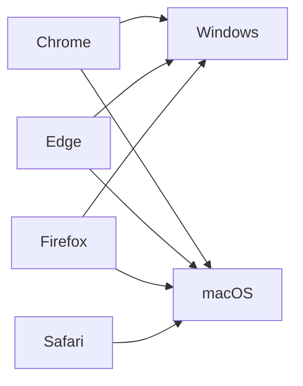
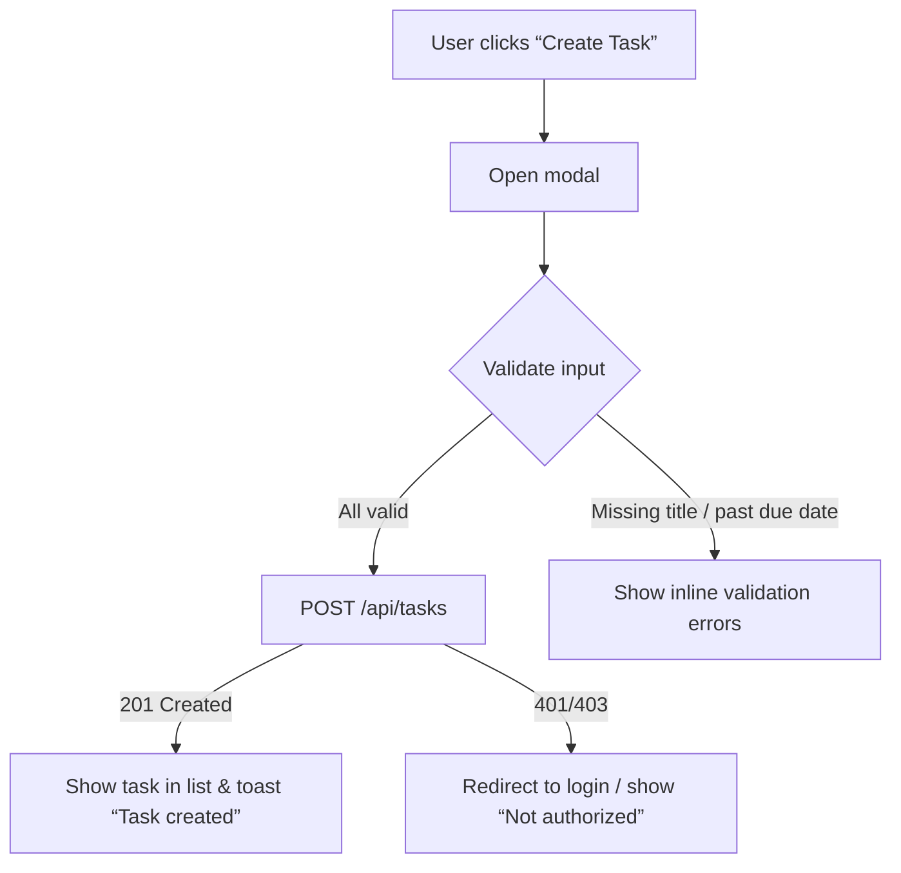
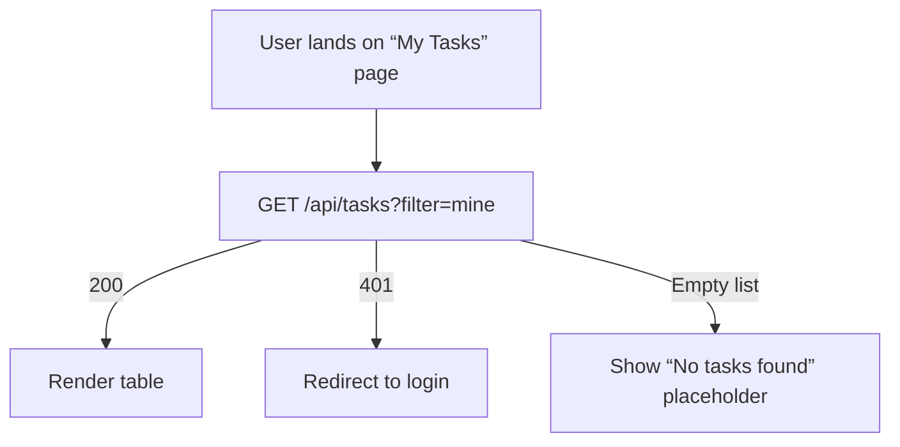
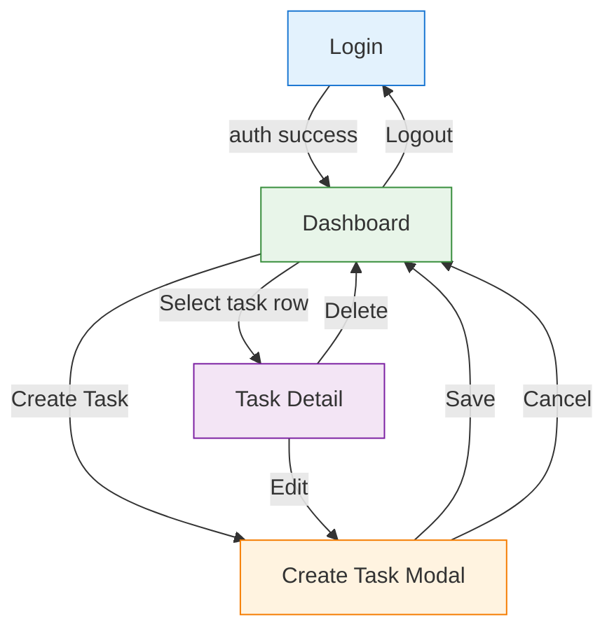

# Software Specification

> Generated by SpecBaker 🎂
> Powered by IBM watsonx.ai

**Generated:** 2026-05-16

**Original Goal:**

> Task management

**Project Complexity:** Moderate
**Domain:** General

---


## Table of Contents

1. [userRoles](#userroles)
2. [accessDeployment](#accessdeployment)
3. [productSummary](#productsummary)
4. [coreRequirements](#corerequirements)
5. [importantDecisions](#importantdecisions)
6. [dataModel](#datamodel)
7. [userJourney](#userjourney)
8. [uiScreens](#uiscreens)
9. [testScenarios](#testscenarios)
10. [implementationPlan](#implementationplan)

## 📋 User Roles & Permissions – Implementation‑Ready Specification

> **Goal:** Define who can do what in the first‑release web‑only task‑management tool (core CRUD + basic status tracking).

---

### 1. Role Overview

| Role | Primary / Secondary | Typical Persona | Core Permissions (CRUD) | Status Updates | Delete | View Scope | Audit Access |
|------|---------------------|----------------|--------------------------|----------------|--------|------------|--------------|
| **Individual Contributor (IC)** | Primary | *“Alex – a software developer who tracks his own tickets and assigns work to teammates.”* | • Create task (own or assign to any IC)  <br>• Read tasks they own **or** are assigned to  <br>• Update title, description, due‑date, assignee | Owner **or** Assignee can move a task through `To‑Do → In‑Progress → Done` (including backward moves) | Only the **owner** may delete their own tasks | See **only** tasks they own **or** are assigned to | Can view audit entries **only** for tasks they own or are assigned to |
| **Administrator (Admin)** | Secondary (optional for v1) | *“Sam – a team lead who needs to clean up orphaned tasks and view audit logs.”* | All IC permissions **plus**: <br>• Delete **any** task <br>• View **all** tasks in the system | Same as IC, plus can change status on any task | Delete any task | View **all** tasks | View **all** audit entries |
| **System (Service Account)** | Secondary (technical) | *“Task‑Scheduler – background job that may create system‑generated tasks.”* | Create tasks (owner = system) | Update status (if needed) | Delete own tasks only | View own tasks | Audit visible to owner/assignee (system) |

> **Note:** If an Admin role is not required for the MVP, it can be omitted and the system will operate with only the **Individual Contributor** role.

---

### 2. Detailed Permissions

| Action | Who May Perform? | Conditions / Business Rules |
|--------|------------------|------------------------------|
| **Create Task** | Any logged‑in IC | • Title **required**  <br>• Due‑date **≥ today**  <br>• Assignee can be any existing IC (including self) |
| **Read / List Tasks** | IC | Returns tasks where `owner_id = current_user` **OR** `assignee_id = current_user` |
| **Update Task (title, description, due‑date, assignee)** | Owner **or** Assignee | Same validation as create; changing assignee does **not** affect audit visibility (new assignee gains view rights) |
| **Change Status** | Owner **or** Assignee | Allowed transitions: `To‑Do → In‑Progress → Done` **or** backward to any previous state. No other status values. |
| **Delete Task** | Owner (IC) **or** Admin (if present) | Only the task’s owner may delete; Admin may delete any. Deletion removes the task and its audit entries. |
| **View Audit Trail** | Owner **or** Assignee (IC) **or** Admin (if present) | Shows `created_by`, `last_modified_by`, `status_change_by`, timestamps. No other users can see the audit. |
| **Admin‑Only (optional)** | Admin | • List all tasks <br>• Delete any task <br>• View all audit entries |

---

### 3. Role‑Based Limitations

| Limitation | Affected Role | Description |
|------------|---------------|-------------|
| **Visibility** | IC | Cannot see tasks they neither own nor are assigned to. |
| **Deletion** | IC | Cannot delete tasks owned by others. |
| **Audit Exposure** | IC | Audit data limited to tasks they own/are assigned to. |
| **Assignment Scope** | IC | Can assign to **any** IC, but cannot assign to non‑existent users. |
| **Admin Privileges** | Admin | Must be granted via a separate “admin” flag in the user table; not exposed to regular UI. |

---

### 4. Assumptions

| # | Assumption |
|---|------------|
| A1 | User authentication is already handled (e.g., JWT session). |
| A2 | A simple `users` table exists with a boolean `is_admin` column. |
| A3 | No team or project hierarchy is required for v1 – tasks are flat. |
| A4 | The UI will hide admin‑only actions when `is_admin = false`. |
| A5 | Audit entries are stored in a separate `task_audit` table linked by `task_id`. |

---

### 5. Open Questions

| # | Question |
|---|----------|
| Q1 | Will there ever be a need for a “read‑only” viewer role (e.g., manager) in the MVP? |
| Q2 | Should the system send email/notification when a task is assigned or its status changes? |
| Q3 | Are there any regulatory compliance requirements (e.g., GDPR) for audit data retention? |
| Q4 | Should admins be able to **re‑assign** tasks owned by others? (currently not required) |

---

### 6. Remarks & Implementation Tips

* **Security:** Enforce all permission checks server‑side (API layer). Never rely on UI hiding.
* **Performance:** Index `owner_id` and `assignee_id` on the `tasks` table for fast scoped queries.
* **Scalability:** The role model is simple; adding new roles later (e.g., “Project Manager”) only requires extending the permission matrix.
* **UX:** In the task list view, show a badge “Owned by me” or “Assigned to me” to make scope clear.
* **Testing:**
  * Verify that a user cannot fetch tasks they are not linked to.
  * Verify that only owners can delete their tasks.
  * Verify that status transitions respect the forward/backward rule.
  * Verify audit visibility rules.

---

### 7. Visual Summary

```mermaid
graph TD
    subgraph Users
        IC[Individual Contributor]
        Admin[Administrator (optional)]
    end

    subgraph Tasks
        T1[Task]
    end

    IC -->|creates| T1
    IC -->|assigned to| T1
    Admin -->|can view/delete any| T1

    style IC fill:#E3F2FD,stroke:#1976D2,stroke-width:2px
    style Admin fill:#FFF3E0,stroke:#F57C00,stroke-width:2px
    style T1 fill:#F1F8E9,stroke:#388E3C,stroke-width:2px
```

---

**Next Steps for Development**

1. Add `is_admin` flag to the `users` table (if not present).
2. Implement permission middleware that checks:
   * `owner_id == current_user.id` **OR** `assignee_id == current_user.id` for read/update.
   * `owner_id == current_user.id` for delete (or admin flag).
3. Create `task_audit` schema and expose a read‑only endpoint limited to task owners/assignees.
4. Wire UI components to hide admin actions when `is_admin` is false.

*End of specification.*

# Access & Deployment Specification
*Task‑Management MVP – Core CRUD & Status Tracking (Web‑only)*

---

## 1. Access Model

| Aspect | Detail |
|--------|--------|
| **Primary access channel** | Web application accessed through a modern browser (no native mobile/desktop client). |
| **URL pattern** | `https://tasks.example.com` (production). Development uses `http://localhost:3000`. |
| **Authentication** | Username‑password login backed by an OAuth 2.0 / OpenID Connect provider (e.g., Azure AD, Okta, or internal IdP). Successful login returns a signed JWT stored in an HttpOnly, Secure cookie. |
| **Authorization** | Role‑based checks performed on the JWT claims: `sub` (user id), `email`, and optional `role` (e.g., `admin`). Business rules (owner vs. assignee) are enforced in the API layer. |
| **Session timeout** | Inactivity timeout = 30 min; absolute token lifetime = 8 h (refresh token flow). |
| **API exposure** | All UI actions go through a RESTful JSON API (`/api/v1/tasks`). No public API is exposed in MVP. |
| **Audit visibility** | Audit entries are returned via `/api/v1/tasks/{id}/audit` and displayed only to the task’s owner and assignee. |

---

## 2. Deployment Model

| Layer | Recommended Technology | Rationale |
|-------|------------------------|-----------|
| **Hosting** | Cloud (managed PaaS) – e.g., Azure App Service, AWS Elastic Beanstalk, or GCP Cloud Run. | Simplifies scaling, TLS termination, and CI/CD. |
| **Runtime** | Node.js 20 (or .NET 8 if the team prefers C#) – container‑ready. | Modern, widely supported, fits SPA + API pattern. |
| **Database** | Managed relational DB (Azure PostgreSQL, Amazon RDS‑PostgreSQL, or Cloud SQL). | ACID guarantees for task CRUD & audit logs. |
| **Containerisation** | Docker image built from `Dockerfile`; CI pipeline pushes to container registry (Docker Hub / Azure Container Registry). | Enables consistent dev‑staging‑prod environments. |
| **Static assets** | Served via CDN (Azure CDN, CloudFront) for fast load times. | Improves UX on global teams. |
| **CI/CD** | GitHub Actions / Azure Pipelines: lint → unit tests → build → push image → deploy to staging → manual approval → prod. | Guarantees repeatable releases. |

### Deployment Environments

| Environment | Purpose | Key Config Differences |
|-------------|---------|------------------------|
| **Development** | Local dev for each engineer. | `dotenv` config, local PostgreSQL (Docker), debug logging, hot‑reload. |
| **Staging** | Pre‑prod validation (QA, user‑acceptance). | Same DB schema as prod, feature flags off, TLS with staging cert, audit logs retained 30 days. |
| **Production** | Live service for end‑users. | High‑availability DB, autoscaling, monitoring (App Insights / CloudWatch), backup retention 90 days. |

---

## 3. Platform & Browser Support

| Platform | Minimum Versions |
|----------|-------------------|
| **Desktop OS** | Windows 10+, macOS 12+, Linux (any recent distro). |
| **Mobile OS** | Not required for MVP (access via mobile browsers is optional). |
| **Browsers** | Chrome 108+, Edge 108+, Firefox 108+, Safari 15+. |
| **Device Types** | Laptop/desktop with keyboard & mouse; tablets with touch are supported as long as the browser meets the version requirement. |

*All browsers must support ES2022, Fetch API, and CSS Grid.*

**Testing matrix** (example, can be expanded in QA plan):



---

## 4. Network & Security Requirements

| Requirement | Detail |
|-------------|--------|
| **Transport security** | Enforce HTTPS (TLS 1.2+). All HTTP requests redirected to HTTPS. |
| **CORS** | Allow only origins `https://tasks.example.com` (prod) and `http://localhost:3000` (dev). |
| **Rate limiting** | 100 requests/second per IP; 10 req/min for login endpoint. |
| **Data protection** | Sensitive fields (JWT, refresh token) stored in HttpOnly, Secure cookies; CSRF protection via SameSite‑Strict. |
| **Backup & DR** | Daily automated DB snapshots; point‑in‑time recovery within 24 h. |
| **Compliance** | No PII beyond email/user‑id; GDPR‑ready deletion endpoint (soft‑delete + purge after 30 days). |

---

## 5. Technical Requirements

| Category | Requirement |
|----------|-------------|
| **Language/Framework** | Front‑end: React 18 + Vite (or Next.js). Back‑end: Express 6 (Node) or ASP.NET Core MVC. |
| **Package manager** | npm 9 (or Yarn 4). |
| **Build** | `npm run build` produces minified static assets; Docker image size < 250 MB. |
| **Testing** | Unit tests (Jest/Mocha) ≥ 80 % coverage; integration tests via SuperTest/Postman. |
| **Logging** | Structured JSON logs to stdout; collected by cloud logging service. |
| **Monitoring** | Health endpoint (`/healthz`) returning 200 when DB reachable; metrics exported to Prometheus or cloud native. |
| **Scalability** | Stateless API servers; horizontal scaling behind load balancer. |
| **Internationalisation** | UI strings stored in i18n JSON; default English. (Future scope). |

---

## 6. Assumptions

| # | Assumption |
|---|------------|
| A1 | The organization already has an OAuth 2.0 / OpenID Connect identity provider that can issue JWTs. |
| A2 | No offline or native mobile support is required for the MVP. |
| A3 | All users have reliable broadband access; no special low‑bandwidth optimisations are needed now. |
| A4 | The audit log is stored in the same relational DB as tasks (simple `audit_events` table). |
| A5 | Administrators are a separate role not needed for MVP; only task owners can delete tasks. |

---

## 7. Open Questions

| # | Question |
|---|----------|
| Q1 | Will the organization require SSO federation (e.g., SAML) in addition to OAuth 2.0? |
| Q2 | Is there a preferred cloud provider (Azure, AWS, GCP) or existing tenancy constraints? |
| Q3 | Should we enable optional two‑factor authentication for all users at launch? |
| Q4 | What is the expected maximum concurrent user count for capacity planning? |
| Q5 | Are there any corporate proxy or firewall rules that could block WebSocket or long‑polling (if used for future real‑time updates)? |

---

## 8. Remarks

* **Security first** – Even though the MVP is simple, enforce HTTPS, HttpOnly cookies, and CSRF protection from day 1.
* **Future‑proofing** – Architecture (containerised API + CDN static assets) allows easy addition of mobile/web‑socket real‑time updates, reporting, and external integrations later without major re‑architecting.
* **Observability** – Include health checks and structured logging now; they will save time when scaling beyond the initial user base.

---

*Prepared by: Systems Analyst – Task Management MVP*

# 📋 Product Summary

| **Item** | **Description** |
|----------|-----------------|
| **Product Goal** | Provide a lightweight, web‑only task‑management tool that lets individual contributors create, assign, and track their own tasks with minimal friction. |
| **Problem Solved** | Teams currently lack a simple, self‑service way to capture personal work items and hand‑off tasks without the overhead of full‑featured project‑management suites. |
| **Target Users** | Individual contributors (any logged‑in employee) who need to manage personal and delegated tasks. |
| **Core Use Cases** | 1. **Create a task** – user enters title, optional description, due date, and selects an assignee (self or any other user). <br>2. **View my tasks** – list of tasks I own **or** that are assigned to me. <br>3. **Update status** – owner or assignee moves a task through *To‑Do → In‑Progress → Done* (including backward moves). <br>4. **Edit task** – owner can change title, description, due date, assignee. <br>5. **Delete task** – owner can delete a task they created. <br>6. **Audit view** – owner and assignee can see a chronological log of who performed create/edit/assign/status changes. |
| **Success Criteria** | • 90 % of beta users can complete the above use cases without assistance. <br>• No task can be saved with a past due date. <br>• Audit entries are accurate and visible to the two involved parties. <br>• System remains responsive (< 200 ms) for typical lists (≤ 200 tasks). |
| **Key Value Propositions** | • **Speed** – no onboarding, just log‑in and start creating tasks. <br>• **Clarity** – only the fields and actions needed for day‑to‑day work. <br>• **Ownership** – each user sees only what matters to them, preserving focus and privacy. |
| **Scope Summary (v1)** | *In‑scope* – CRUD for tasks, basic status workflow, per‑user visibility, audit trail, web UI. <br>*Out‑of‑scope* – reporting dashboards, time‑tracking, external integrations, mobile apps, admin‑only management, role‑based permission granularity beyond owner/assignee. |
| **Assumptions** | • Users are already authenticated via the existing corporate SSO; a user ID and display name are available in the session. <br>• “Task owner” = the user who created the task. <br>• All users have equal rights to assign tasks to any other user. <br>• The audit log is stored as immutable rows in the same DB table (no separate audit service). |
| **Open Questions** | 1. **Retention** – How long should audit entries be retained? <br>2. **Bulk actions** – Will users need bulk delete or status change later? <br>3. **Notification** – Should assignees receive email/web push when a task is assigned or status changes? |
| **Remarks** | • Ensure the UI hides tasks that the current user is neither owner nor assignee (query‑level filter). <br>• Validate due dates on both client‑ and server‑side to prevent race conditions. <br>• Use optimistic concurrency (e.g., `updated_at` timestamp) to avoid lost updates when two parties edit the same task. |

---

## 🛠 Functional Requirements

| ID | Requirement | Acceptance Test |
|----|-------------|-----------------|
| **FR‑01** | **Create Task** – Authenticated user can create a task with: *title* (required), *description* (optional), *due date* (required, today‑or‑future), *assignee* (any user, default = self). | UI shows “Create Task” form; submitting with missing title or past due date shows validation error; task appears in owner’s and assignee’s task list. |
| **FR‑02** | **Read / List Tasks** – User sees a paginated list of tasks where `owner_id = me OR assignee_id = me`. Columns: title, status, due date, assignee, owner. | List loads within 200 ms; tasks not belonging to user are never displayed. |
| **FR‑03** | **Update Status** – Owner **or** assignee can change status among `To‑Do`, `In‑Progress`, `Done`. Transitions may move forward or backward. | Clicking status dropdown updates DB; audit entry recorded; UI reflects new status instantly. |
| **FR‑04** | **Edit Task** – Only the owner can edit title, description, due date, and re‑assign. | Owner opens edit modal, changes fields, saves; changes persist; assignee sees updated info. |
| **FR‑05** | **Delete Task** – Only the owner can delete a task they created. Deletion requires confirmation modal. | Owner clicks delete, confirms; task disappears from both owner’s and assignee’s lists; audit entry recorded. |
| **FR‑06** | **Audit Trail** – Every create, edit, assign, status change, and delete is recorded with: actor_id, action_type, timestamp, and snapshot of changed fields. Visible on a “History” tab for the task, accessible to owner and assignee. | Opening History shows chronological rows; entries match performed actions; other users cannot view the history. |
| **FR‑07** | **Due‑Date Validation** – Server rejects any create or edit where `due_date < today`. | API returns 400 with clear error message; UI displays same. |
| **FR‑08** | **Security** – All endpoints require a valid session token; authorization checks enforce owner/assignee rules. | Unauthorized request returns 401/403; attempts to edit/delete another user’s task are blocked. |

## 🗂 Data Model (simplified)

```mermaid
classDiagram
    class Task {
        +int id PK
        +string title
        +string? description
        +date dueDate
        +enum Status {ToDo, InProgress, Done}
        +int ownerId FK(User)
        +int assigneeId FK(User)
        +datetime createdAt
        +datetime updatedAt
    }
    class TaskAudit {
        +int id PK
        +int taskId FK(Task)
        +int actorId FK(User)
        +enum Action {Create, Edit, Assign, StatusChange, Delete}
        +json changedFields
        +datetime timestamp
    }
    class User {
        +int id PK
        +string email
        +string displayName
    }
    Task "1" --> "1" User : owner
    Task "1" --> "1" User : assignee
    TaskAudit "*" --> "1" Task
    TaskAudit "*" --> "1" User : actor
```

## 📡 API Specification (REST, JSON)

| Method | Endpoint | Body / Params | Success Response | Errors |
|--------|----------|---------------|------------------|--------|
| `POST` | `/api/tasks` | `{title, description?, dueDate, assigneeId}` | `201 Created` + task object | `400` (validation), `401` |
| `GET` | `/api/tasks` | query: `page, size` (optional) | `200 OK` + `{tasks[], total}` (filtered to owner/assignee) | `401` |
| `GET` | `/api/tasks/{id}` | – | `200 OK` + task object (if authorized) | `403`, `404` |
| `PATCH` | `/api/tasks/{id}` | any mutable fields (`title`, `description`, `dueDate`, `assigneeId`) | `200 OK` + updated task | `400`, `403`, `404` |
| `PATCH` | `/api/tasks/{id}/status` | `{status}` | `200 OK` + task | `400`, `403`, `404` |
| `DELETE` | `/api/tasks/{id}` | – | `204 No Content` | `403`, `404` |
| `GET` | `/api/tasks/{id}/audit` | – | `200 OK` + `[auditEntries]` (owner & assignee only) | `403`, `404` |

*All endpoints require `Authorization: Bearer <session‑token>` header.*

## 🎨 UI Wireframe (textual)

```
+---------------------------------------------------+
|  Header:  [Logo]  Task Manager  |  User Avatar   |
+---------------------------------------------------+
|  Create Task  [+]                                 |
+---------------------------------------------------+
|  My Tasks                                          |
|  ------------------------------------------------ |
|  | Title            | Assignee | Due | Status | |
|  ------------------------------------------------ |
|  | Design login UI  | Alice    | 2026‑06‑01 | To‑Do   |
|  | Write API spec   | Me       | 2026‑05‑20 | In‑Progress |
|  ------------------------------------------------ |
|  Pagination controls                               |
+---------------------------------------------------+

Create Task Modal
-----------------
Title*      [_____________________]
Description [_____________________]
Due Date*   [yyyy-mm-dd]  (calendar picker)
Assignee*   [Dropdown list of users] (default = self)
[Create]   [Cancel]

Task Detail Panel (click a row)
--------------------------------
Title: …
Description: …
Owner: …
Assignee: …
Due: …
Status: [Dropdown]
[Save Changes] (owner only)
[Delete] (owner only)
--- History ---
[Timestamp] – User X changed status to In‑Progress
[Timestamp] – User Y assigned to Bob
...
```

## ✅ Acceptance Criteria Checklist

- [ ] Users can log in via SSO and reach the task dashboard.
- [ ] All CRUD operations respect the owner/assignee permission matrix.
- [ ] Due‑date validation prevents past dates on both client and server.
- [ ] Status workflow allows forward and backward moves.
- [ ] Audit entries are stored and displayed correctly to owner & assignee.
- [ ] UI only ever shows tasks belonging to the current user (owner or assignee).
- [ ] Performance: task list loads ≤ 200 ms for 200 rows.
- [ ] Automated unit & integration tests cover each API endpoint and permission rule.

---

## 📌 Remarks & Considerations

1. **Scalability** – Use indexed columns `owner_id` and `assignee_id` for fast filtering.
2. **Security** – Enforce CSRF protection for form submissions; use same‑origin cookies for SSO token.
3. **Future Extensibility** – Design the `Status` enum as a lookup table so new states can be added without DB schema changes.
4. **Internationalization** – Store dates in UTC; UI should display in the user’s locale (out‑of‑scope for v1 but keep in mind).
5. **Testing** – Include end‑to‑end tests (e.g., Cypress) that simulate two users interacting with the same task to verify audit visibility.

---

*Prepared by: Systems Analyst – Requirements Clarification Session*
*Date: 2026‑05‑16*

# Task Management – Core Specification (Version 1.0)

**Target audience:** Individual contributors (ICs) who create, assign, and track their own tasks.
**Scope (MVP):** Basic CRUD + status workflow, web‑only. Advanced reporting, time‑tracking, and external integrations are out‑of‑scope for this release.

---

## 1. Functional Requirements

| # | Requirement | Description | Testable Acceptance |
|---|-------------|-------------|----------------------|
| **FR‑1** | **User authentication** | Only logged‑in users can access any task‑related UI or API. Authentication is performed via the existing SSO/JWT mechanism. | Verify that unauthenticated requests receive HTTP 401. |
| **FR‑2** | **Create task** | A user can create a task with **title (required)**, **description (optional)**, **due date (required, ≥ today)**, and **assignee** (any existing user). The creator becomes the **owner**. | POST `/tasks` returns 201 and the task record contains the supplied fields plus `ownerId`. |
| **FR‑3** | **Read tasks (list & detail)** | • **List view** returns only tasks where the user is **owner** **or** **assignee**. <br>• **Detail view** shows full task data for those tasks. | GET `/tasks` returns only authorized tasks; GET `/tasks/{id}` returns 403 for unauthorized IDs. |
| **FR‑4** | **Update task (editable fields)** | Owner or assignee can edit **title**, **description**, **due date**, **assignee**, and **status** (see FR‑5). All edits must respect validation rules. | PATCH `/tasks/{id}` updates fields and returns 200. |
| **FR‑5** | **Status workflow** | Allowed statuses: `To‑Do`, `In‑Progress`, `Done`. Transitions: forward (To‑Do → In‑Progress → Done) **or** backward to any previous state. Owner **or** assignee may change status. | Changing status from `Done` back to `In‑Progress` succeeds; invalid transition (e.g., `Done` → `To‑Do` when not allowed) returns 400. |
| **FR‑6** | **Delete task** | Only the **owner** may delete a task. Deletion is a soft‑delete (flag `isDeleted = true`) to preserve audit data. | DELETE `/tasks/{id}` by owner returns 204; same request by non‑owner returns 403. |
| **FR‑7** | **Audit trail** | Every create, update, status change, assignment change, and delete records **who**, **when**, and **what** changed. The trail is visible to the task’s **owner** and **assignee** via an “History” tab. | GET `/tasks/{id}/history` returns chronological list for authorized users; unauthorized users receive 403. |
| **FR‑8** | **Search / filter** (basic) | Users can filter their visible tasks by **status**, **due date range**, and **assignee**. | GET `/tasks?status=In-Progress&dueAfter=2024-01-01` returns matching tasks only. |
| **FR‑9** | **Responsive UI** | The web UI must work on desktop browsers (Chrome, Edge, Firefox) and adapt to typical laptop screen sizes (≥ 1024 px width). | Visual inspection on supported browsers; UI does not overflow or hide controls. |

---

## 2. Non‑Functional Requirements

| Category | Requirement | Acceptance |
|----------|-------------|------------|
| **Performance** | List endpoint returns ≤ 200 ms for ≤ 500 tasks per user under normal load (5 concurrent users). | Load test with 5 users, 500 tasks each → response ≤ 200 ms. |
| **Security** | All APIs require HTTPS and JWT authentication. Authorization checks must enforce the rules in FR‑1‑FR‑6. | Pen‑test confirms no unauthenticated/unauthorized access. |
| **Scalability** | Design for horizontal scaling of the web server and stateless API layer. Database can be scaled read‑replicas later. | Architecture diagram shows stateless services; no session state stored on server. |
| **Reliability** | System uptime ≥ 99.5 % (monthly). Soft‑delete ensures audit data is never lost. | Monitoring alerts on downtime; data loss tests pass. |
| **Usability** | UI must allow task creation in ≤ 3 clicks from the dashboard. Error messages are clear and field‑specific. | Usability test with 5 participants meets the 3‑click goal. |
| **Maintainability** | Code follows the project’s linting and CI pipeline; unit test coverage ≥ 80 % for core services. | CI pipeline passes; coverage report ≥ 80 %. |
| **Accessibility** | Meet WCAG 2.1 AA for form fields and status controls. | Automated axe scan reports no violations. |

---

## 3. Technical Constraints

| Constraint | Detail |
|------------|--------|
| **Platform** | Web‑only (HTML5, CSS3, JavaScript/TypeScript). No native mobile app in MVP. |
| **Backend** | Node.js ≥ 18 with Express (or existing framework). |
| **Database** | Relational DB (PostgreSQL) – tasks, users, audit tables. |
| **Auth** | Existing SSO/JWT; do not implement new auth service. |
| **Deployment** | Containerized (Docker) and deployable to Kubernetes or similar orchestrator. |
| **Version control** | Git repository with feature‑branch workflow. |

---

## 4. Integration Requirements

| Integration | Scope |
|-------------|-------|
| **User directory** | Read‑only lookup of existing users (ID, name, email) via the current SSO user service. No write‑back needed. |
| **Email notifications** | **Out of scope** for MVP (may be added in later release). |

---

## 5. Data Requirements

### 5.1 Entity Model (simplified)

```mermaid
classDiagram
    class User {
        <<entity>>
        +uuid id
        +string email
        +string fullName
    }
    class Task {
        <<entity>>
        +uuid id
        +string title
        +string? description
        +date dueDate
        +enum status {ToDo, InProgress, Done}
        +uuid ownerId
        +uuid assigneeId
        +bool isDeleted
        +timestamp createdAt
        +timestamp updatedAt
    }
    class TaskAudit {
        <<entity>>
        +uuid id
        +uuid taskId
        +uuid actorId
        +enum action {Created, Updated, StatusChanged, Assigned, Deleted}
        +json changeDetail
        +timestamp actedAt
    }
    User "1" <-- "0..*" Task : owner
    User "1" <-- "0..*" Task : assignee
    Task "1" <-- "0..*" TaskAudit : logs
```

### 5.2 Storage

| Table | Key columns | Indexes |
|-------|-------------|---------|
| `users` | `id` (PK) | PK, unique email |
| `tasks` | `id` (PK), `ownerId`, `assigneeId`, `status`, `dueDate` | PK, composite index on (`ownerId`, `assigneeId`) for list queries |
| `task_audit` | `id` (PK), `taskId` | PK, index on `taskId` |

---

## 6. Validation Rules

| Field | Rule | Error Code / Message |
|-------|------|----------------------|
| `title` | non‑empty, max 200 chars | 400 – “Title is required and must be ≤ 200 characters.” |
| `description` | max 2000 chars (if present) | 400 – “Description must be ≤ 2000 characters.” |
| `dueDate` | must be today or future (≥ current date, ignoring time zone) | 400 – “Due date cannot be in the past.” |
| `assigneeId` | must reference an existing user | 400 – “Assignee does not exist.” |
| `status` | one of allowed enum values; transition must follow allowed flow (forward or backward) | 400 – “Invalid status transition.” |
| `ownerId` | immutable after creation | 400 – “Owner cannot be changed.” |

---

## 7. Error Handling Requirements

1. **Standard JSON error envelope**

```json
{
  "error": {
    "code": "ERR_VALIDATION",
    "message": "Due date cannot be in the past.",
    "details": { "field": "dueDate" }
  }
}
```

2. **HTTP status mapping**
   - 400 – Validation / business rule violation
   - 401 – Missing/invalid authentication token
   - 403 – Authorization failure (e.g., delete by non‑owner)
   - 404 – Resource not found or not visible to requester
   - 500 – Unexpected server error (log stack trace, return generic message)

3. **Logging** – All errors must be logged with request ID, user ID (if known), and stack trace for 5xx cases.

---

## 8. Acceptance Criteria (Major Requirements)

| # | Criterion | Pass Condition |
|---|-----------|----------------|
| **AC‑1** | **Authentication** | All endpoints reject unauthenticated calls with 401. |
| **AC‑2** | **Task visibility** | A user sees only tasks they own or are assigned to; attempts to access others return 403/404. |
| **AC‑3** | **Create task** | Creating a task with valid data succeeds (201) and appears in both owner’s and assignee’s list. |
| **AC‑4** | **Due‑date validation** | Attempting to set a past due date returns 400 with appropriate message. |
| **AC‑5** | **Status workflow** | Allowed forward/backward transitions succeed; illegal transitions (e.g., unknown status) return 400. |
| **AC‑6** | **Delete permission** | Owner can delete (soft) a task; non‑owner receives 403. |
| **AC‑7** | **Audit visibility** | Owner and assignee can retrieve the audit history; other users cannot. |
| **AC‑8** | **Performance** | List endpoint returns ≤ 200 ms for 500 tasks under load of 5 concurrent users. |
| **AC‑9** | **UI usability** | Task creation reachable within 3 clicks from dashboard; error messages appear inline. |
| **AC‑10** | **Security** | Pen‑test confirms no privilege escalation; all data transmitted over HTTPS. |

---

## 9. Assumptions

| # | Assumption |
|---|------------|
| **A‑1** | User management (registration, password reset, etc.) is handled by the existing SSO system; we only need to read user IDs. |
| **A‑2** | “Soft‑delete” is sufficient for audit compliance; hard deletion is not required in MVP. |
| **A‑3** | The system will run in a trusted internal network; no external API keys are needed. |
| **A‑4** | Time zone handling: all dates are stored in UTC; UI displays dates in the browser’s local zone. |
| **A‑5** | No multi‑tenant separation is required – all users belong to a single organization. |

---

## 10. Open Questions

| # | Question |
|---|----------|
| **Q‑1** | Should tasks support attachments (files) in the future, and if so, what storage strategy? |
| **Q‑2** | Will there be a “admin” role that can view all tasks, or is visibility strictly limited to owner/assignee forever? |
| **Q‑3** | Is there a requirement for bulk operations (e.g., assign multiple tasks at once) in later releases? |
| **Q‑4** | What is the expected maximum number of tasks per user (for capacity planning)? |

---

## 11. Remarks

* **Scalability note:** Although MVP targets a few hundred concurrent users, the stateless API design and indexed DB schema make it easy to scale horizontally later.
* **Future extensions:** The audit table is designed to accommodate additional actions (e.g., comment added) without schema changes.
* **Accessibility:** Ensure all form controls have associated `<label>` elements and ARIA attributes for screen readers.

---

*Prepared by: Systems Analyst – 2026‑05‑16*

# Task Management – Implementation‑Ready Specification (v1.0)

---

## 1. Overview

A lightweight **web‑only** task‑management tool for **individual contributors**.
Core capabilities for the first release are limited to **CRUD**, **assignment**, **due‑date validation**, and **basic status tracking**. Advanced reporting, time‑tracking, and external integrations are out‑of‑scope for now.

---

## 2. Functional Requirements

| ID | Requirement | Acceptance Criteria |
|----|-------------|----------------------|
| **FR‑01** | **User authentication** – only logged‑in users can use the system. | Users must log in with email + password (or SSO if later added). Invalid credentials → error message. |
| **FR‑02** | **Create task** | • Title **required** (max 255 chars). <br>• Description optional (rich‑text). <br>• Due date **required**, must be today or a future date. <br>• Assignee selectable from any existing user. <br>• Owner is the creator (auto‑filled). |
| **FR‑03** | **Read / List tasks** | • **My Tasks** view shows: <br> 1. Tasks where I am **owner**. <br> 2. Tasks where I am **assignee**. <br>• Tasks are sortable/filterable by status, due date, and assignee. |
| **FR‑04** | **Update task** – title, description, due date, assignee, status. | • Only **owner** or **assignee** may edit. <br>• Due‑date validation same as creation. |
| **FR‑05** | **Status workflow** | Allowed statuses: `To‑Do`, `In‑Progress`, `Done`. <br>• Forward flow: To‑Do → In‑Progress → Done. <br>• Backward moves allowed (e.g., Done → In‑Progress). |
| **FR‑06** | **Delete task** | Only the **owner** can delete their own tasks. Deletion prompts confirmation. |
| **FR‑07** | **Audit trail** | Record: <br>• Who created, edited, reassigned, or changed status. <br>• Timestamp of each action. <br>• Visible to **owner** and **assignee** on the task detail page. |
| **FR‑08** | **Responsive UI** | Works on desktop browsers (Chrome, Firefox, Edge, Safari). Mobile view is optional but must not break. |
| **FR‑09** | **Error handling** | User‑friendly messages for validation failures, permission errors, and server errors. |

---

## 3. Non‑Functional Requirements

| Category | Requirement |
|----------|-------------|
| **Security** | - All endpoints require a valid JWT/session cookie. <br>- Input sanitisation to prevent XSS/SQL‑i. <br>- CSRF protection for state‑changing requests. |
| **Performance** | - Page load < 2 s on 3G. <br>- API response < 200 ms for CRUD ops (average). |
| **Scalability** | - Stateless backend; horizontal scaling via load balancer. <br>- Database indexed on `owner_id`, `assignee_id`, `due_date`, `status`. |
| **Maintainability** | - Clean separation: Front‑end (React) ↔ API (REST). <br>- Use repository pattern for data access. |
| **Observability** | - Centralised logging (JSON). <br>- Basic health‑check endpoint (`/health`). |
| **Compliance** | - Store audit logs for at least 90 days. |
| **Availability** | - Target 99.5 % uptime (single‑region deployment for MVP). |

---

## 4. Data Model (ER Diagram)

```
User
 └─ id (PK)
 └─ email (unique)
 └─ name
 └─ password_hash
 └─ created_at

Task
 └─ id (PK)
 └─ title
 └─ description
 └─ due_date
 └─ status ENUM('To-Do','In-Progress','Done')
 └─ owner_id   → User.id
 └─ assignee_id→ User.id
 └─ created_at
 └─ updated_at

TaskAudit
 └─ id (PK)
 └─ task_id   → Task.id
 └─ action ENUM('Created','Edited','Reassigned','StatusChanged','Deleted')
 └─ performed_by → User.id
 └─ performed_at
 └─ details JSON (optional free‑form change snapshot)
```

*All foreign keys enforce `ON DELETE RESTRICT` to preserve audit integrity.*

---

## 5. API Specification (REST)

| Method | Endpoint | Auth | Body / Params | Success Response |
|--------|----------|------|---------------|------------------|
| POST | `/api/tasks` | ✅ | `{title, description?, dueDate, assigneeId}` | `201 Created` + task object |
| GET | `/api/tasks` | ✅ | query: `filter=owned|assigned&status=&dueBefore=` | `200 OK` + list |
| GET | `/api/tasks/:id` | ✅ | – | `200 OK` + task + audit |
| PATCH | `/api/tasks/:id` | ✅ (owner or assignee) | any mutable fields | `200 OK` + updated task |
| DELETE | `/api/tasks/:id` | ✅ (owner) | – | `204 No Content` |
| GET | `/api/users` | ✅ | – | `200 OK` + list of users (for assignee dropdown) |
| GET | `/api/health` | – | – | `200 OK` |

*All responses follow a standard envelope:*

```json
{
  "data": {...},
  "meta": {...},
  "error": null
}
```

---

## 6. UI Wireframes (textual)

```
+---------------------------------------------------+
| Header:  [Logo]  |  My Tasks |  Create Task | Logout |
+---------------------------------------------------+

My Tasks Page
-----------------------------------------------------
| Filter: [Owned] [Assigned] | Status: [All] ▼ |
-----------------------------------------------------
| Title                | Assignee | Due Date | Status |
| --------------------------------------------------- |
| "Write spec"         | Alice    | 2026‑05‑20 | To‑Do |
| "Fix bug #123"       | Me       | 2026‑05‑22 | In‑Progress |
| --------------------------------------------------- |
| [Create New Task] button
```

*Task Detail modal* shows full description, audit log (owner + assignee only), status dropdown, edit/delete buttons (visibility per permission).

---

## 7. Important Decisions (Decision Records)

| # | Decision | Rationale | Tech / Pattern | Trade‑offs / Implications | Status |
|---|----------|-----------|----------------|---------------------------|--------|
| **D1** | **Web‑only launch (no native mobile)** | Target audience works primarily on desktops; reduces scope & maintenance. | SPA (React) + responsive CSS | Future mobile may need redesign or PWA. | ✅ Confirmed |
| **D2** | **Use React (v18) + TypeScript for front‑end** | Strong typing reduces bugs; ecosystem for UI components. | Component‑based UI, hooks, Context for auth. | Slightly longer initial dev time vs plain JS. | ✅ Confirmed |
| **D3** | **REST API with Node.js (Express) + PostgreSQL** | Mature, easy to host, supports ACID for audit integrity. | Repository pattern, service layer. | Not real‑time; acceptable for CRUD. | ✅ Confirmed |
| **D4** | **JWT authentication stored in HttpOnly cookie** | Prevents XSS token theft; simplifies stateless auth. | `express-jwt`, `passport-local`. | Requires CSRF token for state changes. | ✅ Confirmed |
| **D5** | **Task status enum + allow backward transitions** | Flexibility for users to correct mistakes. | Enum in DB, validation middleware. | No complex workflow engine needed now. | ✅ Confirmed |
| **D6** | **Audit trail stored in separate `TaskAudit` table, visible to owner & assignee** | Transparency, meets requirement without exposing to all users. | Insert audit entry in service layer after each mutation. | Slight DB write overhead; negligible for MVP. | ✅ Confirmed |
| **D7** | **Due‑date validation on server & client** | Prevents past dates, improves UX. | Joi (or Zod) schema validation + UI date‑picker min‑today. | Must keep validation logic in sync. | ✅ Confirmed |
| **D8** | **Delete permission limited to task owner** | Simple ownership model, avoids admin overhead. | Middleware `canDeleteTask`. | No “soft delete” – data permanently lost (could be added later). | ✅ Confirmed |
| **D9** | **Stateless backend (no session store)** | Enables horizontal scaling. | JWT, no server‑side session. | Revoking tokens requires short expiry + refresh flow (out of scope now). | ✅ Confirmed |
| **D10** | **Indexing strategy** – indexes on `owner_id`, `assignee_id`, `due_date`, `status`. | Fast task list queries for the two main filters. | PostgreSQL B‑tree indexes. | Slight extra storage, negligible for MVP. | ✅ Confirmed |
| **D11** | **Error handling convention** – unified error envelope with HTTP status codes. | Consistency for front‑end error display. | Express error‑handler middleware. | Requires disciplined use across services. | ✅ Confirmed |
| **D12** | **Future‑proofing: expose a GraphQL endpoint later** | Allows richer queries for reporting in future releases. | Keep service layer agnostic; can add GraphQL wrapper later. | No immediate benefit; adds design overhead now. | ❓ Open Question (priority) |
| **D13** | **Logging & monitoring** – JSON logs to stdout (captured by container platform). | Simplicity; works with most cloud providers. | `winston` logger. | No centralized log aggregation yet. | ✅ Confirmed |

---

## 8. Assumptions

| # | Assumption |
|---|------------|
| **A1** | Users are pre‑registered; registration flow is out of scope. |
| **A2** | Email is unique and used as the login identifier. |
| **A3** | No role hierarchy beyond “regular user”; admin features are deferred. |
| **A4** | The system will run in a single region (no multi‑region replication needed for MVP). |
| **A5** | Browser support limited to evergreen versions (Chrome ≥ 100, Firefox ≥ 100, Edge ≥ 100, Safari ≥ 15). |
| **A6** | Timezone handling: all dates are stored in UTC; UI shows user’s local timezone via browser. |

---

## 9. Open Questions

| # | Question |
|---|----------|
| **Q1** | Will there be a password‑reset / account‑recovery flow in the MVP? |
| **Q2** | Should the audit trail be exportable (CSV/JSON) for owners? |
| **Q3** | Is there a need for soft‑delete (archiving) to comply with any data‑retention policy? |
| **Q4** | Do we need to support bulk operations (e.g., assign multiple tasks at once)? |
| **Q5** | Will there be any integration with corporate SSO (e.g., SAML/OIDC) in the near term? |

---

## 10. Remarks / Risks

* **Security** – Ensure HttpOnly + Secure cookie flags; enforce strong password policy.
* **Scalability** – Current design is horizontally scalable, but future reporting may require a separate analytics store.
* **Maintainability** – Keep business logic in service layer, not in route handlers, to simplify future migration to GraphQL or event‑driven architecture.
* **UX** – Provide clear visual cues for status changes (color badges) and overdue tasks (red highlight).

---

## 11. Acceptance Test Checklist

- [ ] User can log in and view **My Tasks** list (owned + assigned).
- [ ] Creating a task validates title, due date (≥ today), and allows any existing user as assignee.
- [ ] Owner and assignee can edit title, description, due date, assignee, and status.
- [ ] Owner can delete their own task; other users receive “Forbidden”.
- [ ] Status flow respects forward/backward transitions only among the three defined states.
- [ ] Audit entries appear on the task detail page for owner & assignee.
- [ ] All API endpoints reject unauthenticated requests (401).
- [ ] UI displays validation errors inline; server errors show a toast.
- [ ] Performance: task list loads < 2 s on a simulated 3G connection.

---

*Prepared by: Systems Analyst – 2026‑05‑16*
*Next Review: 2026‑05‑30 (to resolve open questions & confirm Q1‑Q5).*

# Task Management – Core Version (MVP)
**Goal:** Provide a lightweight web‑only task‑tracking tool for individual contributors that supports creating, assigning, editing, and tracking the status of tasks.

---

## 1. Overview

| Aspect | Detail |
|--------|--------|
| **Primary Users** | Individual contributors (any logged‑in user). |
| **Platform** | Modern web browsers (desktop & tablet). |
| **Scope (MVP)** | Core CRUD + basic status workflow. No reporting, time‑tracking, or external integrations. |
| **Delivery** | Single‑page web app backed by a RESTful JSON API and a relational database. |

---

## 2. User Roles & Permissions

| Role | Permission | Comments |
|------|------------|----------|
| **Authenticated User** | • Create a task for self or assign to any other user.<br>• View tasks **they own** *or* **are assigned to**.<br>• Update **status** (owner & assignee).<br>• Edit title, description, due‑date, assignee (owner only).<br>• Delete **only** tasks they own. | No admin concept in MVP; future versions may add it. |
| **Unauthenticated Visitor** | No access – must log in. | |

*All permission checks are enforced server‑side.*

---

## 3. Functional Requirements

| ID | Requirement | Acceptance Test |
|----|-------------|-----------------|
| **F‑001** | **Login** – users must authenticate (e.g., email + password, SSO optional). | Valid credentials → session token; invalid → 401. |
| **F‑002** | **Create Task** – supply title, optional description, due‑date (≥ today), optional assignee (any user). | POST `/tasks` returns 201 with task JSON; due‑date in past → 400. |
| **F‑003** | **Read Tasks** – list tasks where `owner_id = me` **or** `assignee_id = me`. | GET `/tasks` returns only owned/assigned tasks. |
| **F‑004** | **Update Task** – owner can edit title, description, due‑date, assignee; owner **or** assignee can change status. | PATCH `/tasks/:id` respects permission matrix; status transition validated. |
| **F‑005** | **Delete Task** – only owner may delete. | DELETE `/tasks/:id` returns 204 for owner; 403 otherwise. |
| **F‑006** | **Status Workflow** – allowed values: `To-Do`, `In-Progress`, `Done`. Forward flow required, but moving back to any previous state is allowed. | Changing status from `Done` → `In-Progress` succeeds; skipping states (e.g., `To-Do` → `Done`) is allowed but recorded. |
| **F‑007** | **Audit Trail** – every create, edit, assign, status change is recorded with actor, timestamp, and changed fields. Visible to task owner and assignee. | GET `/tasks/:id/audit` returns entries only for owner/assignee; admin (future) can see all. |
| **F‑008** | **Search / Filter** – optional basic filter by status or due‑date range on the list endpoint. | GET `/tasks?status=In-Progress&dueAfter=2024-01-01` returns matching tasks. |
| **F‑009** | **Pagination** – list endpoint must support `page` & `pageSize`. | GET `/tasks?page=2&pageSize=20` returns correct slice. |

---

## 4. Business Rules & Validation

| Rule | Description | Implementation |
|------|-------------|----------------|
| **R‑001** | **Title** is mandatory, max 200 characters. | DB NOT NULL, length check in API. |
| **R‑002** | **Description** optional, max 2000 characters. | DB `TEXT`, length check. |
| **R‑003** | **Due‑date** required, must be today or future. | API validation; DB check constraint (`due_date >= CURRENT_DATE`). |
| **R‑004** | **Assignee** may be any existing user; cannot be null (defaults to owner if omitted). | FK to `users.id`. |
| **R‑005** | **Status** default = `To-Do` on creation. | DB default value. |
| **R‑006** | **Audit entries** immutable; never deleted. | Append‑only table. |
| **R‑007** | **Soft delete** – tasks are hard‑deleted (per spec) but can be changed to “archived” in future releases. | `DELETE` removes row; future version may add `is_archived`. |

---

## 5. Data Model

### 5.1 Entity Diagram (textual)

```
+-----------+      1      +-----------+      *      +-----------+
|   Users   |------------>|   Tasks   |<-----------|  Audits   |
+-----------+             +-----------+            +-----------+
      |                         |
      |                         |
      |                         |
      +-------------------------+
               * (owner & assignee)
```

*Each **Task** has two foreign keys to **Users** – `owner_id` and `assignee_id`.
**Audits** reference a single **Task** and the **User** who performed the action.*

### 5.2 Tables

#### 5.2.1 `users` (pre‑existing)

| Column | Type | Constraints |
|--------|------|-------------|
| `id` | `BIGINT` PK | Auto‑increment, unique |
| `email` | `VARCHAR(255)` | NOT NULL, UNIQUE |
| `full_name` | `VARCHAR(150)` | NOT NULL |
| `password_hash` | `VARCHAR(255)` | NOT NULL |
| `created_at` | `TIMESTAMP` | NOT NULL, default `NOW()` |
| `updated_at` | `TIMESTAMP` | NOT NULL, default `NOW()` on update |

*Only needed for FK relationships; authentication handled elsewhere.*

#### 5.2.2 `tasks`

| Column | Type | Required? | Constraints / Validation |
|--------|------|-----------|--------------------------|
| `id` | `BIGINT` PK | Yes | Auto‑increment |
| `title` | `VARCHAR(200)` | Yes | NOT NULL |
| `description` | `TEXT` | No | NULL allowed, max 2000 chars (app‑level) |
| `due_date` | `DATE` | Yes | NOT NULL, `>= CURRENT_DATE` |
| `status` | `VARCHAR(20)` | Yes | NOT NULL, default `'To-Do'`, enum (`To-Do`, `In-Progress`, `Done`) |
| `owner_id` | `BIGINT` FK → `users.id` | Yes | NOT NULL, ON DELETE RESTRICT |
| `assignee_id` | `BIGINT` FK → `users.id` | Yes | NOT NULL, ON DELETE RESTRICT |
| `created_at` | `TIMESTAMP` | Yes | NOT NULL, default `NOW()` |
| `updated_at` | `TIMESTAMP` | Yes | NOT NULL, default `NOW()` on update |
| **Indexes** |  |  | `idx_tasks_owner` (`owner_id`), `idx_tasks_assignee` (`assignee_id`), `idx_tasks_status` (`status`), composite `idx_tasks_owner_assignee` (`owner_id`, `assignee_id`). |

#### 5.2.3 `task_audits`

| Column | Type | Required? | Constraints |
|--------|------|-----------|-------------|
| `id` | `BIGINT` PK | Yes | Auto‑increment |
| `task_id` | `BIGINT` FK → `tasks.id` | Yes | NOT NULL, ON DELETE CASCADE |
| `actor_id` | `BIGINT` FK → `users.id` | Yes | NOT NULL |
| `action` | `VARCHAR(30)` | Yes | Enum: `CREATE`, `UPDATE`, `ASSIGN`, `STATUS_CHANGE`, `DELETE` |
| `changed_fields` | `JSONB` | No | Stores `{field: {old:…, new:…}}` |
| `timestamp` | `TIMESTAMP` | Yes | NOT NULL, default `NOW()` |
| **Indexes** |  |  | `idx_audit_task` (`task_id`), `idx_audit_actor` (`actor_id`). |

### 5.3 Relationships

| From | To | Cardinality | Description |
|------|----|-------------|-------------|
| `users.id` → `tasks.owner_id` | One‑to‑Many | One user can own many tasks. |
| `users.id` → `tasks.assignee_id` | One‑to‑Many | One user can be assigned many tasks. |
| `tasks.id` → `task_audits.task_id` | One‑to‑Many | Each task can have many audit entries. |
| `users.id` → `task_audits.actor_id` | One‑to‑Many | A user can generate many audit entries. |

---

## 6. API Endpoints (summary)

| Method | Path | Auth | Body / Params | Returns |
|--------|------|------|---------------|---------|
| POST | `/auth/login` | – | `{email, password}` | `{token}` |
| GET | `/tasks` | ✔ | `?status=&dueAfter=&page=&pageSize=` | `[{task}]` |
| POST | `/tasks` | ✔ | `{title, description?, dueDate, assigneeId}` | `201 {task}` |
| GET | `/tasks/:id` | ✔ | – | `200 {task}` (owner/assignee only) |
| PATCH | `/tasks/:id` | ✔ | `{title?, description?, dueDate?, assigneeId?, status?}` | `200 {task}` |
| DELETE | `/tasks/:id` | ✔ | – | `204` |
| GET | `/tasks/:id/audit` | ✔ | – | `200 [{audit}]` (owner/assignee only) |

*All endpoints return standard HTTP error codes (400, 401, 403, 404, 500).*

---

## 7. Non‑Functional & Technical Remarks

| Concern | Note |
|---------|------|
| **Security** | Use HTTPS, JWT or session cookie for auth. Verify ownership/assignment on every request. |
| **Scalability** | Indexes on `owner_id`, `assignee_id`, `status` support typical query patterns. Pagination prevents large payloads. |
| **Data Retention** | Hard delete per spec; consider soft‑delete flag for future compliance. |
| **Internationalisation** | Store dates in UTC; UI will display in user’s locale. |
| **Accessibility** | Follow WCAG 2.1 AA for the web UI (focus order, ARIA labels). |
| **Testing** | Unit tests for service layer, integration tests for API, UI end‑to‑end (Cypress). |
| **Deployment** | Containerised (Docker) – one service for API, one for static front‑end. |
| **Performance** | Target < 200 ms API response for list endpoint under 10 k tasks per user. |

---

## 8. Acceptance Criteria (Checklist)

- [ ] Users can log in and obtain a session token.
- [ ] Only authenticated users can access any `/tasks` endpoint.
- [ ] Task creation enforces mandatory title, due‑date ≥ today, and optional description.
- [ ] Owner can assign any existing user as assignee.
- [ ] List endpoint returns **only** tasks owned or assigned to the caller.
- [ ] Owner & assignee can change status; other users receive 403.
- [ ] Owner can edit all mutable fields; assignee can only change status.
- [ ] Owner can delete their own task; others receive 403.
- [ ] Audit entries are created for every mutation and visible to owner & assignee.
- [ ] All validation errors return HTTP 400 with clear messages.
- [ ] Pagination works and respects `page`/`pageSize`.
- [ ] UI displays tasks in a simple table with columns: Title, Assignee, Due Date, Status, Actions.

---

## 9. Assumptions

| # | Assumption |
|---|------------|
| A1 | User management (registration, password reset, etc.) is already provided by an existing auth service. |
| A2 | No multi‑tenant isolation is required; all users belong to a single logical tenant. |
| A3 | “Delete” is a hard delete for MVP; future versions may introduce soft‑delete/archiving. |
| A4 | Email is the unique identifier for users. |
| A5 | The system will run on a relational DB that supports `JSONB` (e.g., PostgreSQL). |
| A6 | The UI will be a single‑page React (or similar) app; exact framework is out of scope for this spec. |

---

## 10. Open Questions

| # | Question |
|---|----------|
| Q1 | Will there be any role besides “authenticated user” (e.g., admin) in the MVP? |
| Q2 | Should tasks be searchable by free‑text (title/description) in the first release? |
| Q3 | Is there a requirement for email notifications on assignment or status change? |
| Q4 | What is the expected maximum concurrent users for capacity planning? |

---

## 11. Visual Summary

### 11.1 High‑Level Flow (Create → View → Update → Delete)

```
[Login] --> [GET /tasks] --> [Task List UI]
   |                     |
   |                     v
   |                [Select Task]
   |                     |
   |   +-----------------+-----------------+
   |   |                                   |
   v   v                                   v
[POST /tasks]   <--  [PATCH /tasks/:id]   <--  [DELETE /tasks/:id]
   |                 (owner/assignee)          (owner only)
   +-------------------+-----------------------+
                       |
                [GET /tasks/:id/audit]
```

### 11.2 Entity Relationship Diagram (simplified)

```
+-----------+      1        *      +-----------+
|   Users   |----------------------|   Tasks   |
+-----------+   owner_id, assignee_id+-----------+
| id (PK)   |                      | id (PK)   |
| ...       |                      | title     |
+-----------+                      | ...       |
                                   +-----------+
                                         |
                                         | *
                                         v
                                   +-----------+
                                   | Audits    |
                                   +-----------+
                                   | id (PK)   |
                                   | task_id   |
                                   | actor_id  |
                                   | ...       |
                                   +-----------+
```

---

**Prepared by:** Systems Analyst – Task Management MVP
**Date:** 2026‑05‑16

# Task Management – Implementation‑Ready Specification
*(Version 1.0 – Core MVP)*

---

## 1. Overview

| Item | Description |
|------|-------------|
| **Goal** | Provide a lightweight web‑only task manager for individual contributors to create, assign, track, and delete their own tasks. |
| **Primary Users** | Logged‑in individual contributors (no managers or admins required for MVP). |
| **Scope (MVP)** | Core CRUD + basic status tracking + audit trail. No reporting, time‑tracking, or external integrations. |
| **Platform** | Modern browsers (Chrome/Edge/Firefox/Safari) – responsive single‑page web app. |
| **Launch Success Criteria** | All core use‑cases work without errors, UI passes basic usability test, and audit data is persisted and viewable by owners/assignees. |

---

## 2. Assumptions

| # | Assumption |
|---|------------|
| A1 | Users are authenticated via an existing SSO / JWT system; the front‑end receives a `userId` and `displayName` on page load. |
| A2 | “Task owner” = the user who created the task. |
| A3 | All users are members of a flat organization – no hierarchy, groups, or roles beyond “regular user”. |
| A4 | The system will store up to **10 000** tasks per tenant; pagination will be required for list views. |
| A5 | Email / push notifications are out of scope for MVP. |
| A6 | The audit trail is read‑only; it cannot be edited or deleted. |
| A7 | UI will be built with a component library (e.g., React + Material‑UI) but the spec is framework‑agnostic. |

---

## 3. Open Questions

| # | Question |
|---|----------|
| Q1 | Should tasks be searchable by title/description? (MVP could omit, add later.) |
| Q2 | What is the maximum length for the title and description fields? |
| Q3 | Should there be a soft‑delete (archived) flag instead of hard delete? |
| Q4 | Are there any compliance requirements for audit‑trail retention (e.g., 90 days)? |
| Q5 | Will there be a “guest” read‑only view for external stakeholders? |

---

## 4. Remarks (Technical / UX / Security)

* **Validation** – Server‑side validation must enforce mandatory title, required future‑or‑today due date, and allowed status values.
* **Authorization** – Every endpoint must verify that the caller is either the task owner (for delete) or owner + assignee (for status updates).
* **Audit Trail Visibility** – Only the task owner and the current assignee may view the audit log for that task.
* **Performance** – List endpoint must support cursor‑based pagination (`limit`, `afterCursor`).
* **Scalability** – Store tasks in a relational DB (e.g., PostgreSQL) with indexes on `ownerId`, `assigneeId`, and `dueDate`.
* **Accessibility** – All UI components must meet WCAG 2.1 AA (focus order, ARIA labels).

---

## 5. Data Model

```sql
TABLE users (
    id          UUID PRIMARY KEY,
    display_name TEXT NOT NULL,
    email       TEXT UNIQUE NOT NULL
);

TABLE tasks (
    id          UUID PRIMARY KEY,
    title       TEXT NOT NULL,
    description TEXT,
    due_date    DATE NOT NULL,
    status      TEXT NOT NULL CHECK (status IN ('To-Do','In-Progress','Done')),
    owner_id    UUID NOT NULL REFERENCES users(id),
    assignee_id UUID NOT NULL REFERENCES users(id),
    created_at  TIMESTAMP WITH TIME ZONE DEFAULT now(),
    updated_at  TIMESTAMP WITH TIME ZONE DEFAULT now()
);

TABLE task_audit (
    id          UUID PRIMARY KEY,
    task_id     UUID NOT NULL REFERENCES tasks(id) ON DELETE CASCADE,
    action      TEXT NOT NULL,               -- e.g., "created", "status_changed"
    performed_by UUID NOT NULL REFERENCES users(id),
    payload     JSONB,                       -- snapshot of changed fields
    performed_at TIMESTAMP WITH TIME ZONE DEFAULT now()
);
```

*Indexes*: `tasks(owner_id)`, `tasks(assignee_id)`, `tasks(due_date)`.

---

## 6. Functional Requirements

| ID | Requirement | Acceptance Test |
|----|-------------|-----------------|
| **FR‑1** | **Create Task** – Any logged‑in user can create a task for themselves and optionally assign it to any other user. | POST `/api/tasks` returns 201 with task JSON; task appears in owner’s and assignee’s list. |
| **FR‑2** | **Read Tasks** – Users can list tasks they own **or** are assigned to. | GET `/api/tasks?filter=mine` returns only matching tasks; pagination works. |
| **FR‑3** | **Update Task (title/description/due‑date/assignee)** – Only the task owner may edit these fields. | Owner PATCH `/api/tasks/{id}` with valid payload → 200; non‑owner → 403. |
| **FR‑4** | **Status Transition** – Owner **or** assignee may change status following allowed flow (forward or backward). | PATCH `/api/tasks/{id}/status` with `"In-Progress"` → 200; invalid transition → 400. |
| **FR‑5** | **Delete Task** – Only the owner may delete a task. | DELETE `/api/tasks/{id}` by owner → 204; by others → 403. |
| **FR‑6** | **Audit Trail** – Every create, edit, status change, and delete is recorded. Owners & assignees can view via `/api/tasks/{id}/audit`. | After any action, GET audit returns entry with correct `performed_by` and `payload`. |
| **FR‑7** | **Due‑Date Validation** – System rejects past dates on create or edit. | Attempt to set due_date = yesterday → 400 with error message. |
| **FR‑8** | **UI – Task List** – Shows title, assignee, due date, status, and a “details” button. | Visual inspection; tasks are sortable by due date. |
| **FR‑9** | **UI – Task Detail** – Displays all fields, audit log (owner/assignee only), and action buttons (Edit, Change Status, Delete). | Owner opens detail → sees audit entries; non‑owner without edit rights sees read‑only view. |

---

## 7. API Specification (REST)

| Method | Endpoint | Auth | Body / Params | Success Codes | Error Codes |
|--------|----------|------|---------------|---------------|-------------|
| **POST** | `/api/tasks` | JWT | `{title, description?, dueDate, assigneeId}` | 201 Created (task) | 400 (validation), 401, 403 |
| **GET** | `/api/tasks` | JWT | `?page=1&limit=20&filter=mine` | 200 (array) | 401 |
| **GET** | `/api/tasks/{id}` | JWT | – | 200 (task) | 401, 403 (not owner/assignee), 404 |
| **PATCH** | `/api/tasks/{id}` | JWT | `{title?, description?, dueDate?, assigneeId?}` | 200 (updated) | 400, 401, 403, 404 |
| **PATCH** | `/api/tasks/{id}/status` | JWT | `{status}` | 200 (updated) | 400 (invalid transition), 401, 403, 404 |
| **DELETE** | `/api/tasks/{id}` | JWT | – | 204 No Content | 401, 403, 404 |
| **GET** | `/api/tasks/{id}/audit` | JWT | – | 200 (audit array) | 401, 403, 404 |

*All endpoints must return JSON with standard error envelope `{code, message, details?}`.*

---

## 8. UI Wireframe Sketch (textual)

```
+---------------------------------------------------+
| Header:  [Logo]  Task Manager  |  User Avatar ▼   |
+---------------------------------------------------+
| Sidebar (collapsed)                               |
|  • My Tasks (active)                              |
|  • Create Task                                    |
+---------------------------------------------------+

--- My Tasks Page -------------------------------------------------
| Filter: [All] [Owned] [Assigned]   Search: [________] (🔍)      |
| ---------------------------------------------------------------- |
| +----------------+----------------+-----------+----------------+ |
| | Title          | Assignee       | Due Date  | Status         | |
| +----------------+----------------+-----------+----------------+ |
| | Fix login bug  | Alice          | 2026‑05‑20| To‑Do          | |
| | Design UI mock | Me (Bob)       | 2026‑05‑22| In‑Progress    | |
| | …              | …              | …         | …              | |
| ---------------------------------------------------------------- |
| Pagination: << 1 2 3 4 >>                                      |
+-----------------------------------------------------------------+

--- Create / Edit Task Modal ---------------------------------------
| Title* [____________________________]                           |
| Description [____________________________] (optional)          |
| Due Date*  [2026‑05‑20] (date picker)                           |
| Assignee*  [Dropdown list of users]                             |
| [Cancel]   [Save]                                               |
+-----------------------------------------------------------------+

--- Task Detail ----------------------------------------------------
| Title: Fix login bug                                            |
| Owner: Bob (you)                                                |
| Assignee: Alice                                                 |
| Due: 2026‑05‑20                                                 |
| Status: [To‑Do ▼] (owner/assignee can change)                  |
| ---------------------------------------------------------------- |
| Description: …                                                 |
| ---------------------------------------------------------------- |
| Audit Log (visible to owner & assignee)                        |
|  • 2026‑05‑15 09:12 – Created by Bob                             |
|  • 2026‑05‑16 14:05 – Status changed to In‑Progress by Alice    |
| ---------------------------------------------------------------- |
| [Edit]   [Delete]   [Close]                                     |
+-----------------------------------------------------------------+
```

---

## 9. User Journey / Workflow

Below are the **core flows** with decision points, alternative paths, and error handling.
Mermaid flowcharts are provided for quick visual reference.

### 9.1 Create a Task



**Success scenario** – Task appears instantly in both owner’s and assignee’s task list.

**Failure scenarios**

| Condition | System response |
|-----------|-----------------|
| Title empty | Inline error “Title is required”. |
| Due date in past | Inline error “Due date cannot be in the past”. |
| Network error | Toast “Unable to create task, please retry”. |
| 401/403 | Redirect to login page (or show modal “Session expired”). |

### 9.2 View My Tasks



*Alternative path*: User selects filter “Assigned to me” – same endpoint with `filter=assigned`.

### 9.3 Update Task Details (Owner only)

```mermaid
flowchart TD
    A[Owner opens task detail] --> B[Clicks “Edit”]
    B --> C[Edit modal appears]
    C --> D{Validate changes}
    D -->|Valid| E[PATCH /api/tasks/{id}]
    E -->|200| F[Refresh detail view, show “Task updated”]
    D -->|Invalid| G[Show validation errors]
    E -->|403| H[Show “You cannot edit this task”]
```

**Edge case** – Changing assignee to a non‑existent user → API returns 400; UI shows “Select a valid user”.

### 9.4 Change Status (Owner **or** Assignee)

```mermaid
flowchart TD
    A[User (owner or assignee) clicks status dropdown] --> B[Select new status]
    B --> C{Is transition allowed?}
    C -->|Yes| D[PATCH /api/tasks/{id}/status]
    D -->|200| E[Update UI, show toast “Status updated”]
    C -->|No| F[Show error “Invalid status transition”]
    D -->|403| G[Show “You are not permitted to change status”]
```

*Allowed transitions*: To‑Do ↔ In‑Progress ↔ Done (any direction).

**Failure** – API returns 400 for illegal transition (e.g., custom future state not defined).

### 9.5 Delete Task (Owner only)

```mermaid
flowchart TD
    A[Owner clicks “Delete”] --> B[Confirm modal “Are you sure?”]
    B --> C[User confirms]
    C --> D[DELETE /api/tasks/{id}]
    D -->|204| E[Remove task from UI, toast “Task deleted”]
    D -->|403| F[Show “Only the owner can delete”]
    D -->|404| G[Show “Task not found – may have been removed”]
```

**Edge case** – Two owners try to delete simultaneously → second request receives 404; UI shows friendly message.

### 9.6 View Audit Trail

```mermaid
flowchart TD
    A[Owner or Assignee opens task detail] --> B[Click “Audit Log”]
    B --> C[GET /api/tasks/{id}/audit]
    C -->|200| D[Render chronological list]
    C -->|403| E[Hide button entirely (UI guard) – should never happen]
```

*Only visible to owner & assignee.*

**Failure** – Network timeout → show “Unable to load audit, retry?” with retry button.

---

## 10. Edge Cases & Error Handling Summary

| Scenario | Detection | UI Response |
|----------|-----------|-------------|
| **Concurrent edit** (owner edits while assignee changes status) | `updated_at` timestamp mismatch (optimistic lock) | Show “Task was modified by another user. Refresh?” |
| **Assignee removed from system** | API returns 400 on assign | Disable that user in dropdown, show “User no longer active”. |
| **Due date set to today but time already passed** | Server validates date only (no time) | Accept; UI may warn “Due today”. |
| **Large task list** (>100 items) | Pagination cursor empty | Show “End of list”. |
| **Session expires** | 401 from any API call | Auto‑redirect to login page, preserve intended action. |
| **Unexpected server error (500)** | Any endpoint | Toast “Something went wrong – please try again later”. |

---

## 11. Acceptance Checklist

- [ ] All CRUD endpoints implemented with proper auth checks.
- [ ] Front‑end task list filters correctly (owned vs assigned).
- [ ] Validation prevents past due dates and empty titles.
- [ ] Status dropdown enforces allowed transitions.
- [ ] Audit entries are created for every mutating action.
- [ ] Owner can delete their own tasks; others receive 403.
- [ ] UI displays audit log only to owner/assignee.
- [ ] Pagination works for >20 tasks.
- [ ] Automated unit & integration tests cover each flow (including error paths).

---

*End of Specification.*

# Task Management – Core v1 UI Specification

**Purpose** – Provide a minimal, web‑only interface that lets individual contributors (ICs) create, assign, view, and track the status of their own tasks and tasks assigned to them.
**Scope** – Core CRUD + basic status flow, audit‑trail visibility for owners/assignees. No reporting, time‑tracking, or external integrations in this release.

---

## 1. Screen Catalogue

| # | Screen | Primary Goal | Key UI Components | Main User Actions |
|---|--------|--------------|-------------------|-------------------|
| 1 | **Login** | Authenticate the user before any task data is shown. | • Email / Username field  <br>• Password field  <br>• “Sign In” button  <br>• “Forgot password?” link | • Submit credentials → redirect to **Dashboard** (if success). |
| 2 | **Dashboard / My Tasks** | List all tasks the user can see (owned + assigned). | • Top bar (logo, user avatar, logout)  <br>• “Create Task” FAB / button  <br>• Filter bar (status dropdown, due‑date range)  <br>• Task table / list cards (Title, Assignee, Due, Status, Edit/Delete icons)  <br>• Empty‑state illustration  <br>• Pagination controls (optional) | • Open **Create Task** modal  <br>• Click a row → **Task Detail**  <br>• Click Edit icon → **Edit Task** modal  <br>• Click Delete icon → confirm dialog  <br>• Change status inline (dropdown or toggle) |
| 3 | **Create / Edit Task** (modal) | Capture required fields and persist a new or updated task. | • Modal header (“New Task” / “Edit Task”)  <br>• Text input: **Title** (required)  <br>• Textarea: **Description** (optional)  <br>• Date‑picker: **Due Date** (required, ≥ today)  <br>• User‑selector dropdown: **Assignee** (all users)  <br>• Status selector (only in Edit)  <br>• “Save” / “Cancel” buttons  <br>• Inline validation messages | • Fill fields → **Save** → close modal, refresh Dashboard  <br>• Cancel → close modal without changes |
| 4 | **Task Detail** (full‑page view) | Show all task data plus audit trail for owners/assignees. | • Breadcrumb navigation (Dashboard > Task #)  <br>• Read‑only fields: Title, Description, Owner, Assignee, Due, Status  <br>• **Audit Trail** table (Action, Actor, Timestamp) – visible only to owner & assignee  <br>• Edit & Delete buttons (visible only to owner)  <br>• Status dropdown (owner + assignee)  <br>• Back to Dashboard link | • Update status → immediate UI update  <br>• Click Edit → open **Edit Task** modal  <br>• Click Delete → confirm dialog |
| 5 | **Error / 404** | Graceful handling of unexpected routes or server failures. | • Friendly illustration  <br>• Message (“Page not found” / “Something went wrong”)  <br>• “Return to Dashboard” button | • Navigate back to Dashboard |

*Only screens 1‑4 are part of the MVP; screen 5 is a generic fallback.*

---

## 2. Navigation Flow



*All navigation is client‑side SPA style (React/Vue/Angular). The URL reflects the view (`/dashboard`, `/tasks/:id`).*

---

## 3. Wireframe Descriptions (textual)

### 3.1 Login
- Centered card (max‑width 320 px).
- Top: app logo.
- Form fields stacked vertically with 16 px spacing.
- Primary button full‑width, disabled until both fields non‑empty.
- Footer link for password reset.

### 3.2 Dashboard
- **Header** (fixed top, height 64 px): logo left, user avatar + dropdown right.
- **Main area** (flex column):
  - **Filter bar** (height 48 px) – status dropdown, date range picker, “Clear Filters” button.
  - **Task list** – on desktop a table (columns: Title, Assignee, Due, Status, Actions). On < 768 px width, switch to stacked cards (each card shows same fields vertically).
  - **Create Task** – floating action button (FAB) bottom‑right (plus icon) *and* a “Create Task” button in the filter bar for accessibility.
- **Empty state** – centered illustration with “You have no tasks yet. Click + to create one.”

### 3.3 Create / Edit Task Modal
- Modal overlay (max‑width 600 px, centered).
- Form fields in a single column, each with label above input.
- Date‑picker restricts past dates (client‑side validation).
- Assignee dropdown searchable (type‑ahead).
- **Save** button disabled until required fields valid.
- Inline error messages in red under the offending field.

### 3.4 Task Detail
- **Breadcrumb**: Dashboard > Task #123.
- Two‑column layout on desktop (left: fields, right: audit trail). On mobile, audit trail collapses under fields.
- **Status**: dropdown with options “To‑Do”, “In‑Progress”, “Done”. Changing status triggers immediate PATCH request.
- **Edit** button (only for owner) opens modal.
- **Delete** button (owner only) opens confirmation dialog (“Are you sure? This cannot be undone.”).

---

## 4. UI States

| State | Visual Cue | When Triggered |
|-------|------------|----------------|
| **Loading** (Dashboard, Detail) | Skeleton rows / spinner overlay | API call pending |
| **Empty** (Dashboard) | Illustration + CTA | No tasks returned |
| **Error** (any screen) | Red banner or modal with error text, retry button | API returns 4xx/5xx or network failure |
| **Success** (Create/Edit/Delete) | Toast notification (“Task created successfully”) that fades after 3 s | API returns 200/201 |
| **Validation error** (modal) | Red text under field, field border turns red | Client‑side rule violation (e.g., missing title, past due date) |
| **Permission‑restricted** | Hide Delete/Edit icons; status dropdown disabled | Current user is not owner (or not assignee for status) |

---

## 5. Responsive Design

| Breakpoint | Adjustments |
|------------|-------------|
| **≥ 1024 px** (desktop) | Full table view, two‑column detail layout, persistent header. |
| **768 – 1023 px** (tablet) | Table remains but columns shrink; action icons become a kebab menu. |
| **< 768 px** (mobile) | Switch to vertical card list; FAB moves to bottom‑center; modal becomes full‑screen sheet; breadcrumb hidden, back arrow shown. |
| **All** | Touch‑friendly hit targets (≥ 44 px), high‑contrast mode support, ARIA labels for screen readers. |

---

## 6. Permission‑Based UI Differences

| Role / Relation | Can **Create** | Can **View** | Can **Edit** | Can **Change Status** | Can **Delete** |
|-----------------|----------------|--------------|--------------|-----------------------|----------------|
| **Task Owner** | Yes (any user) | Own tasks + tasks where they are assignee | Yes (all fields) | Yes (owner + assignee) | Yes (own tasks only) |
| **Assignee (not owner)** | Yes (can create own tasks) | Own tasks + tasks where they are assignee | No (cannot edit fields) | Yes | No |
| **Other logged‑in user** | Yes (own tasks) | Only own tasks (no visibility of unrelated tasks) | No | No | No |

*UI Implementation*:
- Hide **Edit** and **Delete** icons unless `currentUser.id === task.ownerId`.
- Show **Status** dropdown only if `currentUser.id === task.ownerId || currentUser.id === task.assigneeId`.
- Filter API request to return only tasks where `ownerId == me` OR `assigneeId == me`.

---

## 7. Assumptions

| # | Assumption |
|---|------------|
| A1 | User authentication is handled by an existing SSO / JWT service; the front‑end receives `userId` and `displayName` on login. |
| A2 | A REST endpoint `/api/tasks` supports standard CRUD with query parameters `ownerId`, `assigneeId`, `status`, `dueDate`. |
| A3 | The list of all possible assignees is small enough (< 500) to be loaded once at app start and cached client‑side. |
| A4 | Audit trail is stored as an array of `{action, actorId, timestamp}` on each task object and returned with the task detail payload. |
| A5 | No pagination is required for the MVP; the UI will display up to 100 tasks; if more, a simple “Load more” button appears. |
| A6 | Browser support: latest Chrome, Edge, Firefox, Safari (ES2022). |
| A7 | All dates are handled in UTC and displayed in the user’s local timezone. |

---

## 8. Open Questions

| # | Question |
|---|----------|
| Q1 | Should tasks be searchable by free‑text (title/description) in the Dashboard? |
| Q2 | Is there a requirement for email notifications when a task is assigned or its status changes? |
| Q3 | Will there be a “soft‑delete” (archival) policy, or is deletion permanent? |
| Q4 | Do we need to support bulk actions (e.g., change status of multiple selected tasks)? |
| Q5 | What is the expected maximum number of concurrent users? This influences API rate‑limiting and UI pagination decisions. |

---

## 9. Remarks / Technical Considerations

* **Validation** – Enforce due‑date rule both client‑side (date‑picker) and server‑side to avoid race conditions.
* **Security** – Backend must double‑check that the requesting user is either owner or assignee before returning a task; never rely solely on front‑end filtering.
* **Audit Visibility** – The audit table should be sortable by date and limited to the last 50 entries for performance.
* **Accessibility** – All interactive elements need keyboard focus order, ARIA labels, and sufficient color contrast.
* **State Management** – Use a lightweight store (e.g., Redux Toolkit or Vuex) to cache the current user and task list; optimistic UI updates for status changes improve perceived speed.
* **Testing** – Write unit tests for: field validation, permission UI gating, API error handling, and status transition logic. End‑to‑end tests (Cypress) for the main flows (login → create → edit → delete).

---

### End of Specification

This document provides a concrete, implementation‑ready blueprint for the core task‑management UI. Development teams can now translate each screen description into components, wire them to the defined API contracts, and verify completeness against the listed actions and states.

# Task Management – Implementation‑Ready Specification

*Version 1.0 – Core CRUD & Basic Status Tracking*

---

## 1. Overview

A lightweight web‑only task manager for **individual contributors**.
Each logged‑in user can create tasks for themselves, assign them to any other user, and track progress through a simple status flow.
Only the **task owner** can delete a task; both **owner** and **assignee** may update the status.
All actions are recorded in an **audit trail** visible to the owner and the assignee.

---

## 2. Functional Requirements

| ID | Feature | Description | Acceptance Criteria |
|----|---------|-------------|---------------------|
| **F‑01** | **User Authentication** | Users must be authenticated before accessing any task UI. | Redirect to login page if not authenticated; JWT/session token validated on every request. |
| **F‑02** | **Create Task** | Owner can create a task with mandatory title, optional description, required due‑date (≥ today), and optional assignee. | - Title cannot be empty.<br>- Due date picker disables past dates.<br>- Owner field auto‑filled with current user.<br>- Success → task appears in owner’s list. |
| **F‑03** | **Read / List Tasks** | Users see **only** tasks they own **or** are assigned to. | List page shows a table of tasks filtered by `ownerId == me OR assigneeId == me`. |
| **F‑04** | **Update Task (Edit)** | Owner can edit title, description, due‑date, and re‑assign. | Same validation as create; audit entry recorded for each changed field. |
| **F‑05** | **Status Transition** | Owner **or** assignee can move a task through statuses: `To‑Do → In‑Progress → Done`. Back‑track to any previous status is allowed. | UI shows a dropdown with allowed statuses; illegal transitions blocked. |
| **F‑06** | **Delete Task** | Only the task owner can delete the task. | Delete button visible only to owner; after deletion task disappears from all lists. |
| **F‑07** | **Audit Trail** | Every create, edit, assign, status change, and delete is logged. Visible to owner & assignee on the task detail view. | Audit table shows: action, actor, timestamp, changed fields. |
| **F‑08** | **Due‑Date Validation** | System must reject past dates on create/edit. | Attempting to save with past date returns validation error. |
| **F‑09** | **Responsive Web UI** | All screens must work on modern browsers (Chrome, Edge, Firefox, Safari) at desktop resolution. | No horizontal scroll; UI elements adapt to 1024‑1920px width. |

---

## 3. Non‑Functional Requirements

| Category | Requirement |
|----------|-------------|
| **Performance** | • List view loads ≤ 2 seconds for up to 1 000 tasks per user.<br>• API response time ≤ 300 ms for CRUD operations. |
| **Scalability** | Design for horizontal scaling of the stateless web tier; DB can be sharded later. |
| **Security** | • Enforce authentication on every endpoint.<br>• Authorization checks per F‑03, F‑05, F‑06.<br>• Input sanitisation to prevent XSS.<br>• CSRF tokens for state‑changing requests.<br>• Store passwords (if any) with bcrypt/argon2 (handled by auth service). |
| **Reliability** | • Audit entries are written in the same transaction as the primary task change.<br>• Soft‑delete flag for tasks (optional future). |
| **Maintainability** | • Clean separation: API (REST/JSON), Service layer, Data Access layer.<br>• Use TypeScript (or typed language) for compile‑time safety. |
| **Internationalisation** | Dates stored in UTC; UI displays in user’s local timezone. |
| **Accessibility** | WCAG 2.1 AA – all interactive elements keyboard‑navigable, proper ARIA labels. |

---

## 4. Data Model

```mermaid
classDiagram
    class User {
        <<entity>>
        +id: UUID
        +email: string
        +fullName: string
    }

    class Task {
        <<entity>>
        +id: UUID
        +title: string
        +description: string
        +dueDate: date
        +status: StatusEnum
        +ownerId: UUID
        +assigneeId: UUID
        +createdAt: timestamp
        +updatedAt: timestamp
    }

    class AuditEntry {
        <<entity>>
        +id: UUID
        +taskId: UUID
        +action: string   // CREATE, UPDATE, STATUS_CHANGE, ASSIGN, DELETE
        +actorId: UUID
        +timestamp: timestamp
        +details: json    // field‑wise diff
    }

    enum StatusEnum {
        ToDo
        InProgress
        Done
    }

    User "1" <-- "0..*" Task : owns
    User "1" <-- "0..*" Task : assigned to
    Task "1" <-- "0..*" AuditEntry : logs
```

---

## 5. API Endpoints (REST)

| Method | URL | Body | Auth | Returns |
|--------|-----|------|------|---------|
| `GET` | `/api/tasks` | – | ✅ | List of tasks visible to caller |
| `POST` | `/api/tasks` | `{title, description?, dueDate, assigneeId?}` | ✅ | Created task |
| `GET` | `/api/tasks/{id}` | – | ✅ (owner or assignee) | Task detail + audit |
| `PUT` | `/api/tasks/{id}` | any editable fields | ✅ (owner) | Updated task |
| `PATCH` | `/api/tasks/{id}/status` | `{status}` | ✅ (owner or assignee) | Updated status |
| `DELETE` | `/api/tasks/{id}` | – | ✅ (owner) | 204 No Content |

All responses follow JSON API format; error payload includes `code` and `message`.

---

## 6. UI Wireframes (ASCII)

```
+---------------------------------------------------+
|  Header:  [Logo]   Task Manager   [User Avatar]   |
+---------------------------------------------------+
|  + New Task ------------------------------------+ |
|  | Title: _________________________________   | |
|  | Description: ___________________________   | |
|  | Due Date: [calendar]   Assignee: [search] | |
|  | [Create] [Cancel]                         | |
+---------------------------------------------------+

| My Tasks (owner or assignee)                     |
|---------------------------------------------------|
| Title          | Due | Assignee | Status | Actions |
|---------------------------------------------------|
| Fix login bug  | 2026‑05‑20 | Alice   | To‑Do  | [Edit] [Del] |
| Write docs     | 2026‑05‑22 | Me      | In‑Prog| [Edit]        |
+---------------------------------------------------+

Task Detail (click title)
+---------------------------------------------------+
| Title: Fix login bug                               |
| Description: ...                                   |
| Owner: Bob                                         |
| Assignee: Alice                                    |
| Due: 2026‑05‑20                                    |
| Status: To‑Do  [Change ▼]                         |
| --------------------------------------------------- |
| Audit Trail                                        |
| 2026‑05‑15 09:12 – Bob created task                 |
| 2026‑05‑15 09:15 – Alice assigned to task           |
+---------------------------------------------------+
```

---

## 7. Assumptions

1. **Authentication service** (login, token issuance) already exists and provides a `userId` claim.
2. User directory is external; the UI can query `/api/users?search=` for assignee autocomplete.
3. No admin role is required for version 1 – all permission logic is based on owner/assignee.
4. Time‑zone handling: client sends ISO‑8601 dates; server stores UTC.
5. Pagination is not required for the initial launch (max 1 000 tasks per user).

---

## 8. Open Questions

| # | Question |
|---|----------|
| O‑01 | Should tasks be sortable / filterable (e.g., by due date, status) in the list view? |
| O‑02 | Is there a need for email/in‑app notifications when a user is assigned a task? |
| O‑03 | Will there ever be a “project” or “team” grouping, or is the system strictly flat? |
| O‑04 | Should soft‑delete be implemented (retain data for audit) or hard delete? |
| O‑05 | What is the expected maximum concurrent users for performance sizing? |

---

## 9. Remarks

* Future versions can add reporting, time‑tracking, and external integrations (e.g., Slack, Jira).
* Consider implementing optimistic UI updates for status changes to improve perceived performance.

---

# 10. Test Scenarios

### 10.1 Critical Test Cases (Core Features)

| TC | Description | Steps | Expected Result |
|----|-------------|-------|-----------------|
| **TC‑01** | Create task with valid data | 1. Login as *User A*.<br>2. Open “New Task”.<br>3. Fill title, due date = tomorrow, optional assignee *User B*.<br>4. Click **Create**. | Task appears in *User A* list; API returns 201; audit entry “CREATE” recorded; *User B* can see the task in their list. |
| **TC‑02** | Prevent past due date | 1. Login.<br>2. Open “New Task”.<br>3. Set due date = yesterday.<br>4. Click **Create**. | UI shows validation error “Due date cannot be in the past”; no API call is made. |
| **TC‑03** | Owner can delete own task | 1. Owner creates task.<br>2. Click **Delete** on that task.<br>3. Confirm deletion. | Task removed from list; API returns 204; audit entry “DELETE” recorded; task no longer visible to anyone. |
| **TC‑04** | Non‑owner cannot delete | 1. *User A* creates task and assigns to *User B*.<br>2. *User B* logs in, attempts to delete. | Delete button hidden; API returns 403 if forced; task remains. |
| **TC‑05** | Status transition forward & back | 1. Owner creates task (status = To‑Do).<br>2. Owner changes to In‑Progress → Done.<br>3. Owner changes back to In‑Progress. | Each transition succeeds; status column updates; audit entries for each change. |
| **TC‑06** | Both owner & assignee can update status | 1. Owner creates task and assigns to *User B*.<br>2. *User B* logs in, changes status to In‑Progress.<br>3. Owner later changes to Done. | Both updates succeed; audit shows who performed each change. |
| **TC‑07** | Audit visibility | 1. Owner creates task, assigns, changes status.<br>2. Owner opens task detail → audit tab.<br>3. Assignee opens same task detail. | Both see full audit list; other users (not owner/assignee) cannot access task detail. |
| **TC‑08** | List view filters correctly | 1. *User A* creates two tasks: one assigned to self, one assigned to *User B*.<br>2. *User B* logs in, views list. | List shows only the task where *User B* is owner or assignee (the second one). |

### 10.2 Edge Cases

| TC | Description | Steps | Expected Result |
|----|-------------|-------|-----------------|
| **TC‑E01** | Assign task to self (owner = assignee) | Create task and set assignee = self. | Task appears once in list; owner and assignee are same; status updates allowed. |
| **TC‑E02** | Change assignee after creation | Owner edits task, selects a new assignee. | New assignee can now see task; old assignee loses visibility; audit records “ASSIGN_CHANGE”. |
| **TC‑E03** | Simultaneous status update (race condition) | Two browsers (owner & assignee) open same task; both change status at the same time. | Last write wins; API returns 200 with final status; audit shows both actions with timestamps. |
| **TC‑E04** | Delete task while another user is viewing it | Owner deletes task; *User B* has task detail page open. | *User B* receives 404 on next action; UI shows “Task not found”. |
| **TC‑E05** | Large description (10 KB) | Create task with a 10 KB description. | Task saved; UI truncates preview but full text available in detail view; no performance degradation. |

### 10.3 Acceptance Criteria (per major feature)

| Feature | Acceptance Criteria |
|---------|---------------------|
| **Create** | All mandatory fields validated; due date ≥ today; task persisted; audit entry created; visible to owner & assignee. |
| **Read/List** | Only tasks where `ownerId == me OR assigneeId == me` are returned; response time ≤ 300 ms for ≤ 1 000 tasks. |
| **Update** | Owner can edit any field; validation same as create; audit records changed fields; status change allowed per rules. |
| **Delete** | Only owner can delete; returns 204; task removed from all users’ lists; audit entry recorded. |
| **Audit** | Every action creates a record with actor, timestamp, and diff; visible to owner & assignee; not exposed to others. |

### 10.4 Performance Test Scenarios

| TC | Description | Load | Expected Metric |
|----|-------------|------|-----------------|
| **TC‑P01** | List 1 000 tasks for a user | 100 concurrent users, each requesting list | 95 % of requests ≤ 2 s; server CPU ≤ 70 % |
| **TC‑P02** | Create 500 tasks per minute | Spike of 500 POST /tasks in 60 s | API 99 % ≤ 300 ms; no DB deadlocks |
| **TC‑P03** | Status update burst | 200 users each change status of 10 tasks simultaneously | 99 % ≤ 250 ms; audit writes not causing contention |

### 10.5 Security Test Scenarios

| TC | Description | Steps | Expected Result |
|----|-------------|-------|-----------------|
| **TC‑S01** | Unauthorized access | Call `/api/tasks` without token. | 401 Unauthorized. |
| **TC‑S02** | Horizontal privilege escalation | *User B* attempts to GET `/api/tasks/{id}` of a task owned by *User A* (not assigned). | 403 Forbidden. |
| **TC‑S03** | CSRF protection | Submit a form from a different origin without CSRF token. | Request rejected (403). |
| **TC‑S04** | XSS in description | Create task with `` in description. | Description rendered as escaped text; no script execution. |
| **TC‑S05** | SQL Injection attempt | Send `title = "test'; DROP TABLE tasks; --"` via API. | Input sanitized; DB unchanged; error 400. |

### 10.6 Integration Test Scenarios

| TC | Description | Integration Points |
|----|-------------|--------------------|
| **TC‑I01** | User search for assignee | UI → `/api/users?search=alice` returns matching users; dropdown populates. |
| **TC‑I02** | Audit API consumption | Front‑end fetches `/api/tasks/{id}` and displays audit entries; data matches DB records. |
| **TC‑I03** | Time‑zone handling | Client in GMT+2 sends dueDate `2026-05-20T00:00:00+02:00`; server stores UTC `2026-05-19T22:00:00Z`. UI later shows local date correctly. |

### 10.7 User Acceptance Test (UAT) Scenarios

| TC | Scenario | Success Indicator |
|----|----------|--------------------|
| **UAT‑01** | “I want to track my personal tasks.” | User creates, edits, and deletes tasks for self without seeing others’ tasks. |
| **UAT‑02** | “I need to assign work to a teammate.” | User assigns a task to another user; teammate sees it instantly. |
| **UAT‑03** | “I want to know what happened to a task.” | Owner and assignee open task detail and read a complete audit log. |
| **UAT‑04** | “I must not be able to delete my teammate’s task.” | Delete button absent; any forced API call returns 403. |

### 10.8 Negative Test Cases

| TC | Description | Steps | Expected Result |
|----|-------------|-------|-----------------|
| **TC‑N01** | Empty title | Attempt to create task with title = `""`. | Validation error “Title is required”. |
| **TC‑N02** | Invalid status value | PATCH `/api/tasks/{id}/status` with `{status: "Archived"}`. | 400 Bad Request, message “Invalid status”. |
| **TC‑N03** | Assign to non‑existent user | Provide `assigneeId = "dead‑beef"` that does not exist. | 404 Not Found or 400 with “Assignee not found”. |
| **TC‑N04** | Duplicate task IDs (simulated) | Force two POSTs with same client‑generated UUID. | Second request fails with 409 Conflict. |
| **TC‑N05** | Large payload attack | Send description > 1 MB. | 413 Payload Too Large (limit set to 500 KB). |

### 10.9 Regression Test Considerations

* Re‑run all **TC‑01 – TC‑08** after any change to the data model, status flow, or permission logic.
* Verify that audit entries are still created for every mutation.
* Ensure that pagination (if added later) does not break visibility rules.

---

**End of Specification**.  Implement according to the above functional and non‑functional requirements, and validate with the listed test scenarios.

# Task Management Tool – Clarified Specification & Implementation Plan

*Version 1.0 – Core CRUD & Status Tracking*
*Target audience: Individual contributors (self‑service task owners & assignees)*
*Launch platform: Web browser (responsive UI)*

---

## 1. High‑Level Overview

| Goal | Provide a lightweight, web‑only task manager that lets any logged‑in user create, assign, view, update, and delete their own tasks while seeing tasks assigned to them. |
|------|---------------------------------------------------------------------------------------------------------------------------------------------------|
| Why | Enable individuals to organise work without the overhead of full‑blown project‑management suites. |
| Success Criteria | • All core CRUD operations work for the defined user set. <br>• Status flow follows **To‑Do → In‑Progress → Done** (with backward moves). <br>• Audit trail visible to task owner & assignee. <br>• No tasks can be created with a past due date. <br>• UI is usable on desktop & tablet browsers. |

---

## 2. Functional Requirements

| ID | Requirement | Details |
|----|-------------|---------|
| **FR‑01** | **User Authentication** | Users must be logged‑in (session‑based or JWT). No guest access. |
| **FR‑02** | **Create Task** | • Fields: **Title** (required, ≤150 chars), **Description** (optional, rich‑text), **Due Date** (required, ≥ today), **Assignee** (any existing user). <br>• Owner = creator (auto‑filled). |
| **FR‑03** | **Read / List Tasks** | • **My Tasks** view shows: <br> – Tasks where *owner = me* **or** *assignee = me*. <br>• List columns: Title, Assignee, Due Date, Status, Last Modified. |
| **FR‑04** | **Update Task** | • Owner or Assignee can edit **Title, Description, Due Date, Assignee, Status**. <br>• Status transitions: <br> - Allowed forward: To‑Do → In‑Progress → Done <br> - Allowed backward: any step to any previous step. |
| **FR‑05** | **Delete Task** | • Only the **owner** may delete a task. <br>• Soft‑delete (flag) with a “Deleted” badge; actual purge after 30 days (future enhancement). |
| **FR‑06** | **Status Change** | • Both owner & assignee can change status (see FR‑04). |
| **FR‑07** | **Audit Trail** | • Record: *action*, *actor*, *timestamp*, *changed fields*. <br>• Visible on the task detail page to **owner** and **assignee** only. |
| **FR‑08** | **Validation Rules** | • Title cannot be empty. <br>• Due date cannot be earlier than today. <br>• Assignee must exist. |
| **FR‑09** | **Responsive UI** | • Works on ≥ 768 px width; collapsible side‑menu for tablets. |
| **FR‑10** | **Error Handling** | • User‑friendly messages for validation failures, permission errors, and server issues. |

---

## 3. Non‑Functional Requirements

| Category | Requirement |
|----------|-------------|
| **Performance** | Page load ≤ 2 s on a typical 3G connection; API response ≤ 300 ms for CRUD ops. |
| **Security** | • All endpoints require authentication. <br>• CSRF protection for state‑changing requests. <br>• Input sanitisation (XSS, SQL‑i). |
| **Scalability** | Design with a stateless REST API; can be horizontally scaled later. |
| **Maintainability** | Separate front‑end (React/TS) and back‑end (Node + Express or similar). Use repository pattern for data access. |
| **Accessibility** | WCAG 2.1 AA compliance for core UI components (forms, tables). |
| **Audit Retention** | Keep audit entries for at least 1 year. |

---

## 4. Data Model (simplified)

```mermaid
classDiagram
    class User {
        <<entity>>
        id: UUID
        email: string
        name: string
    }

    class Task {
        <<entity>>
        id: UUID
        title: string
        description: string
        dueDate: date
        status: enum{ToDo, InProgress, Done}
        ownerId: UUID
        assigneeId: UUID
        createdAt: datetime
        updatedAt: datetime
        deleted: boolean
    }

    class AuditLog {
        <<entity>>
        id: UUID
        taskId: UUID
        actorId: UUID
        action: enum{Created, Updated, StatusChanged, Deleted}
        changedFields: json
        timestamp: datetime
    }

    User "1" <-- "0..*" Task : owner
    User "1" <-- "0..*" Task : assignee
    Task "1" <-- "0..*" AuditLog : logs
```

---

## 5. API Endpoints (REST)

| Method | URL | Auth | Body | Returns |
|--------|-----|------|------|---------|
| `POST` | `/api/tasks` | ✅ | `{title, description?, dueDate, assigneeId}` | created task |
| `GET`  | `/api/tasks?my=true` | ✅ | – | list of tasks where owner = me **or** assignee = me |
| `GET`  | `/api/tasks/:id` | ✅ (owner/assignee) | – | task detail + audit |
| `PUT`  | `/api/tasks/:id` | ✅ (owner/assignee) | any updatable fields | updated task |
| `PATCH`| `/api/tasks/:id/status` | ✅ (owner/assignee) | `{status}` | updated status |
| `DELETE`| `/api/tasks/:id` | ✅ (owner) | – | soft‑deleted flag |

All responses follow a standard envelope `{ success: bool, data: ..., error?: string }`.

---

## 6. UI Wireframe Sketches

```
+---------------------------------------------------+
| Header:  [Logo]   My Tasks   | User Avatar ▼     |
+---------------------------------------------------+
| Sidebar (collapsible)                             |
|  - Dashboard                                      |
|  - My Tasks                                       |
|  - Create Task                                    |
+---------------------------------------------------+
| Main Content:                                     |
|  ------------------------------------------------ |
|  | + Create New Task (button)                  | |
|  ------------------------------------------------ |
|  | Task List (table)                           | |
|  | ------------------------------------------------ |
|  | | Title | Assignee | Due | Status | Actions | |
|  | ------------------------------------------------ |
|  | | ...                                            |
|  ------------------------------------------------ |
+---------------------------------------------------+
```

*Task Detail Modal* – shows fields, audit log (owner & assignee only), status dropdown, edit/delete buttons (as permitted).

---

## 7. Implementation Plan

### Phase 1 – Foundations (2 weeks)

| Feature | Description | Dependencies | Effort |
|--------|-------------|--------------|--------|
| **Auth scaffolding** | Login page, session/JWT middleware, user model (seed data). | None | 3 d |
| **Task CRUD API** | Endpoints from §5, validation, permission checks. | Auth | 5 d |
| **Database schema** | Tables for `users`, `tasks`, `audit_log`. | Auth, API | 2 d |
| **Front‑end skeleton** | React app with routing, layout, protected routes. | Auth | 3 d |
| **Create Task UI** | Form with validation (title, due date, assignee picker). | API, Auth | 3 d |
| **Task List UI** | “My Tasks” view, pagination, basic filters. | API | 3 d |
| **Status flow** | Dropdown respecting forward/backward rules. | API | 2 d |
| **Audit display** | Inline table on task detail, limited to owner/assignee. | API | 2 d |
| **Delete (owner only)** | Soft‑delete button, confirmation modal. | API | 1 d |
| **Testing** | Unit tests for API, component tests for UI, integration smoke test. | All | 4 d |
| **Documentation** | README, API spec (OpenAPI), UI guide. | All | 2 d |

**Milestone 1 – MVP Release** (End of Week 2)
- All core CRUD + status + audit visible to owner/assignee.
- Deployed to staging environment, basic smoke‑test passed.

### Phase 2 – polish & robustness (1 week)

| Feature | Description | Dependencies |
|--------|-------------|--------------|
| **Responsive enhancements** | Tablet breakpoints, mobile‑friendly tables. | UI |
| **Client‑side error handling** | Toast notifications, inline field errors. | UI |
| **Server‑side security hardening** | CSRF tokens, rate limiting, input sanitisation. | API |
| **Performance tweaks** | DB indexes on `ownerId`, `assigneeId`, `dueDate`. | DB |
| **Accessibility audit** | Keyboard navigation, ARIA labels. | UI |
| **Extended audit visibility** | “View full audit” toggle for owners/assignees. | API |
| **Automated CI/CD pipeline** | GitHub Actions → build, test, deploy. | All |

**Milestone 2 – Production Ready** (End of Week 3)
- Meets non‑functional requirements, passes security & accessibility checks.

### Phase 3 – Future Enhancements (post‑launch, optional)

| Feature | Rationale |
|---------|-----------|
| **Soft‑delete purge job** | Clean up after 30 days. |
| **Bulk actions** (multi‑select delete, status change) | Improves productivity for power users. |
| **Search & filter** (by title, date range) | Enhances discoverability. |
| **Export CSV** | Simple reporting for individuals. |
| **Admin role** (manage users, view all tasks) | For future organisational rollout. |
| **Integration hooks** (Webhooks, Slack) | External collaboration. |

---

## 8. Risks & Mitigation

| Risk | Impact | Mitigation |
|------|--------|------------|
| **Insufficient validation** (e.g., past due dates) | Data quality issues | Server‑side checks + unit tests. |
| **Permission leakage** (users seeing others’ tasks) | Security breach | Centralised permission middleware; automated tests for each endpoint. |
| **Performance degradation with many tasks** | Slow UI | DB indexing, pagination, lazy loading. |
| **Audit log growth** | Storage bloat | Retention policy (1 yr) + archival script. |
| **Browser compatibility** | Users on older browsers may break | Use modern polyfills, test on latest Chrome/Firefox/Edge. |

---

## 9. Assumptions

- **A1** – User accounts already exist; registration/login UI is out of scope for V1.
- **A2** – “Assignee” selection is a simple dropdown of all users (no groups/teams).
- **A3** – No email notifications are required now.
- **A4** – The system will be hosted on a typical LAMP/Node stack with PostgreSQL (or equivalent).

---

## 10. Open Questions

| Question | Needed Clarification |
|----------|----------------------|
| **Q1** – Should tasks be searchable by free‑text title/description in V1? | If yes, add a simple search box; otherwise defer. |
| **Q2** – Is there a maximum number of tasks a user can own? | Might affect pagination strategy. |
| **Q3** – Will there be any SLA for task data backup/recovery? | Determines backup frequency. |
| **Q4** – Are there any branding guidelines (logo, colour palette) to follow? | UI design assets. |

---

## 11. Summary

- **Core scope**: CRUD + status + audit for individual‑to‑individual tasks.
- **Delivery**: 3‑week timeline (Phase 1 + Phase 2) with a production‑ready MVP.
- **Future**: Optional Phase 3 adds bulk actions, search, admin role, and integrations.

The specification above is ready for the development team to start sprint planning, create tickets, and begin implementation.

---

## Document Information

**Generated by:** SpecBaker
**Version:** 1.0.0
**Generated at:** 2026-05-16T08:39:55.958Z

### How to Use This Specification

1. **Review** - Read through all sections carefully
2. **Clarify** - Ask questions about anything unclear
3. **Implement** - Use the "Bob-Ready Prompt" section to start development
4. **Iterate** - Update this spec as requirements evolve

### Next Steps

- Share this specification with your development team
- Use the Bob-Ready Prompt with IBM Bob for implementation
- Set up your development environment
- Begin with the Implementation Plan section

---

*This specification was generated using SpecBaker and IBM watsonx.ai*
