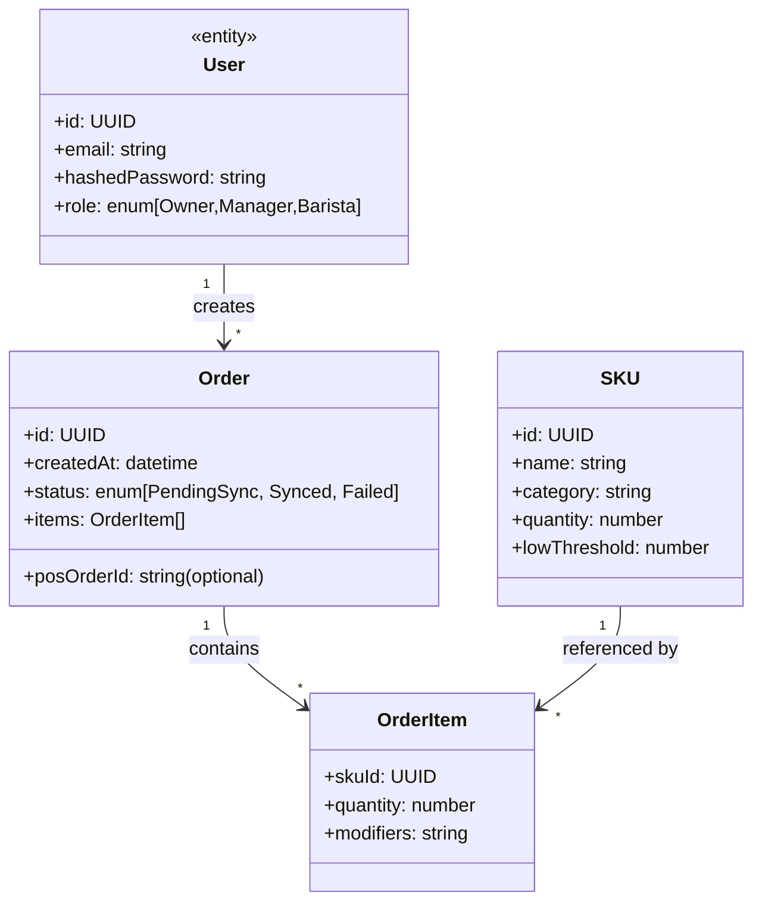
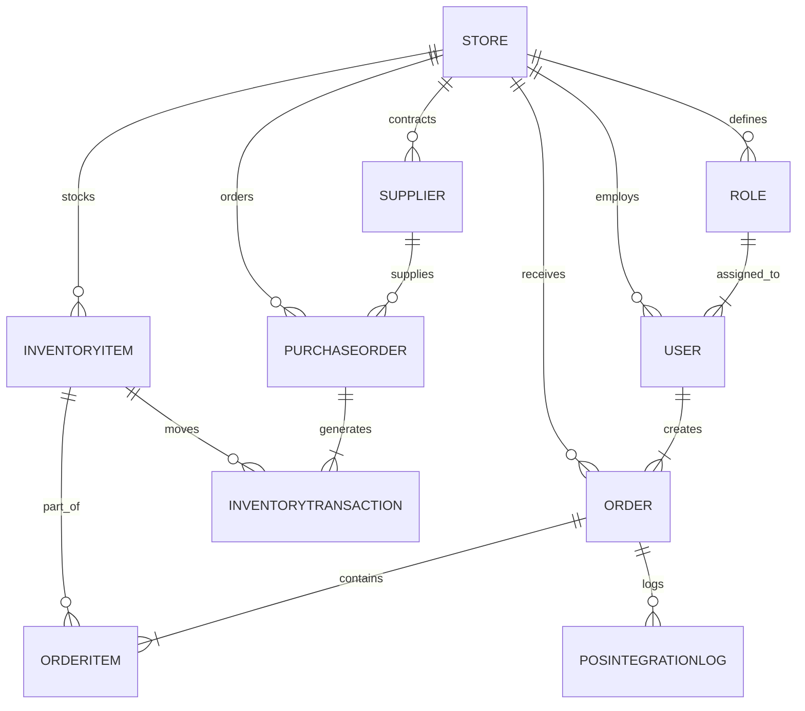

# Software Specification

> Generated by SpecBaker 🎂
> Powered by IBM watsonx.ai

**Generated:** 2026-05-16

**Original Goal:**

> Coffee store  management app

**Project Complexity:** Moderate
**Domain:** Web

---


## Table of Contents

1. [productSummary](#productsummary)
2. [accessDeployment](#accessdeployment)
3. [userRoles](#userroles)
4. [coreRequirements](#corerequirements)
5. [importantDecisions](#importantdecisions)
6. [userJourney](#userjourney)
7. [dataModel](#datamodel)
8. [testScenarios](#testscenarios)
9. [uiScreens](#uiscreens)
10. [implementationPlan](#implementationplan)

## ☕ Coffee Store Management App – Product Summary (MVP)

| **Aspect** | **Details** |
|------------|-------------|
| **Product Goal** | Deliver a web‑only management portal that lets coffee‑shop staff track inventory in real‑time, take customer orders offline, and sync those orders with the existing POS system. |
| **Problem Statement** | The shop currently relies on paper logs and manual stock counts, leading to stock‑outs, over‑ordering, and lost sales when the internet drops during busy periods. |
| **Target Users** | 1. **Baristas** – need to take orders on any device (tablet, laptop, phone) even without connectivity.<br>2. **Store Manager** – monitors inventory levels, receives low‑stock alerts, and reconciles orders with the POS.<br>3. **Owner/Accountant** – views periodic inventory reports for budgeting. |
| **Core Use‑Cases (MVP)** | 1. **Take Order (Offline)** – Barista creates an order, selects items, and saves it locally.<br>2. **Sync Orders** – When connectivity is restored, the app pushes pending orders to the POS and marks them “synced”.<br>3. **Update Inventory** – Each order automatically decrements inventory; manager can manually adjust stock counts.<br>4. **Low‑Stock Alerts** – System flags items below a configurable threshold (e.g., 10 units).<br>5. **POS Integration** – Orders are sent to the existing POS via its REST API; inventory changes are reflected back to the POS if it supports stock updates. |
| **Success Criteria** | - 100 % of orders created offline are successfully synced within 5 seconds of reconnection.<br>- Inventory view updates in <2 seconds for the manager.<br>- Integration passes POS API contract tests (order creation, stock update).<br>- No data loss after at least 30 days of simulated offline usage.<br>- Positive usability rating ≥ 4/5 from a pilot group of 5 baristas. |
| **Key Value Propositions** | - **Zero‑downtime ordering** – sales continue even when Wi‑Fi fails.<br>- **Accurate stock visibility** – prevents over‑selling and waste.<br>- **Single web portal** – no need to install native apps.<br>- **Seamless POS sync** – eliminates double entry. |
| **Scope Summary (MVP)** | - Web‑only responsive UI (HTML5 + CSS + JS framework of choice).<br>- Service Worker + IndexedDB for offline order storage.<br>- Inventory module (CRUD, low‑stock alerts).<br>- POS integration layer (REST API client).<br>- Basic authentication/role‑based access (Barista vs Manager).<br>- Deployment on a cloud host (e.g., Azure/App Service). |
| **Assumptions** | 1. The existing POS exposes a documented **REST API** for order creation and stock updates.<br>2. Baristas will use modern browsers that support Service Workers (Chrome, Safari, Edge).<br>3. Inventory items are simple SKUs (no complex BOM).<br>4. Security requirements are limited to HTTPS and basic auth/JWT; no SSO needed for MVP.<br>5. The shop has a reliable internet connection most of the time, so offline is a fallback, not the primary mode. |
| **Open Questions** | - What authentication method does the POS require (API key, OAuth2, etc.)?<br>- Are there any regulatory compliance needs (e.g., PCI‑DSS for payment data) that affect the web app?<br>- What is the expected maximum concurrent users during peak hours?<br>- Should the inventory module support batch imports (CSV) for initial stock load?<br>- Is there a need for multi‑store (franchise) support in later phases? |
| **Remarks / Risks** | - **Offline Sync Conflicts** – If two baristas modify the same inventory item offline, conflict‑resolution logic must be defined (e.g., last‑write‑wins or manager review).<br>- **POS API Rate Limits** – Verify limits to avoid throttling during bulk sync.<br>- **Data Persistence** – Ensure IndexedDB data is persisted across browser restarts and cleared only after successful sync.<br>- **Scalability** – Use a stateless backend (e.g., Node/Express) behind a load balancer to allow horizontal scaling if traffic grows.<br>- **Testing** – Include automated end‑to‑end tests that simulate offline → online transitions. |

---

### Simple Architecture Sketch (MVP)

```
+-------------------+        HTTPS        +-------------------+
|   Browser (Barista)  <----------------->  Web Server (API) |
|  (React/Angular)   |                     |  (Node/Express)   |
|  Service Worker    |                     |  - Auth (JWT)     |
|  IndexedDB (offline) |   Sync Orders   |  - Inventory CRUD |
+----------+--------+                     |  - POS Integration|
           |                               +--------+----------+
           |                                        |
           |   POS REST API (order, stock)          |
           v                                        v
      +----------+                           +----------+
      |   POS    |                           | Database |
      | (Existing)                         | (PostgreSQL)|
      +----------+                           +----------+
```

*Barista UI → Service Worker caches orders → on reconnect, API pushes to POS and updates DB.*

---

**Next Steps for Development Team**

1. **Confirm POS API details** (auth, endpoints, rate limits).
2. **Select front‑end framework** (React + Redux Toolkit recommended).
3. **Define data model** for inventory items and orders.
4. **Prototype offline order flow** using Service Worker & IndexedDB.
5. **Implement low‑stock alert thresholds** configurable per item.
6. **Set up CI/CD pipeline** with automated integration tests for POS sync.

*Once the above items are validated, the team can begin sprint planning for the MVP.*

## Access & Deployment Specification
*Coffee‑store Management App – MVP (Inventory tracking + offline barista ordering + POS integration)*

---

### 1. How Users Access the Application
| Role / User | Access Method | Primary UI | Offline Capability |
|------------|---------------|-----------|--------------------|
| **Barista** | Web browser (desktop or tablet) | Responsive UI (PWA) | **Yes** – can open the ordering screen, add items to a local queue, and sync when connectivity returns. |
| **Store Manager / Owner** | Web browser (desktop, laptop, tablet) | Dashboard UI | No (always online for reporting). |
| **POS System** | Server‑to‑server API (REST/JSON) | N/A | N/A |
| **Support / DevOps** | SSH / CI pipeline | N/A | N/A |

*All users will reach the app via a single URL (e.g., `https://app.coffeestore.com`). No native mobile apps are delivered.*

---

### 2. Deployment Model
| Aspect | Decision |
|--------|----------|
| **Model** | Cloud‑hosted SaaS (single‑tenant or multi‑tenant, TBD). Deployable on any major IaaS (AWS, Azure, GCP) using Docker containers. |
| **Runtime** | • Front‑end: React (compiled to static assets, served via CDN). <br>• Back‑end: Node.js 18 (Express) + PostgreSQL 15. |
| **Hosting** | • Front‑end static files → CDN (e.g., CloudFront, Azure CDN). <br>• API & DB → Managed Kubernetes (EKS/AKS/GKE) or managed container service (Fargate, App Service). |
| **Scalability** | Auto‑scale based on CPU / request count; horizontal pod scaling for API, read‑replicas for PostgreSQL. |
| **CI/CD** | GitHub Actions (or GitLab CI) → build → container registry → automated deployment to dev → staging → prod. |
| **TLS** | Enforced HTTPS with certificates from a trusted CA (e.g., Let’s Encrypt). |
| **Backup / DR** | Daily automated DB snapshots, 7‑day retention, point‑in‑time recovery enabled. |

---

### 3. Technical Requirements

| Category | Requirement |
|----------|-------------|
| **Supported Browsers** | Latest two versions of Chrome, Edge, Firefox, Safari (desktop & mobile). Must support Service Workers for offline PWA. |
| **Operating Systems / Devices** | Windows 10+, macOS 12+, iOS 13+, Android 9+. Any device with a modern browser is acceptable. |
| **Service Worker / PWA** | - Cache static assets and order‑queue data locally. <br>- Sync API (`POST /orders/offline-sync`) when connectivity restored. |
| **Authentication** | OAuth 2.0 / OpenID Connect (e.g., Auth0, Azure AD B2C). Role‑based access control (RBAC): `BARISTA`, `MANAGER`, `ADMIN`. Tokens stored in HttpOnly cookies. |
| **Authorization** | API endpoints enforce RBAC via middleware. Barista can only POST orders; Manager can view inventory & reports; Admin can manage users & POS integration settings. |
| **Network** | - Minimum 3 Mbps outbound for sync (typical coffee‑shop Wi‑Fi). <br>- Offline mode must continue to work with **no network**; sync retries with exponential back‑off. |
| **API Integration (POS)** | - REST endpoint provided by existing POS (documented URL, auth token). <br>- Required calls: `GET /inventory`, `POST /sales`. <br>- Integration layer must translate internal data model to POS schema. |
| **Data Persistence** | Orders created offline stored in IndexedDB; on sync, persisted to PostgreSQL with unique client‑generated UUID to avoid duplicates. |
| **Logging & Monitoring** | Centralized logs (e.g., Loki/ELK) and metrics (Prometheus + Grafana). Alert on sync failures > 5 min. |
| **Security** | OWASP Top 10 mitigations, CSP headers, CSRF protection, rate limiting (100 req/s per IP). |
| **Environment Variables** | `NODE_ENV`, `DB_CONNECTION_STRING`, `POS_API_URL`, `POS_API_KEY`, `JWT_SECRET`, `CDN_URL`, etc. |

---

### 4. Platform Support & Compatibility

| Platform | Minimum Version | Notes |
|----------|----------------|-------|
| Chrome | 92+ | Full PWA support |
| Edge | 92+ | |
| Firefox | 90+ | |
| Safari (macOS/iOS) | 14+ | Service Worker support required |
| iOS Safari | 13+ | Offline storage limited to 50 MB (acceptable for order queue) |
| Android Chrome | 9+ | |
| Windows | 10 | |
| macOS | 12 (Monterey) | |

*Testing matrix: each major browser on desktop + Chrome on Android + Safari on iOS.*

---

### 5. Authentication & Access Control

1. **Login Flow**
   - User navigates to `/login`.
   - Redirect to OAuth provider → returns `id_token` & `access_token`.
   - Server validates token, creates a session cookie (`HttpOnly`, `Secure`, `SameSite=Strict`).

2. **RBAC Enforcement**
   - Middleware reads user role from token claims.
   - Routes are annotated with required roles.
   - UI components hide/show based on role (client‑side) **and** server validates every request.

3. **Session Expiry**
   - Access token TTL: 1 hour. Refresh token flow (if provider supports) or re‑login required.

4. **Barista Offline**
   - After initial login, a **refresh token** is stored in IndexedDB (encrypted) to allow token renewal when back online.

---

### 6. Network & Offline Requirements

| Requirement | Detail |
|-------------|--------|
| **Online** | All API calls (inventory, sync) require HTTPS. |
| **Offline** | Barista UI must load from cache (HTML/CSS/JS) and store new orders locally. No server interaction required until network is restored. |
| **Sync Strategy** | On reconnection, client sends a batch of pending orders (`POST /orders/offline-sync`). Server deduplicates using client‑generated UUIDs. |
| **Connectivity Checks** | Service Worker listens to `online`/`offline` events; UI shows “Offline – orders will sync automatically”. |

---

### 7. Environment Requirements

| Environment | Purpose | Key Config |
|-------------|---------|------------|
| **Development** | Local coding & unit tests. | Docker Compose (frontend, backend, DB). Hot‑reload enabled. |
| **Staging** | Pre‑production validation, integration tests with POS sandbox. | Same infra as prod but with lower scaling, test POS credentials. |
| **Production** | Live coffee‑store usage. | Autoscaling, monitoring, backups, real POS credentials. |
| **Local Development** | Optional for UI only. | `npm start` serves React dev server; proxy to local API. |

*All environments must use the same environment‑variable schema; secrets injected via CI pipeline (e.g., GitHub Secrets).*

---

### 8. Assumptions
- **POS Integration**: The existing POS exposes a documented REST API with OAuth‑2 client‑credentials flow. No custom middleware beyond request/response mapping is required.
- **User Management**: An external IdP (Auth0, Azure AD B2C, etc.) will be provisioned; the app does not need to implement password storage.
- **Offline Data Volume**: Barista order queue will never exceed 5 MB per shift, comfortably fitting within IndexedDB limits.
- **Hosting Provider**: Cloud provider will support managed PostgreSQL and container orchestration (e.g., AWS RDS + EKS). If a different provider is chosen, equivalent services must exist.

---

### 9. Open Questions
1. **POS API Details** – What are the exact endpoint URLs, authentication method, and data schema for inventory and sales?
2. **Tenant Model** – Will the app be single‑tenant (one coffee store) or multi‑tenant (multiple stores on the same instance)?
3. **Compliance Requirements** – Any PCI‑DSS, GDPR, or local data‑privacy regulations that affect logging, data retention, or user consent?
4. **Performance SLAs** – Desired maximum latency for order sync and inventory refresh?
5. **User Provisioning** – Will managers be able to invite barista accounts, or will an admin create them manually?

---

### 10. Remarks & Considerations
- **Security**: Because the app handles sales data, enforce strict CSP, X‑Content‑Type‑Options, and HSTS headers.
- **Scalability**: Even though MVP is modest, design the API statelessly to allow horizontal scaling from day one.
- **Offline Conflict Resolution**: If two baristas edit the same inventory item offline, the server should apply “last‑write‑wins” based on timestamp, but a future enhancement could include manual reconciliation.
- **Testing**: Include end‑to‑end Cypress tests that simulate offline mode (using `cy.intercept` + `cy.goOffline`).
- **Monitoring**: Set up alerts for sync failures > 5 minutes, high error rates (> 2 %), and DB connection spikes.

---

*Prepared for the development team to start provisioning infrastructure, configuring CI/CD pipelines, and building the PWA front‑end with offline support.*

## Coffee‑Store Management App – User Roles Specification

> **Purpose** – Define who will use the web‑only system, what they can do, and what they cannot. This drives UI design, API scopes, data‑access rules, and test cases for the MVP (inventory tracking + offline order taking + POS integration).

---

### 1. Primary User Types

| Role | Core Goal (Why they need the app) | Typical Device | Primary UI Section |
|------|----------------------------------|----------------|--------------------|
| **Barista** | Take customer orders, view current inventory, mark items as used, work offline when the network is down. | Tablet / desktop browser (landscape) | Order‑Entry, Inventory Quick‑Check |
| **Store Manager** | Oversee daily operations, approve inventory adjustments, view sales & POS sync status, manage staff accounts. | Desktop / laptop browser | Dashboard, Inventory Management, Staff Admin |
| **Inventory Clerk** | Record deliveries, conduct stock counts, adjust inventory levels, generate low‑stock alerts. | Desktop / tablet browser | Inventory Management, Reports |
| **Owner / System Administrator** | Configure the whole system (POS integration, user roles, security settings), view high‑level analytics, backup/restore data. | Any browser (desktop preferred) | Settings, Integrations, Analytics |

---

### 2. Secondary User Types

| Role | Reason for inclusion (future‑proof) | Access notes |
|------|------------------------------------|--------------|
| **Shift Supervisor** | May need to approve barista‑submitted offline orders before they are sent to POS. | Limited to order‑approval workflow; cannot edit inventory. |
| **Accountant** | Needs read‑only access to sales & inventory reports for bookkeeping. | View‑only on Finance & Reports modules; no UI for order entry. |
| **Maintenance / IT** | Troubleshoot sync issues, monitor system health. | Access to system logs & sync status; no business data editing. |

---

### 3. Personas (practical, human‑focused descriptions)

| Persona | Role | Daily Tasks | Pain Points (MVP focus) |
|---------|------|-------------|--------------------------|
| **Lena** (Barista, 2 years) | Barista | Open order screen, add items, submit to POS, check if beans are in stock, work during Wi‑Fi outage. | Needs instant offline UI; cannot lose orders if connection drops. |
| **Marco** (Store Manager, 5 years) | Store Manager | Review low‑stock alerts, approve inventory receipts, monitor POS sync health, add new barista accounts. | Must see real‑time inventory & know when offline orders have been synced. |
| **Jia** (Inventory Clerk, part‑time) | Inventory Clerk | Receive delivery, scan items, update counts, generate weekly stock report. | Requires bulk edit UI and clear audit trail for adjustments. |
| **Sofia** (Owner, 10 years) | Owner / Admin | Set up POS API keys, view monthly revenue, grant/revoke staff permissions, export data for accounting. | Wants a single place to control integrations and security. |

---

### 4. Permissions & Access Levels

| Permission | Barista | Store Manager | Inventory Clerk | Owner / Admin | Shift Supervisor | Accountant |
|------------|:-------:|:-------------:|:---------------:|:-------------:|:----------------:|:----------:|
| **View Inventory** | ✅ | ✅ | ✅ | ✅ | ✅ | ✅ |
| **Edit Inventory (add/adjust)** | ❌ | ✅ (approve) | ✅ | ✅ | ❌ | ❌ |
| **Create Offline Order** | ✅ | ✅ | ❌ | ✅ | ✅ (approve) | ❌ |
| **Submit Order to POS** | ✅ (auto‑sync) | ✅ | ❌ | ✅ | ✅ (approve) | ❌ |
| **Approve Offline Orders** | ❌ | ✅ | ❌ | ✅ | ✅ | ❌ |
| **Configure POS Integration** | ❌ | ❌ | ❌ | ✅ | ❌ | ❌ |
| **Manage Users / Roles** | ❌ | ✅ (manage staff) | ❌ | ✅ | ❌ | ❌ |
| **View Financial Reports** | ❌ | ✅ | ✅ (limited) | ✅ | ❌ | ✅ |
| **Export Data** | ❌ | ✅ | ✅ | ✅ | ❌ | ✅ |
| **Access System Logs** | ❌ | ❌ | ❌ | ✅ | ✅ (IT) | ❌ |

*✅ = allowed, ❌ = not allowed, “✅ (limited)” = read‑only or restricted to specific fields.*

---

### 5. Responsibilities per Role

| Role | Key Responsibilities |
|------|-----------------------|
| **Barista** | • Capture orders (online or offline). <br>• Mark items as “used” to decrement inventory in real time. <br>• Sync offline orders automatically when connectivity returns. |
| **Store Manager** | • Review and approve inventory changes. <br>• Monitor POS‑sync health and resolve conflicts. <br>• Onboard / deactivate staff accounts. |
| **Inventory Clerk** | • Record incoming shipments (quantity, SKU). <br>• Perform periodic stock‑takes and reconcile discrepancies. <br>• Set low‑stock thresholds and receive alerts. |
| **Owner / Admin** | • Set up POS API credentials & mapping. <br>• Define role‑based permissions. <br>• Generate/export enterprise‑level reports. <br>• Perform data backup / restore. |
| **Shift Supervisor** | • Review offline orders submitted by baristas before they are pushed to POS. |
| **Accountant** | • View sales, cost‑of‑goods‑sold, and inventory valuation reports. <br>• Export CSV/Excel for accounting software. |
| **Maintenance / IT** | • Access system health dashboard, error logs, and sync status. <br>• Reset offline cache if corrupted. |

---

### 6. Role‑Based Limitations

| Role | Limitation |
|------|------------|
| **Barista** | Cannot modify inventory levels directly; only “use” items which decrements count. |
| **Store Manager** | Cannot delete the Owner account or change POS integration keys. |
| **Inventory Clerk** | Cannot submit orders to POS; can only adjust inventory. |
| **Shift Supervisor** | No visibility into financial reports or system settings. |
| **Accountant** | No ability to edit any data; read‑only on reports. |
| **Maintenance / IT** | No access to business data (orders, inventory) – only technical logs. |

---

### 7. Admin / Operator Role

- **Owner / System Administrator** is the **single source of truth** for:
  - Creating, editing, and deleting all other roles.
  - Managing POS integration (API keys, endpoint URLs, mapping of POS items to internal SKUs).
  - Setting global security policies (password complexity, session timeout).
  - Performing full data export/import and system backups.

---

### 8. Assumptions (explicitly inferred)

| # | Assumption |
|---|------------|
| A1 | Authentication will be handled via email + password (or SSO) and JWT tokens stored in HttpOnly cookies. |
| A2 | Offline data (orders, inventory adjustments) will be persisted in the browser’s IndexedDB and synced via a background worker when the network is restored. |
| A3 | POS integration is a RESTful API that accepts order payloads and returns an acknowledgement ID. |
| A4 | The MVP supports a **single store**; multi‑store handling will be added in a later phase. |
| A5 | All roles share the same UI theme; role‑specific menus are hidden/shown based on permissions. |
| A6 | Audit trails (who changed inventory, when) are stored in a server‑side log table and are immutable. |
| A7 | The system will run on a modern browser (Chrome/Edge/Firefox) that supports Service Workers and IndexedDB. |

---

### 9. Open Questions (need clarification)

| # | Question |
|---|----------|
| Q1 | Will baristas ever need to **edit** an offline order after it’s saved locally (e.g., change item quantity)? |
| Q2 | Should the system support **role hierarchy** (e.g., Manager inherits Barista permissions) or flat explicit permission lists? |
| Q3 | What is the required **retention period** for audit logs and offline order caches? |
| Q4 | Are there any **regulatory compliance** requirements (e.g., GDPR) that affect user data handling? |
| Q5 | Will the POS integration require **real‑time push** (WebSocket) or is a simple HTTP POST sufficient? |
| Q6 | Is there a need for **two‑factor authentication** for Owner/Admin accounts? |

---

### 10. Remarks (technical & UX considerations)

- **Security** – Enforce least‑privilege principle; all API endpoints must validate JWT scopes. Sensitive actions (e.g., inventory adjustments) should require re‑authentication or a short “confirm password” modal.
- **Offline Conflict Resolution** – When an offline order sync collides with a concurrent online order (e.g., same inventory item), the system must prioritize the earliest timestamp and surface a conflict UI for the Manager to resolve.
- **Performance** – Inventory list should be cached client‑side; updates from offline sync must merge without full page reload.
- **Scalability** – Design permission checks as a reusable middleware so adding new roles later (e.g., “Regional Manager”) is trivial.
- **UX** – Barista UI must be **single‑page, minimal clicks**, with large touch targets for tablets. Offline indicator (green/red badge) should be always visible.
- **Testing** – Include automated tests for:
  - Role‑based API access (403 for unauthorized).
  - Offline order creation, storage, and sync.
  - Inventory decrement logic when multiple offline orders affect the same SKU.

---

*This specification provides a concrete, testable foundation for building the user‑role layer of the Coffee‑Store Management web app.*

# Coffee Store Management App – Clarified Specification (MVP)

---

## 1. Core Functional Requirements

| # | Requirement | Description | Acceptance Test |
|---|-------------|-------------|-----------------|
| **F1** | **Web‑only UI** | The system is delivered as a responsive web application that runs in modern browsers (Chrome, Edge, Safari, Firefox) on desktop, tablet, and mobile devices. | UI loads correctly on Chrome (desktop) and Safari (iPhone) without errors. |
| **F2** | **User Roles** | Three roles are defined: **Admin**, **Barista**, **Inventory Clerk**. Role‑based access controls restrict UI elements and API endpoints. | Logging in as each role shows only permitted menus; attempts to access forbidden endpoints return 403. |
| **F3** | **Inventory Tracking (MVP)** | - Add / edit / delete product items (name, SKU, unit, cost, selling price, reorder‑level). <br>- Record stock movements (receipts, usage, waste). <br>- Real‑time stock level view per item. | Admin creates a new product, records a receipt of 10 units, then a usage of 3 units; displayed quantity = 7. |
| **F4** | **Barista Order Capture (Offline‑first)** | Baristas can create, edit, and cancel customer orders while offline. Orders are stored locally (IndexedDB) and automatically synced to the server when connectivity is restored. | With network disabled, barista creates an order; order appears in UI. After re‑enabling network, the order is persisted on the server and visible to Admin. |
| **F5** | **Order Sync & Conflict Resolution** | On sync, if the same order was modified on the server, the client must merge changes using “last‑write‑wins” and flag the order for manual review. | Simulate concurrent edit; after sync, server version wins and a warning icon appears on the order. |
| **F6** | **POS Integration (Initial)** | The app must push completed orders to the existing POS via its REST API (`POST /orders`). The POS returns an order ID which is stored locally. | After an order is marked *Completed*, a POST is made to the POS mock endpoint; response contains `posOrderId`; UI shows the ID. |
| **F7** | **Dashboard (Admin)** | Summary view showing: total inventory value, low‑stock alerts (stock ≤ reorder‑level), today’s sales count, and number of pending offline orders. | Admin logs in; dashboard displays correct counts based on seeded data. |
| **F8** | **Audit Log** | Every create / update / delete on inventory and orders is recorded with user, timestamp, and operation type. | Admin updates a product; audit table contains a row with `operation=UPDATE`, correct user, and timestamp. |
| **F9** | **Authentication & Session Management** | Users authenticate via email/password (hashed with bcrypt). JWT access token (15 min) + refresh token (7 days) stored in HttpOnly cookies. | Successful login returns JWT; subsequent API calls succeed; after token expiry, refresh flow works without re‑login. |

---

## 2. Non‑Functional Requirements

| Category | Requirement | Acceptance Test |
|----------|-------------|-----------------|
| **Performance** | UI must render the inventory list (≤ 200 rows) in < 2 s on a 3G connection. | Load test with throttled 3G; list appears within 2 s. |
| **Security** | - All API endpoints require HTTPS.<br>- Input sanitisation to prevent XSS/SQLi.<br>- Role‑based authorization enforced server‑side.<br>- Passwords stored with bcrypt (cost ≥ 12). | Penetration test verifies no XSS injection; unauthorized API call returns 401/403. |
| **Scalability** | Stateless backend; can be horizontally scaled behind a load balancer. | Deploy two identical containers behind Nginx; traffic is balanced without session loss. |
| **Reliability** | Offline order capture must survive browser reloads and device restarts. Data persisted in IndexedDB. | Close browser, reopen, offline orders still present. |
| **Usability** | UI follows WCAG AA contrast; barista order screen supports keyboard navigation and large touch targets (≥ 44 px). | Accessibility audit passes AA; barista can complete an order using only keyboard. |
| **Maintainability** | Codebase follows a layered architecture (API → Service → Repository). Unit test coverage ≥ 80 % for core modules. | CI pipeline reports ≥ 80 % coverage on pull request. |

---

## 3. Technical Constraints

| Constraint | Detail |
|------------|--------|
| **Frontend** | React 18 + TypeScript + Vite. State management with Redux Toolkit. UI library: Material‑UI (MUI). |
| **Offline Storage** | IndexedDB accessed via `idb` library. Sync logic implemented with Service Workers (Workbox). |
| **Backend** | Node.js 20 + Express 4. JWT authentication. PostgreSQL 15 for persistent data. |
| **Hosting** | Deploy to a cloud provider (e.g., AWS Elastic Beanstalk or Azure App Service) behind an HTTPS‑terminating load balancer. |
| **POS API** | Existing POS exposes a REST endpoint secured with API key (provided by client). Must be called from backend (server‑to‑server) to keep the key secret. |
| **CI/CD** | GitHub Actions: lint → unit tests → build → deploy to staging. |

---

## 4. Integration Requirements

| # | Integration | Details |
|---|-------------|---------|
| **I1** | **POS System** | - Backend calls `POST https://pos.example.com/api/orders` with JSON payload `{orderId, items[], total, timestamp}`.<br>- API key passed in `Authorization: Bearer <key>` header.<br>- POS returns `{posOrderId}`; store it on the order record. |
| **I2** | **Email Service (future)** | Not required for MVP; placeholder interface defined for later notification of low‑stock alerts. |
| **I3** | **Analytics** | Google Analytics (GA4) script loaded on all pages; no personal data sent. |

---

## 5. Data Requirements

| Entity | Key Fields | Important Attributes |
|--------|------------|----------------------|
| **User** | `id (UUID)`, `email`, `passwordHash`, `role` | `createdAt`, `lastLoginAt` |
| **Product** | `id (UUID)`, `sku`, `name`, `unit`, `costPrice`, `sellPrice`, `reorderLevel` | `stockQty`, `createdAt`, `updatedAt` |
| **StockMovement** | `id`, `productId`, `type (RECEIPT|USAGE|WASTE)`, `quantity`, `timestamp`, `userId` | |
| **Order** | `id`, `status (DRAFT|COMPLETED|SYNCED)`, `items[]`, `total`, `createdAt`, `updatedAt`, `posOrderId (nullable)` | `offline = true/false` |
| **AuditLog** | `id`, `entity`, `entityId`, `operation`, `userId`, `timestamp`, `details` | |

All tables use `UUID` primary keys. Foreign keys enforce referential integrity.

---

## 6. Validation Rules

| Rule | Context | Condition |
|------|---------|-----------|
| **V1** | Product creation | `sku` must be unique; `name` non‑empty; `stockQty` ≥ 0; `reorderLevel` ≥ 0. |
| **V2** | Stock movement | `quantity` > 0; resulting `stockQty` after movement cannot be negative. |
| **V3** | Order item | `quantity` > 0; `productId` must exist and have sufficient stock (unless order is saved offline). |
| **V4** | User login | Email format valid; password length ≥ 8. |
| **V5** | POS sync payload | `total` must equal sum of (`item.quantity * product.sellPrice`). |

---

## 7. Error Handling Requirements

| Scenario | Response | UI Behaviour |
|----------|----------|--------------|
| **E1** | API validation failure (400) | Show field‑specific error messages inline. |
| **E2** | Unauthorized (401) | Redirect to login page with “Session expired” toast. |
| **E3** | Forbidden (403) | Show “You do not have permission to perform this action.” modal. |
| **E4** | POS integration failure (5xx) | Queue order for retry; display non‑intrusive banner “Sync with POS pending”. |
| **E5** | Offline sync conflict | Mark order with warning icon; provide “Resolve” button opening a diff view. |
| **E6** | Network loss while online | Switch UI to “offline mode” indicator; continue allowing offline actions. |

All error responses follow a JSON envelope: `{code, message, details?}`.

---

## 8. Acceptance Criteria (Major Requirements)

1. **Inventory Tracking** – Admin can CRUD products, view real‑time stock, receive low‑stock alerts.
2. **Offline Order Capture** – Barista can create orders with no network, orders persist across reloads, and sync automatically when online.
3. **POS Integration** – Completed orders are posted to the POS API; POS order ID is stored and displayed.
4. **Security** – All communications over HTTPS; passwords hashed; JWT auth works; role‑based checks enforced.
5. **Performance** – Inventory list loads < 2 s on throttled 3G; sync of ≤ 50 offline orders completes within 5 s after reconnection.

---

## 9. Assumptions

| # | Assumption |
|---|------------|
| **A1** | The existing POS provides a stable REST endpoint with API key authentication (no OAuth). |
| **A2** | Barista devices are modern browsers that support Service Workers and IndexedDB. |
| **A3** | No multi‑store (multiple locations) support is required for MVP. |
| **A4** | Email verification is out of scope for the first release. |
| **A5** | Inventory adjustments are performed only by the Inventory Clerk or Admin; baristas cannot modify stock directly. |

---

## 10. Open Questions

| # | Question |
|---|----------|
| **Q1** | What is the exact format of the POS order payload (field names, required vs optional)? |
| **Q2** | Should the system generate automatic purchase orders when stock falls below reorder level, or just display alerts? |
| **Q3** | Is there a need for multi‑currency support (e.g., USD vs local currency)? |
| **Q4** | What is the expected maximum concurrent offline orders per barista (affects IndexedDB sizing)? |
| **Q5** | Will there be any reporting/export (CSV/Excel) requirements in later phases? |

---

## 11. Remarks

* **Scalability Note** – Because the backend is stateless, adding a Redis cache for frequently accessed inventory data can be considered after MVP.
* **Testing** – Include end‑to‑end Cypress tests for offline → online sync flow and POS integration mock.
* **Future Enhancements** – Mobile‑native wrappers (PWA) can be added later to improve barista experience without building separate native apps.

---

*Prepared by: Systems Analyst – Coffee Store Management App*
*Date: 2026‑05‑16*

# Coffee Store Management App – MVP Specification
**Domain:** Web (browser‑only)
**Complexity:** Moderate

---

## 1. Overview

The first release delivers a **web‑only** application that lets coffee‑shop staff manage inventory, take customer orders **offline**, and sync those orders with the existing **POS system** when connectivity returns.

*Why:*
- Centralised, real‑time view of stock prevents waste and stock‑outs.
- Baristas can keep serving when the internet drops, preserving sales.
- Integration with the current POS avoids duplicate data entry and keeps accounting accurate.

---

## 2. Functional Requirements

| ID | Feature | Description | Acceptance Criteria |
|----|---------|-------------|----------------------|
| **FR‑001** | Inventory Dashboard | Shows current stock levels for all SKUs (beans, milk, syrups, disposables, etc.). | - List sortable by name, category, low‑stock flag.<br>- Stock quantity updates in real time for online users.<br>- Low‑stock threshold configurable per SKU. |
| **FR‑002** | Inventory Edit | Authorized users (Manager, Owner) can add, edit, or delete SKUs and adjust quantities. | - Form validation (numeric qty ≥ 0).<br>- Change audit log stored. |
| **FR‑003** | Barista Order UI (Online & Offline) | Simple order‑taking screen (item picker, quantity, modifiers). Works when the browser is offline. | - Orders can be saved locally when `navigator.onLine === false`.<br>- UI indicates “Offline – will sync later”. |
| **FR‑004** | Sync Engine | When connectivity is restored, all locally‑saved orders are sent to the backend and then to the POS. | - Successful sync clears local store.<br>- Retry with exponential back‑off on failure.<br>- Conflict resolution: if inventory changed, barista sees a warning before finalising. |
| **FR‑005** | POS Integration | After order sync, the order is posted to the existing POS via its REST API. | - POS returns order ID → stored in our DB.<br>- If POS rejects, order is flagged for manual review. |
| **FR‑006** | Authentication & Authorization | Role‑based access (Owner, Manager, Barista). Single‑sign‑on (SSO) optional for future. | - JWT issued after login.<br>- UI elements hidden/disabled per role. |
| **FR‑007** | Audit & Reporting (MVP) | Basic report: “Current inventory”, “Orders processed today”. | - Exportable CSV. |
| **FR‑008** | Responsive Design | UI works on desktop, tablet, and phone browsers. | - No horizontal scroll at 320 px width. |

---

## 3. Non‑Functional Requirements

| Category | Requirement |
|----------|-------------|
| **Performance** | Page load < 2 s on 3G; inventory list pagination (max 50 rows per page). |
| **Reliability** | Offline order capture must survive browser refresh or tab close (IndexedDB persistence). |
| **Security** | HTTPS everywhere; JWT signed with RS256; CSRF protection; input sanitisation. |
| **Scalability** | Stateless front‑end; back‑end horizontally scalable behind a load balancer; DB sharding not required for MVP but design for future growth. |
| **Maintainability** | Clean architecture (feature‑sliced modules); unit tests ≥ 80 % for core logic; linting & CI pipeline. |
| **Compliance** | GDPR‑compatible: no personal data stored beyond order details; ability to delete a user’s data on request. |

---

## 4. Data Model (simplified)



*All tables have `createdAt`, `updatedAt`, and audit fields.*

---

## 5. Offline‑Sync Strategy

1. **Local Store** – Use **IndexedDB** via the `idb` library.
2. **Write‑Ahead** – When an order is submitted offline, write a record with status `PendingSync`.
3. **Sync Worker** – A Service Worker (or background `setInterval`) monitors `navigator.onLine`. On transition to online:
   - Pull pending orders, send to back‑end `/api/orders/sync`.
   - Back‑end validates, updates inventory, forwards to POS, returns POS order ID.
   - On success → status `Synced` → remove from IndexedDB.
   - On failure → status `Failed` + error message; UI shows “Retry” button.
4. **Conflict Handling** – If inventory quantity would go negative, back‑end rejects and returns the current quantity; UI prompts barista to adjust.

---

## 6. POS Integration (MVP)

| Item | Detail |
|------|--------|
| **API Type** | Existing POS exposes a **RESTful JSON** endpoint `POST /orders`. |
| **Auth** | API key (provided by POS vendor). Store in server‑side env var `POS_API_KEY`. |
| **Payload** | `{ orderId, items:[{sku, qty, modifiers}], total }`. |
| **Response** | `{ success:true, posOrderId:string }` or error object. |
| **Error Handling** | On 5xx → retry up to 3 times; on 4xx → flag order for manual review. |

*If the POS API changes, a thin **adapter layer** (`src/integrations/posAdapter.js`) isolates the rest of the code.*

---

## 7. UI / UX Highlights

- **Top navigation**: Inventory, Orders, Reports, Settings (role‑based).
- **Inventory page**: Table with colour‑coded low‑stock rows (red). Inline edit for quantity.
- **Order page (Barista)**: Large buttons for popular items, quick‑add modifiers, “Submit” becomes “Save Offline” when offline (icon change).
- **Sync status indicator**: Persistent banner at bottom showing “All orders synced” or “3 orders pending sync”.

---

## 8. Acceptance Criteria (MVP Complete)

1. All FR‑001 – FR‑008 implemented and demoed.
2. Offline order capture works across Chrome/Firefox/Safari on desktop & mobile browsers.
3. Successful sync with POS for at least 10 consecutive orders.
4. Role‑based UI hides inventory edit for Barista.
5. Security scan (OWASP ZAP) passes with no critical findings.
6. Unit tests ≥ 80 % for inventory service, order sync service, POS adapter.
7. Deployment to staging environment with HTTPS and CI pipeline passing.

---

## 9. Important Decisions

| # | Decision | Rationale | Tech Choice | Trade‑offs / Implications | Design Pattern | Security | Scalability | Maintainability | Open / Pending |
|---|----------|-----------|-------------|---------------------------|----------------|----------|-------------|-----------------|----------------|
| **D1** | **Web‑only delivery** | Reduces scope, leverages existing browser capabilities; mobile browsers already supported. | React 18 + Vite, responsive CSS (Tailwind). | No native push notifications; relies on Service Worker for offline. | Feature‑sliced architecture (modules per domain). | JWT + HTTPS. | Stateless front‑end; can add PWA later. | Easy to extend to native via React Native if needed. | ✅ |
| **D2** | **Offline order capture using IndexedDB** | Provides durable client‑side storage; works across browsers without extra plugins. | `idb` library, Service Worker for sync. | Larger bundle size; requires careful migration when schema changes. | Repository pattern for local data access. | Data stays on client until sync → no server exposure. | Client‑side load negligible; sync load handled by back‑end queue. | Clear separation of local vs remote repos simplifies testing. | ✅ |
| **D3** | **Backend stack: Node.js (Express) + PostgreSQL** | Familiar to team, good async handling for sync, strong transactional support for inventory updates. | Node 20, Express, TypeORM, PostgreSQL 15. | Not serverless; requires VM/container management. | Domain‑Driven Design (services, repositories). | Helmet, rate‑limiting, JWT verification. | Horizontal scaling via container orchestration (Docker + K8s). | TypeORM migrations keep DB schema versioned. | ✅ |
| **D4** | **POS integration via thin adapter layer** | Isolates external API changes; keeps core domain clean. | Adapter module (`src/integrations/posAdapter.js`). | Slight latency added; extra code to maintain. | Adapter pattern. | API key stored in env, never exposed to client. | Adapter can be swapped for mock during load testing. | Unit‑testable in isolation. | ✅ |
| **D5** | **Authentication with JWT (RS256)** | Stateless, works well for SPA, easy role checks. | `jsonwebtoken`, RSA key pair. | Token revocation requires short expiry + refresh endpoint. | Guard middleware. | Tokens signed with private key; public key in JWKS endpoint. | Scales horizontally – no session store. | Centralised auth service can be replaced later. | ✅ |
| **D6** | **Responsive UI using Tailwind CSS** | Fast development, consistent design system, mobile‑first. | Tailwind v3, React component library (Headless UI). | Utility‑first CSS may be unfamiliar to new devs. | Component composition. | No CSS injection risk; CSP can whitelist `style-src`. | CSS generated at build time – minimal runtime cost. | Tailwind config versioned; easy theming later. | ✅ |
| **D7** | **Data sync retry strategy – exponential back‑off** | Reduces load spikes on flaky networks, improves user experience. | Custom retry utility (max 5 attempts). | Longer wait time for persistent failures; may need manual retry UI. | Retry pattern. | No security impact. | Handles burst sync after long offline periods. | Centralised logic, reusable. | ✅ |
| **D8** | **Audit logging for inventory changes** | Needed for compliance and troubleshooting. | PostgreSQL `audit_log` table, write via DB trigger or service layer. | Extra write per change; minor performance hit. | Decorator pattern around repository. | Log entries immutable; access limited to Owner/Manager. | Scales with DB partitioning if volume grows. | Simple queryable logs. | ✅ |
| **D9** | **Future PWA support (add to home screen, push)** | Not required for MVP but kept in roadmap. | Service Worker already present; manifest file prepared. | Additional testing on iOS/Android browsers. | – | – | – | – | **Pending** – decide timeline after MVP. |
| **D10** | **CI/CD pipeline** | Guarantees quality and fast releases. | GitHub Actions: lint, test, build, Docker push, deploy to staging. | Requires maintenance of pipeline scripts. | – | Secrets stored in GitHub Encrypted Secrets. | Docker containers enable easy scaling. | Automated tests keep codebase healthy. | ✅ |

---

## 10. Assumptions

| # | Assumption |
|---|------------|
| **A1** | The existing POS system provides a stable REST endpoint with API key authentication. |
| **A2** | Inventory SKUs are relatively static; bulk import/export is not needed in MVP. |
| **A3** | Users will access the app via modern browsers that support Service Workers and IndexedDB. |
| **A4** | Role management (Owner/Manager/Barista) will be handled internally; no external identity provider needed now. |
| **A5** | Low‑stock thresholds are set per SKU by a Manager and do not require complex forecasting. |

---

## 11. Open Questions

| # | Question |
|---|----------|
| **Q1** | What is the exact authentication flow for existing staff (e.g., LDAP, SSO) – do we need to support it later? |
| **Q2** | Does the POS API require any specific data format for modifiers (e.g., JSON vs. flat string)? |
| **Q3** | What is the expected maximum number of concurrent users (baristas) during peak hours? |
| **Q4** | Are there any legal requirements for data retention (e.g., keep order logs for X years)? |
| **Q5** | Should the inventory module support batch updates (e.g., receiving a delivery) in MVP? |

---

## 12. Remarks

- **Performance:** Use pagination and server‑side filtering for inventory list to keep payloads small.
- **Testing:** Include end‑to‑end tests (Cypress) that simulate offline → online transition.
- **Monitoring:** Add basic health‑check endpoint (`/healthz`) and log order sync successes/failures to a centralized logging service (e.g., Loki).
- **Documentation:** Auto‑generate API docs with Swagger/OpenAPI for the POS adapter and internal endpoints.

---

**Next Steps**

1. Confirm answers to open questions Q1‑Q5.
2. Approve the technology stack and decision record (D1‑D10).
3. Kick‑off sprint planning with story breakdown based on the functional requirements table.

*End of specification.*

## Coffee‑Store Management App – User Journey / Workflow (MVP)

> **Scope** – Web‑only application, accessible from any modern browser (desktop, tablet, phone).
> **Core MVP Features** – Inventory tracking, offline order taking for baristas, integration with the existing POS system.

---

### 1️⃣ Actors & Roles

| Role | Primary Responsibilities | Access Level |
|------|---------------------------|--------------|
| **Barista** | Take customer orders, view product availability, submit orders to POS, sync offline data | Full UI (order screen, inventory view, sync button) |
| **Store Manager** | Manage inventory items, adjust stock levels, view reports, configure POS credentials | Admin UI (inventory CRUD, settings) |
| **System** | Persist data, handle offline storage, reconcile sync, communicate with external POS API | – |
| **External POS** | Accept order payloads, return confirmation or error codes | – |

---

## 2️⃣ High‑Level Flow Overview

```
+----------------+       +----------------+       +-------------------+
|   Barista UI   | <---> |   Local Cache  | <---> |   Server Backend  |
+----------------+       +----------------+       +-------------------+
        |                         |                         |
        | (offline)               | (sync)                  | (POS API)
        v                         v                         v
+----------------+       +----------------+       +-------------------+
|   POS System   | <---- |   Sync Service | ----> |   Inventory DB    |
+----------------+       +----------------+       +-------------------+
```

*All user actions first hit the **Local Cache** (IndexedDB / Service Worker). When connectivity is restored, the **Sync Service** pushes pending orders to the server, which then forwards them to the POS and updates the central inventory.*

---

## 3️⃣ Detailed User Flows

### 3.1 Barista Takes an Order (Offline‑First)

| Step | Actor / System | Action / Interaction | System Response |
|------|----------------|----------------------|-----------------|
| **1** | Barista | Opens **Order Screen** (URL: `/orders`). UI loads from local cache. | Order UI renders instantly (cached product list, inventory levels). |
| **2** | Barista | Selects items (e.g., “Latte”, “Blueberry Muffin”). | UI decrements *available quantity* locally; shows **“In Stock”** or **“Low Stock”** badge. |
| **3** | Barista | Clicks **“Add to Ticket”** → repeats for all items. | Ticket list updates; total price calculated client‑side. |
| **4** | Barista | Presses **“Submit Order”**. | Order object stored in **Local Cache** with status `PENDING`. UI shows **“Order saved locally – will sync when online.”** |
| **5** | Barista | (Optional) Clicks **“Sync Now”** if connectivity is available. | Triggers Sync Service (see Flow 3.3). |
| **6** | Barista | Ends shift, logs out. | No server call required; all data remains in cache. |

#### Decision Points & Alternatives

- **Inventory Check** – If selected quantity > locally cached stock, UI blocks selection and shows **“Insufficient stock – please adjust.”**
- **Order Cancellation** – Barista can **“Discard Ticket”** before submission; cache entry is removed.

#### Edge Cases & Error Handling

| Situation | Handling |
|-----------|----------|
| **Cache Full / Quota Exceeded** | Show modal **“Device storage limit reached – please sync or clear old orders.”** Prevent further order entry until resolved. |
| **Duplicate Submit** (user double‑clicks) | Disable **Submit** button after first click; deduplicate on sync by order UUID. |
| **Time‑drift** (client clock off) | Use server‑generated timestamp on sync; ignore client timestamp for ordering. |

#### Success Scenario

- Order saved locally, later synced, POS returns `200 OK`, inventory reduced centrally, UI shows **“Order successfully sent to POS.”**

#### Failure Scenario

- Sync fails (network error, POS returns `409 Conflict`). UI shows **“Sync failed – will retry automatically.”** Order remains `PENDING`. Barista can manually retry.

---

### 3.2 Inventory Management (Manager)

| Step | Actor / System | Action | System Response |
|------|----------------|--------|-----------------|
| **1** | Manager | Opens **Inventory Dashboard** (`/inventory`). | Dashboard loads from server (or cache if offline). |
| **2** | Manager | Adds a new product or edits stock quantity. | Change stored in **Local Cache** with status `DIRTY`. UI shows **“Saved locally – pending sync.”** |
| **3** | Manager | Clicks **“Sync Now”** (or relies on auto‑sync). | Sync Service pushes `PUT/POST` payloads to server. |
| **4** | Server | Validates data (e.g., SKU uniqueness, non‑negative quantity). | Returns `200 OK` → local entry marked `SYNCED`. If validation fails, returns `400` with error details. |
| **5** | Server | Broadcasts updated inventory to all connected clients via WebSocket (optional). | Barista UI automatically refreshes cached stock levels. |

#### Decision Points

- **Low‑Stock Alert** – If quantity falls below threshold (configurable), system flags item and sends email to manager (future enhancement).

#### Edge Cases

| Situation | Handling |
|-----------|----------|
| **Concurrent Edit** (two managers edit same SKU) | Server uses **optimistic locking** (`etag`/`version`). On conflict, returns `409`; UI prompts manager to reload. |
| **Offline Edit** | Changes stay local; on sync, same conflict logic applies. |

#### Success / Failure

- **Success** – Server acknowledges, inventory updated globally.
- **Failure** – UI displays error message; manager can retry or discard changes.

---

### 3.3 Sync Service (Automatic & Manual)

1. **Trigger** – Runs on:
   - Browser `online` event.
   - User‑initiated **“Sync Now”**.
   - Periodic timer (e.g., every 5 min) while online.

2. **Process**
   - Pull all `PENDING` orders and `DIRTY` inventory records from IndexedDB.
   - Batch them (`max 20` per request) and POST to `/api/sync`.
   - Server validates, forwards orders to POS, updates central inventory, returns per‑item status.

3. **Responses**
   - **All OK** → Mark local entries `SYNCED`, remove from pending queue.
   - **Partial Failure** → Keep failed items `PENDING`, display per‑item error (e.g., “Item out of stock in POS”).
   - **Network Failure** → Retry with exponential back‑off (max 5 attempts).

4. **User Feedback**
   - Toast notifications: *“Sync in progress…”*, *“Sync completed – 3 orders sent.”*, *“Sync error: 2 orders failed.”*

---

### 3.4 POS Integration Flow (Server Side)

1. **Receive Sync Payload** → `/api/sync` (JSON: orders, inventory updates).
2. **Authenticate** using stored POS credentials (OAuth token / API key).
3. **For each order**:
   - POST to POS endpoint `/orders`.
   - If POS returns `201 Created`, record `POS_ORDER_ID`.
   - If POS returns `409 Conflict` (e.g., item unavailable), mark order `FAILED_POS`.
4. **Update Central Inventory** (subtract ordered quantities).
5. **Return** a summary to the client (success count, error list).

**Security Remark:** All POS calls must be over HTTPS; tokens stored encrypted in server DB; never expose them to the browser.

---

## 4️⃣ Alternative Paths & Edge Cases

| Path | Trigger | Flow Variation |
|------|---------|----------------|
| **A. Barista works completely offline (no network for entire shift)** | No `online` event occurs. | Orders accumulate locally; at shift end, manager logs in on a connected device and triggers **Sync**. |
| **B. POS system down** | POS API returns `5xx`. | Sync Service marks orders `PENDING_POS`; UI shows **“POS unavailable – will retry later.”** |
| **C. Inventory mismatch after sync** | Server inventory differs from barista’s cached view (e.g., another store updated stock). | Server sends updated stock in sync response; client refreshes cache and notifies barista of any impacted pending orders. |
| **D. User logs out with unsynced data** | Barista clicks **Logout** while offline. | Prompt: *“You have 2 unsynced orders. Sync now or keep them for next login?”* – Options: **Sync**, **Keep**, **Discard**. |
| **E. Browser storage cleared** | User clears site data. | On next load, app detects missing cache, prompts to **“Download latest inventory from server?”** – requires online connection. |

---

## 5️⃣ Success & Acceptance Criteria

| Criterion | Testable Condition |
|-----------|--------------------|
| **Offline Order Capture** | Barista can create and submit an order with the browser offline; order persists in IndexedDB. |
| **Automatic Sync** | When network returns, pending orders are sent to server within 30 seconds and marked `SYNCED`. |
| **POS Confirmation** | For each synced order, server receives a `201` from POS and stores the external order ID. |
| **Inventory Consistency** | After a successful sync, central inventory quantity = previous quantity – ordered amount. |
| **Error Visibility** | Any sync or POS error is displayed to the user via a toast and persisted in the UI until resolved. |
| **Concurrency Handling** | Simultaneous inventory edits from two managers result in a `409` conflict and UI prompt to reload. |
| **Performance** | UI loads the Order Screen in < 1 s on a typical 3G connection (cached data). |
| **Security** | POS credentials never appear in client‑side code; all API calls are over HTTPS. |

---

## 6️⃣ Assumptions

- **A1.** The existing POS provides a RESTful API with endpoints `/orders` (POST) and `/auth/token` (POST) that accept JSON and return standard HTTP status codes.
- **A2.** Inventory items have a unique SKU; the manager will pre‑populate the product catalog before baristas start using the app.
- **A3.** Browser support includes IndexedDB and Service Workers (modern Chrome, Edge, Safari, Firefox).
- **A4.** No multi‑store (multiple physical locations) requirement for MVP – all data is scoped to a single store.

---

## 7️⃣ Open Questions

| # | Question |
|---|----------|
| **Q1** | What authentication method will be used for staff (e.g., email/password, SSO, simple token)? |
| **Q2** | Does the POS require any specific data format for order items (e.g., price, tax codes)? |
| **Q3** | Should the system retain a full audit log of every order and inventory change, or is a simple “last updated” timestamp sufficient for MVP? |
| **Q4** | Are there any regulatory compliance requirements (e.g., GDPR) that affect how offline data is stored on the client? |
| **Q5** | What is the expected maximum number of concurrent offline orders a barista might accumulate before syncing? |

---

## 8️⃣ Remarks (Implementation Considerations)

- **Scalability:** Use a lightweight Node.js/Express (or similar) backend with a relational DB (PostgreSQL) for inventory; orders can be stored in a separate `orders` table with a foreign key to `pos_order_id`.
- **Offline Strategy:** Service Worker caches static assets; IndexedDB holds two object stores: `orders` (status: PENDING/SYNCED) and `inventory` (status: SYNCED/DIRTY).
- **Testing:** Include unit tests for the Sync Service (mock network failures), integration tests for POS API calls, and end‑to‑end Cypress tests covering offline → online transitions.
- **UX:** Use a persistent **Sync Indicator** (green when online & synced, orange when pending, red on error) in the header.
- **Error Reporting:** Centralized error logger on the server (e.g., Winston) to capture POS failures for later analysis.

---

*This specification provides a concrete, testable blueprint for the MVP’s core user journeys, ensuring the development team can implement, test, and validate the coffee‑store management app with confidence.*

## Coffee‑Store Management App – Data Model Specification
*Web‑only solution (browser‑based) – MVP focuses on **Inventory Tracking** with **offline order entry** for baristas and integration to the existing POS system.*

---

### 1. Core Entities & Relationships

| Entity | Description | Key Attributes (type) | Required? | Relationships |
|--------|-------------|-----------------------|-----------|---------------|
| **Store** | Physical coffee shop (supports multi‑store SaaS). | `store_id` **UUID** (PK) <br> `name` **string(100)** <br> `address` **string(200)** <br> `timezone` **string** (IANA) | All | 1‑to‑many **User**, 1‑to‑many **InventoryItem**, 1‑to‑many **Order**, 1‑to‑many **PurchaseOrder** |
| **User** | Staff member (barista, manager, admin). | `user_id` **UUID** (PK) <br> `store_id` **UUID** (FK) <br> `full_name` **string(100)** <br> `email` **string(150)** <br> `password_hash` **string(255)** <br> `role_id` **UUID** (FK) <br> `is_active` **bool** | All except `is_active` (default = true) | Many‑to‑one **Store**, Many‑to‑one **Role** |
| **Role** | Permission set (e.g., Barista, Manager, Admin). | `role_id` **UUID** (PK) <br> `store_id` **UUID** (FK) <br> `name` **enum('Barista','Manager','Admin')** <br> `permissions` **json** (list of permission codes) | All | Many‑to‑one **Store**, 1‑to‑many **User** |
| **InventoryItem** | SKU tracked in the store. | `item_id` **UUID** (PK) <br> `store_id` **UUID** (FK) <br> `sku` **string(30)** <br> `name` **string(150)** <br> `unit` **enum('kg','g','lb','oz','pcs','ml','l')** <br> `unit_cost` **decimal(10,2)** <br> `reorder_point` **decimal(10,2)** <br> `is_active` **bool** | All except `is_active` (default = true) | Many‑to‑one **Store**, 1‑to‑many **InventoryTransaction**, 1‑to‑many **OrderItem** |
| **Supplier** | Vendor that provides inventory items. | `supplier_id` **UUID** (PK) <br> `store_id` **UUID** (FK) <br> `name` **string(150)** <br> `contact_email` **string(150)** <br> `phone` **string(30)** | All | Many‑to‑one **Store**, 1‑to‑many **PurchaseOrder** |
| **PurchaseOrder** | Order placed to a Supplier. | `po_id` **UUID** (PK) <br> `store_id` **UUID** (FK) <br> `supplier_id` **UUID** (FK) <br> `order_date` **datetime** <br> `expected_arrival` **datetime** (optional) <br> `status` **enum('Draft','Submitted','Received','Cancelled')** | All except `expected_arrival` | Many‑to‑one **Store**, Many‑to‑one **Supplier**, 1‑to‑many **InventoryTransaction** (type = ‘IN’) |
| **InventoryTransaction** | Stock movement (IN from PO, OUT for sales, ADJUST). | `tx_id` **UUID** (PK) <br> `item_id` **UUID** (FK) <br> `store_id` **UUID** (FK) <br> `type` **enum('IN','OUT','ADJUST')** <br> `quantity` **decimal(12,3)** <br> `unit_cost` **decimal(10,2)** (only for IN) <br> `reference_id` **UUID** (FK to PO or Order) <br> `timestamp` **datetime** | All | Many‑to‑one **InventoryItem**, Many‑to‑one **Store** |
| **Order** | Customer order captured by barista (offline‑capable). | `order_id` **UUID** (PK) <br> `store_id` **UUID** (FK) <br> `user_id` **UUID** (FK – barista) <br> `order_number` **string(20)** (unique per store) <br> `status` **enum('Pending','SentToPOS','Completed','Cancelled')** <br> `created_at` **datetime** <br> `synced_at` **datetime** (null until POS sync) | All except `synced_at` | Many‑to‑one **Store**, Many‑to‑one **User**, 1‑to‑many **OrderItem** |
| **OrderItem** | Line‑item of an Order. | `order_item_id` **UUID** (PK) <br> `order_id` **UUID** (FK) <br> `item_id` **UUID** (FK) <br> `quantity` **decimal(12,3)** <br> `price` **decimal(10,2)** (selling price) | All | Many‑to‑one **Order**, Many‑to‑one **InventoryItem** |
| **POSIntegrationLog** | Audit of communication with the external POS. | `log_id` **UUID** (PK) <br> `store_id` **UUID** (FK) <br> `order_id` **UUID** (FK, nullable) <br> `direction` **enum('Outbound','Inbound')** <br> `payload` **json** <br> `response` **json** <br> `status_code` **int** <br> `created_at` **datetime** | All | Many‑to‑one **Store**, optional link to **Order** |
| **OfflineSyncQueue** *(client‑side representation – persisted in IndexedDB)* | Queue of locally created Orders awaiting upload. | `queue_id` **UUID** (client generated) <br> `order_json` **json** (full Order payload) <br> `created_at` **datetime** | All | N/A (client only) |

> **Note:** All primary keys are UUID v4. Foreign keys are enforced at the DB level.

---

### 2. Data Constraints & Validations

| Entity | Constraint | Description |
|--------|------------|-------------|
| Store | `name` **unique** (global) | Prevent duplicate store names. |
| User | `email` **unique per store** | `UNIQUE (store_id, email)`. |
| InventoryItem | `sku` **unique per store** | `UNIQUE (store_id, sku)`. |
| Order | `order_number` **unique per store** | Generated as `YYMMDD-####`. |
| InventoryTransaction | `quantity` **> 0**; for `OUT` transaction, resulting stock ≥ 0 (business rule enforced in service layer). |
| PurchaseOrder | `status` transition rules (e.g., cannot move from `Cancelled` to `Submitted`). |
| OrderItem | `price` **≥ 0**; `quantity` **> 0**. |
| POSIntegrationLog | `status_code` **≥ 100 && ≤ 599**. |
| OfflineSyncQueue | `order_json` must validate against Order schema before enqueue. |

---

### 3. Indexes & Keys

| Table | Index | Columns | Type |
|-------|-------|---------|------|
| Store | PK | `store_id` | B‑Tree |
| User | PK | `user_id` | B‑Tree |
| User | UI\_email\_store | (`store_id`, `email`) | Unique B‑Tree |
| Role | PK | `role_id` | B‑Tree |
| InventoryItem | PK | `item_id` | B‑Tree |
| InventoryItem | UI\_sku\_store | (`store_id`, `sku`) | Unique B‑Tree |
| InventoryTransaction | IDX\_item\_date | (`item_id`, `timestamp`) | B‑Tree |
| Order | PK | `order_id` | B‑Tree |
| Order | UI\_order\_num\_store | (`store_id`, `order_number`) | Unique B‑Tree |
| OrderItem | IDX\_order | `order_id` | B‑Tree |
| PurchaseOrder | PK | `po_id` | B‑Tree |
| POSIntegrationLog | IDX\_store\_date | (`store_id`, `created_at`) | B‑Tree |

---

### 4. Ownership, Permissions & Tenant Boundaries

* **Tenant:** `store_id` is the tenant identifier. All queries must be scoped by the authenticated user’s `store_id`.
* **Roles & Permissions:**
  * **Barista** – can create **Order** (offline), view own orders, read **InventoryItem** (stock levels).
  * **Manager** – can edit **InventoryItem**, create **PurchaseOrder**, view all orders, approve stock adjustments.
  * **Admin** – full CRUD on Users, Roles, Suppliers, and can configure POS integration credentials.

Permission checks are enforced in the API layer; DB rows are never exposed across stores.

---

### 5. Data Lifecycle

| Entity | Creation | Update | Archive / Soft‑Delete | Permanent Delete |
|--------|----------|--------|----------------------|-------------------|
| Store | Admin UI | Admin UI | N/A (rare) | Hard delete after all child data removed |
| User | Admin UI | Admin UI (profile) | `is_active = false` (soft) | Hard delete after 90 days of inactivity |
| InventoryItem | Manager UI | Manager UI (cost, reorder point) | `is_active = false` (soft) – hidden from UI | Hard delete after 1 year of inactivity |
| PurchaseOrder | Manager UI | Status changes only | `status = 'Cancelled'` → archived | Hard delete after 2 years |
| Order | Barista UI (offline) | Sync updates status | `status = 'Completed'` → archived after 6 months | Hard delete after 5 years (per local law) |
| POSIntegrationLog | System generated | N/A | Retain 90 days, then purge | Automatic purge |

---

### 6. Offline‑First Considerations

* **Client storage:** IndexedDB stores `OfflineSyncQueue` entries and a read‑only copy of `InventoryItem` (stock levels).
* **Sync algorithm:**
  1. On reconnection, iterate queue FIFO.
  2. POST Order payload to `/api/orders/sync`.
  3. On success, mark `synced_at`, remove entry, create `POSIntegrationLog`.
  4. Conflict detection – if `InventoryTransaction` would cause negative stock, server returns `409 Conflict`; client shows “Insufficient stock – adjust manually”.

* **Data versioning:** Each `InventoryItem` carries a `last_modified` timestamp. Client refreshes the cache if server `last_modified` > cached value.

---

### 7. Integration with Existing POS

| Integration Point | Data Flow | Direction | Format |
|-------------------|-----------|-----------|--------|
| **Order push** | When an Order status becomes `SentToPOS`, POST JSON to POS `/sales` endpoint. | Outbound | `application/json` (order + items) |
| **Order status pull** | Periodic GET `/sales/{order_number}` to confirm settlement. | Inbound | JSON |
| **Inventory sync (optional for future)** | Not required for MVP; may be added later. | – | – |

*Credentials (API key, secret) are stored encrypted at the **Store** level and accessed via a service‑account token.*

---

### 8. Assumptions

| # | Assumption |
|---|------------|
| A1 | The product will support **multiple stores** (SaaS) even though the first client may have only one location. |
| A2 | All staff authenticate via email/password (no SSO). |
| A3 | The existing POS exposes a **RESTful JSON API** with endpoints for creating a sale and querying its status. |
| A4 | Offline usage is limited to **order entry**; inventory adjustments must be performed online. |
| A5 | Currency is a single global value (e.g., USD) – no multi‑currency handling in MVP. |
| A6 | Data retention policies follow typical US/EU regulations (archiving, soft‑delete). |

---

### 9. Open Questions

| # | Question |
|---|----------|
| Q1 | What is the exact authentication method for the POS API (API key, OAuth2, etc.)? |
| Q2 | Should baristas be able to **edit** an offline order before sync, or only delete & recreate? |
| Q3 | Are there any **tax** or **discount** rules that need to be stored with an Order? |
| Q4 | Will the system ever need to support **multiple currencies** or **price tiers** (e.g., loyalty pricing)? |
| Q5 | What is the expected **maximum concurrent users** per store (helps size DB indexes & connection pool)? |
| Q6 | Is there a requirement to export inventory reports (CSV, PDF) in the MVP? |

---

### 10. Remarks (Technical / UX / Security)

* **Security:** Store passwords with Argon2id; encrypt POS credentials at rest using AES‑256‑GCM.
* **Performance:** Indexes on `store_id` + frequent filter columns (e.g., `sku`, `order_number`) to keep queries O(log n).
* **Scalability:** Design DB schema to be sharded by `store_id` if SaaS expands beyond a few hundred stores.
* **UX:** Offline order screen must show a clear “offline – will sync automatically” banner and allow manual “Sync now”.
* **Testing:** Include unit tests for stock‑validation logic, integration tests for POS sync, and end‑to‑end tests for offline‑online transition.

---

## Entity‑Relationship Diagram (Mermaid)



---

**End of Data Model Specification**. Implementers can now translate these tables, constraints, and relationships directly into the chosen relational database (e.g., PostgreSQL) and build the corresponding API services.

# Coffee Store Management App – Implementation‑Ready Specification
**Goal:** Provide a web‑only management solution for a coffee shop that tracks inventory, lets baristas take orders offline, and syncs with the existing POS system.

---

## 1. Scope & Deliverables

| Item | Description | Priority (MVP) |
|------|-------------|----------------|
| **Web‑only UI** | Responsive web app reachable from any modern browser (desktop, tablet, phone). | ✅ |
| **Inventory Tracking** | CRUD for products, stock levels, low‑stock alerts, audit log. | ✅ |
| **Offline Order Capture** | Barista UI works without network; orders stored locally and synced when back online. | ✅ |
| **POS Integration** | Real‑time push of completed orders to the existing POS via its REST API. | ✅ |
| **User Roles** | Admin, Manager, Barista (offline). | ✅ |
| **Reporting Dashboard** (basic) | Current inventory, daily sales summary (derived from POS data). | ❌ (post‑MVP) |
| **Mobile Native Apps** | iOS/Android native clients. | ❌ (out of scope) |

---

## 2. Functional Requirements

### 2.1 User Management
1. **Login** – Email + password (hashed with bcrypt).
2. **Roles & Permissions** –
   * **Admin** – Full access, user provisioning.
   * **Manager** – Inventory edit, view reports.
   * **Barista** – Create orders (offline/online), view product list.

### 2.2 Inventory Tracking
| Action | UI Flow | Business Rules |
|--------|--------|----------------|
| **View Inventory** | Paginated table with search & filter. | Show product name, SKU, unit, current qty, reorder‑level. |
| **Add Product** | Modal form → *Name, SKU, Unit, Initial Qty, Reorder Level*. | SKU must be unique. Qty ≥ 0. |
| **Edit Product** | Inline edit or modal. | Qty cannot be negative. |
| **Delete Product** | Confirmation dialog. | Only if no pending orders reference the product. |
| **Low‑Stock Alert** | Badge on dashboard & email to Manager. | Trigger when `qty ≤ reorderLevel`. |
| **Audit Log** | Immutable log per product (who, when, change). | Stored in `inventory_audit` table. |

### 2.3 Order Capture (Barista)
1. **Create Order** – Select products, quantity, optional notes.
2. **Offline Mode** – When `navigator.onLine === false`, order is saved to IndexedDB (`orders_offline`). UI shows “Offline – will sync”.
3. **Sync Process** – On reconnection:
   * Validate stock (deduct from inventory).
   * Push order payload to POS API (`/api/v1/orders`).
   * Mark local record as `synced`.
   * Resolve conflicts (e.g., insufficient stock) by prompting the barista.

### 2.4 POS Integration
* **Endpoint**: `POST https://pos.example.com/api/v1/orders` (provided by client).
* **Auth**: API key in `Authorization: Bearer <key>`.
* **Payload**:
```json
{
  "orderId": "local-uuid",
  "timestamp": "ISO8601",
  "items": [{ "sku": "ESP001", "qty": 2 }],
  "notes": "Extra hot"
}
```
* **Response**: `200 OK` with POS order reference.
* **Error handling** – Retry up to 3 times, then flag for manual review.

### 2.5 Reporting (Basic)
* **Dashboard widgets** – Current inventory levels, low‑stock count, today’s sales total (pulled from POS).

---

## 3. Non‑Functional Requirements

| Category | Requirement |
|----------|-------------|
| **Performance** | Page load ≤ 2 s on 3G; inventory list ≤ 100 ms for pagination. |
| **Scalability** | Support up to 500 concurrent users; DB indexed on SKU and role. |
| **Reliability** | Offline order capture must survive browser refresh/crash (IndexedDB persistence). |
| **Security** | HTTPS everywhere; OWASP Top 10 mitigations; role‑based API authorisation (JWT). |
| **Data Retention** | Audit logs kept 2 years; inventory data archived after 5 years. |
| **Accessibility** | WCAG 2.1 AA compliance for all UI components. |
| **Backup/Recovery** | Daily DB backup; ability to restore to any point within 30 days. |

---

## 4. Technical Architecture

```
+-------------------+          +-------------------+          +-------------------+
|   Browser (SPA)   |  HTTPS   |   API Gateway     |  HTTPS   |   POS System      |
|  React + Redux    | <------> | Node.js/Express   | <------> | 3rd‑party API     |
|  IndexedDB (offline) |      |   Auth (JWT)      |          +-------------------+
+-------------------+          +-------------------+
          |                               |
          |   PostgreSQL (primary)        |
          +-------------------------------+
```

* **Frontend** – React 18, React‑Router, Redux Toolkit, Service Worker for offline detection, IndexedDB via `idb` library.
* **Backend** – Node.js 20, Express 4, PostgreSQL 15, Sequelize ORM.
* **CI/CD** – GitHub Actions → Docker image → Kubernetes (or simple Docker‑Compose for MVP).

---

## 5. Data Model (simplified)

| Table | Key Columns | Description |
|-------|-------------|-------------|
| `users` | `id`, `email`, `password_hash`, `role` | Auth & RBAC |
| `products` | `id`, `sku` (unique), `name`, `unit`, `quantity`, `reorder_level` | Inventory |
| `inventory_audit` | `id`, `product_id`, `changed_by`, `change_type`, `old_qty`, `new_qty`, `timestamp` | Immutable log |
| `orders_offline` | `uuid`, `created_at`, `items (JSON)`, `status` (`pending`/`synced`/`error`) | Offline storage |
| `orders_sync_log` | `id`, `order_uuid`, `pos_ref`, `status`, `attempts`, `last_attempt_at` | Sync tracking |

---

## 6. Assumptions, Open Questions & Remarks

| Type | Detail |
|------|--------|
| **Assumption** | POS system provides a stable REST endpoint with API key authentication. |
| **Assumption** | Barista devices are modern browsers that support Service Workers & IndexedDB. |
| **Open Question** | What email service will be used for low‑stock alerts? (SMTP, SendGrid, etc.) |
| **Open Question** | Is there a requirement for multi‑store (multiple coffee shop locations) in the future? |
| **Remark** | Offline sync conflict resolution strategy must be documented with the manager (e.g., “order rejected – insufficient stock”). |
| **Remark** | UI design should follow the existing brand style guide (colors, fonts). |
| **Remark** | Consider adding a simple “Print receipt” button that calls the POS print endpoint (post‑MVP). |

---

## 7. Test Scenarios

### 7.1 Critical Test Cases (Main Features)

| # | Feature | Steps | Expected Result |
|---|---------|-------|-----------------|
| **TC‑01** | **Login – valid credentials** | 1. Navigate to `/login`. 2. Enter admin email + password. 3. Click **Sign In**. | JWT token stored, redirected to dashboard, user role = Admin. |
| **TC‑02** | **Login – invalid credentials** | 1. Enter wrong password. 2. Click **Sign In**. | Error message “Invalid email or password”, no token stored. |
| **TC‑03** | **Add new product** (Admin) | 1. Open **Inventory** → **Add Product**. 2. Fill all fields, SKU = `LAT001`. 3. Submit. | Product appears in list, DB row created, audit log entry recorded. |
| **TC‑04** | **Add product – duplicate SKU** | Same as TC‑03 but SKU already exists. | Validation error “SKU must be unique”. |
| **TC‑05** | **Low‑stock alert** | 1. Set product qty = 5, reorder level = 5. 2. Save. | Dashboard badge shows “Low Stock”, email sent to manager. |
| **TC‑06** | **Barista takes order online** | 1. Log in as Barista. 2. Ensure network online. 3. Create order for 2 × `LAT001`. 4. Submit. | Order sent to POS, inventory qty reduced by 2, order marked `synced`. |
| **TC‑07** | **Barista takes order offline** | 1. Disconnect network. 2. Log in as Barista. 3. Create order. 4. Submit. | Order stored in IndexedDB, UI shows “Offline – will sync”. |
| **TC‑08** | **Offline → Online sync** | After TC‑07, reconnect network. 5. Wait for sync (service worker). | Order payload posted to POS, inventory updated, local record status = `synced`. |
| **TC‑09** | **Sync conflict – insufficient stock** | 1. Offline order for 10 × product with only 5 in stock. 2. Reconnect. | Sync fails, barista receives prompt “Insufficient stock, adjust quantity”. |
| **TC‑10** | **POS integration – successful POST** | Mock POS endpoint to return `200 OK`. Submit online order. | Backend receives `200`, stores POS reference, returns success to UI. |
| **TC‑11** | **POS integration – failure & retry** | Mock POS to return `500` on first two attempts, `200` on third. Submit order. | System retries automatically, order finally marked `synced`. |
| **TC‑12** | **Audit log creation** | Edit a product’s quantity. | New row in `inventory_audit` with correct `old_qty`, `new_qty`, user ID. |

### 7.2 Edge Cases

| # | Description | Steps | Expected Result |
|---|-------------|-------|-----------------|
| **EC‑01** | **Network flaps during sync** | Start sync, then disable network mid‑request, re‑enable. | Sync resumes, no duplicate orders, final status `synced`. |
| **EC‑02** | **Large inventory list (10 k items)** | Load inventory page. | Pagination works, response ≤ 100 ms, UI remains responsive. |
| **EC‑03** | **Concurrent edits** | Two managers edit same product simultaneously; second saves after first. | Second save fails with “Record has been modified, reload”. |
| **EC‑04** | **Browser storage limit** | Fill IndexedDB with > 50 MB of offline orders. | Browser shows storage‑full warning; UI prevents further offline orders until sync. |

### 7.3 Acceptance Criteria (per major feature)

| Feature | Acceptance Criteria |
|---------|---------------------|
| **Inventory Tracking** | All CRUD operations succeed with validation; low‑stock alerts fire; audit log immutable. |
| **Offline Order Capture** | Barista can create, edit, delete orders while offline; orders persist across page reloads; automatic sync on reconnection. |
| **POS Integration** | Every successfully synced order appears in POS system with matching items; errors are logged and retried. |
| **Security** | All API endpoints require valid JWT; role checks enforced; OWASP tests pass. |
| **Performance** | Page load ≤ 2 s on simulated 3G; API latency ≤ 150 ms for inventory queries. |

### 7.4 Performance Test Scenarios

| # | Scenario | Load | Metric | Pass Threshold |
|---|----------|------|--------|-----------------|
| **PT‑01** | Concurrent users browsing inventory | 200 users, 5 s ramp‑up | Avg response time | ≤ 150 ms |
| **PT‑02** | Bulk order sync (100 offline orders) | 1 user, batch sync | Total sync time | ≤ 5 s |
| **PT‑03** | Dashboard rendering | 50 users | Time to first paint | ≤ 1.5 s |

### 7.5 Security Test Scenarios

| # | Test | Steps | Expected Result |
|---|------|-------|-----------------|
| **ST‑01** | **SQL Injection** | Attempt to inject `'; DROP TABLE products;--` in SKU field. | Input rejected, DB unchanged. |
| **ST‑02** | **Cross‑Site Scripting (XSS)** | Insert `` as product name. | Rendered as plain text, no script execution. |
| **ST‑03** | **Broken Authentication** | Access `/api/inventory` without JWT. | `401 Unauthorized`. |
| **ST‑04** | **Privilege Escalation** | Barista calls `POST /api/products` via Postman with JWT of barista. | `403 Forbidden`. |
| **ST‑05** | **CSRF** | Attempt POST order from external site without CSRF token. | Request rejected (`403`). |

### 7.6 Integration Test Scenarios

| # | Integration Point | Steps | Expected Result |
|---|-------------------|-------|-----------------|
| **IT‑01** | **POS Order POST** | Mock POS endpoint, send order payload. | POS returns `200` with order ID; system stores reference. |
| **IT‑02** | **POS Auth Failure** | Use invalid API key. | POS returns `401`; system logs error, marks order `error`. |
| **IT‑03** | **Email Alert Service** | Trigger low‑stock condition, mock SMTP. | Email sent to manager’s address, content includes product SKU & qty. |

### 7.7 User Acceptance Test (UAT) Scenarios

| # | Actor | Goal | Steps | Success Indicator |
|---|-------|------|-------|-------------------|
| **UAT‑01** | Manager | Verify inventory view & low‑stock email | Log in, view dashboard, set product qty ≤ reorder level | Dashboard badge appears, email received within 2 min. |
| **UAT‑02** | Barista | Take orders during a network outage | Disable Wi‑Fi, create several orders, re‑enable Wi‑Fi | All orders sync, inventory updates correctly. |
| **UAT‑03** | Admin | Add new staff and assign role | Navigate to **User Management**, create user, set role = Barista | New user can log in, sees only barista UI. |

### 7.8 Negative Test Cases

| # | Description | Steps | Expected Result |
|---|-------------|-------|-----------------|
| **NT‑01** | Submit order with negative quantity | Enter `-1` for a product. | Validation error “Quantity must be > 0”. |
| **NT‑02** | Delete product referenced by pending offline order | Attempt delete while offline order exists. | Deletion blocked, message “Product in pending orders”. |
| **NT‑03** | Upload malformed JSON to API | POST `/api/products` with invalid JSON. | `400 Bad Request`. |
| **NT‑04** | Exceed max file upload size (if future image upload) | Upload 10 MB image (limit 5 MB). | `413 Payload Too Large`. |

### 7.9 Regression Test Considerations

* Re‑run all **TC‑01 – TC‑12** after any change to:
  * Inventory schema (new columns).
  * Sync algorithm (e.g., adding conflict‑resolution UI).
  * POS API version bump.
* Verify that offline‑order persistence survives browser upgrades (Chrome → Edge).

---

## 8. Deliverables Checklist

- [ ] Responsive React SPA (login, inventory, barista order UI).
- [ ] Service Worker & IndexedDB implementation for offline.
- [ ] Node/Express API with JWT auth, role‑based ACL.
- [ ] PostgreSQL schema (tables above).
- [ ] POS integration module (configurable endpoint & API key).
- [ ] Low‑stock email notification service (configurable SMTP).
- [ ] Test suite (Jest + React Testing Library + SuperTest).
- [ ] CI pipeline (lint, unit tests, Docker build).

---

*Prepared by: Systems Analyst*
*Date: 2026‑05‑16*

# Coffee‑Store Management App – UI Screen Outline (Web‑only MVP)

> **Goal** – Provide a web‑only management console that lets staff (especially baristas) track inventory, take orders offline, and sync with the existing POS system.

> **Scope for MVP** – Inventory tracking is the only “must‑have” feature, but offline order capture is required for baristas. All other screens are optional extensions that can be added later.

---

## 1. Assumptions  *(explicitly inferred)*

| # | Assumption |
|---|------------|
| A1 | Users authenticate via **email + password** (JWT token stored in HttpOnly cookie). |
| A2 | The existing POS system exposes a **RESTful JSON API** (endpoints: `/orders`, `/products`, `/sync`). |
| A3 | Offline data is persisted in the browser using **IndexedDB** and synchronized via a background Service Worker. |
| A4 | Roles are pre‑defined: **Admin**, **Manager**, **Barista**, **Viewer**. Role is part of the JWT payload. |
| A5 | The UI will be built with a modern component library (e.g., React + Material‑UI) that supports responsive breakpoints (xs, sm, md, lg). |
| A6 | All screens must be usable on desktop **≥ 1024 px** and on tablets/large phones (≥ 600 px). |
| A7 | The app will be hosted on HTTPS with CSP, X‑XSS‑Protection, etc. |
| A8 | “Success” feedback is shown via toast/snackbar; “Error” via modal or inline alert. |
| A9 | Inventory items have the fields: `SKU`, `Name`, `Category`, `Quantity`, `Unit`, `ReorderLevel`, `Cost`, `Supplier`. |
| A10 | Barista order capture works in **offline‑first** mode: orders are stored locally and marked “Pending Sync”. |

---

## 2. Open Questions

| # | Question |
|---|----------|
| Q1 | What exact authentication protocol does the POS use (OAuth2, API key, etc.)? |
| Q2 | Are there any regulatory requirements for data retention (e.g., how long to keep offline orders)? |
| Q3 | Should inventory changes be version‑controlled (audit log) or is a simple “last write wins” acceptable? |
| Q4 | What is the expected maximum concurrent users (affects scaling of sync service)? |
| Q5 | Will baristas need to edit an order after it is taken but before sync? |
| Q6 | Are there any branding guidelines (colors, logo, fonts) that must be applied? |

---

## 3. Remarks (Technical / UX / Business)

* **Sync Conflict Resolution** – When an offline order is synced, the server may reject it (e.g., out‑of‑stock). UI must surface the conflict and allow the barista to adjust quantity or cancel.
* **Security** – All API calls must include the JWT; POS integration keys must never be exposed to the client (use a server‑side proxy).
* **Performance** – Inventory list may contain hundreds of rows; implement virtual scrolling and server‑side pagination.
* **Accessibility** – All interactive elements need proper ARIA labels; focus order must be logical for keyboard navigation.
* **Scalability** – Service Worker sync queue should be throttled (max 10 concurrent uploads) to avoid flooding the POS API.

---

## 4. UI Screen Outline

> The following table gives a high‑level map; each screen description follows.

| # | Screen | Primary Users | Navigation Links |
|---|--------|---------------|------------------|
| S1 | **Login** | All | → Dashboard (on success) |
| S2 | **Dashboard (Home)** | Admin, Manager, Barista, Viewer | → Inventory List, Orders, Settings |
| S3 | **Inventory List** | Admin, Manager, Viewer | → Inventory Detail, Add Item |
| S4 | **Inventory Detail / Edit** | Admin, Manager | ← Inventory List, → Save, → Delete |
| S5 | **Add Inventory Item** | Admin, Manager | ← Inventory List, → Save |
| S6 | **Barista Order Capture** | Barista | ← Dashboard, → Order Review |
| S7 | **Order Review & Submit** | Barista | ← Order Capture, → Sync (if online) |
| S8 | **Sync Status / Offline Queue** | Barista, Manager | ← Dashboard |
| S9 | **POS Integration Settings** | Admin | ← Dashboard |
| S10| **User Management** | Admin | ← Dashboard |
| S11| **Error / Not‑Found (404)** | All | → Dashboard (home) |
| S12| **Loading Overlay** (global) | All | – |

Below each screen is broken down into **Purpose**, **Key Components**, **Primary Actions**, **Wireframe (text description)**, **States**, **Responsive notes**, and **Permission‑based UI differences**.

---

### S1 – Login

| Aspect | Details |
|--------|---------|
| **Purpose** | Authenticate the user and establish a session token. |
| **Key Components** | - Email input <br> - Password input (show/hide) <br> - “Remember me” checkbox <br> - “Login” button <br> - “Forgot password?” link |
| **Primary Actions** | 1. Submit credentials → `/api/auth/login` <br> 2. On success, store JWT in HttpOnly cookie and redirect to **Dashboard**. |
| **Wireframe (text)** | Centered card (max‑width 360 px). Top: logo. Form fields stacked vertically with 16 px spacing. Bottom: login button full‑width, secondary link left‑aligned. |
| **States** | - **Empty**: fields empty, button disabled. <br> - **Loading**: button shows spinner, inputs disabled. <br> - **Error**: inline alert “Invalid email or password”. |
| **Responsive** | Card width shrinks to 90 % on < 600 px; inputs remain full‑width. |
| **Permissions** | N/A – same UI for all roles. |

---

### S2 – Dashboard (Home)

| Aspect | Details |
|--------|---------|
| **Purpose** | Central hub; quick overview of inventory health and pending offline orders. |
| **Key Components** | - Top navigation bar (logo, user avatar, logout) <br> - Side drawer (collapsed on mobile) with links: **Inventory**, **Orders**, **Settings** (admin only) <br> - Summary cards: *Total SKUs*, *Low‑stock items*, *Pending Orders* <br> - “Take Order” quick button (visible to Barista) |
| **Primary Actions** | - Click a summary card → filtered list (e.g., Low‑stock → Inventory List with filter). <br> - Click “Take Order” → **Barista Order Capture**. |
| **Wireframe (text)** | Two‑column layout on desktop: left side drawer (250 px), right main area. Top row: three equal‑width cards. Bottom row: empty placeholder for future widgets. |
| **States** | - **Loading**: skeleton cards. <br> - **Error**: banner “Failed to load dashboard data”. |
| **Responsive** | On < 960 px, side drawer becomes temporary overlay; cards stack vertically. |
| **Permissions** | - **Admin/Manager** see *Low‑stock* and *Pending Orders* cards. <br> - **Barista** sees only *Pending Orders* and “Take Order” button. <br> - **Viewer** sees only *Total SKUs* and *Low‑stock* (no order button). |

---

### S3 – Inventory List

| Aspect | Details |
|--------|---------|
| **Purpose** | Browse, search, and filter all inventory items. |
| **Key Components** | - Search bar (SKU / Name) <br> - Filter dropdown (Category, Supplier) <br> - Table with columns: SKU, Name, Qty, Unit, Reorder Level, Actions <br> - Pagination controls <br> - “Add New Item” FAB (floating action button) for Admin/Manager |
| **Primary Actions** | - Click a row → **Inventory Detail**. <br> - Click “Edit” icon → inline edit mode (if allowed). <br> - Click “Delete” icon → confirmation modal. <br> - Click FAB → **Add Inventory Item**. |
| **Wireframe (text)** | Full‑width table inside a card. Search bar above table, filters to the right. Pagination at bottom right. FAB anchored bottom‑right. |
| **States** | - **Empty**: “No inventory items found.” with illustration and “Add first item” button. <br> - **Loading**: table skeleton rows. <br> - **Error**: retry banner. |
| **Responsive** | Table collapses to stacked cards on < 600 px: each item becomes a vertical card showing key fields, with action icons at the bottom. |
| **Permissions** | - **Admin/Manager**: full CRUD (Add, Edit, Delete). <br> - **Viewer**: read‑only (no FAB, no edit/delete icons). <br> - **Barista**: read‑only (no edit/delete). |

---

### S4 – Inventory Detail / Edit

| Aspect | Details |
|--------|---------|
| **Purpose** | View full details of an item and modify its attributes (if permitted). |
| **Key Components** | - Header with item name & SKU <br> - Editable fields (Quantity, Reorder Level, Cost, Supplier) <br> - “Save” primary button, “Cancel” secondary button <br> - “Delete Item” button (admin only) |
| **Primary Actions** | - Edit fields → enable “Save”. <br> - Click “Save” → PATCH `/api/inventory/:sku`. <br> - Click “Delete” → confirmation → DELETE request. |
| **Wireframe (text)** | Two‑column form (label left, input right) on desktop; single column on mobile. Save/Cancel buttons fixed at bottom of the page (sticky). |
| **States** | - **Loading**: spinner overlay. <br> - **Error**: inline field errors (e.g., “Quantity must be a number”). <br> - **Success**: toast “Item updated”. |
| **Responsive** | Form fields become full‑width on narrow screens; action buttons stack vertically. |
| **Permissions** | - **Admin**: can edit all fields, delete. <br> - **Manager**: can edit Quantity, Reorder Level, Cost; cannot delete. <br> - **Viewer/Barista**: view‑only (inputs disabled, no Save). |

---

### S5 – Add Inventory Item

| Aspect | Details |
|--------|---------|
| **Purpose** | Create a new inventory record. |
| **Key Components** | - Same field set as **Inventory Detail** (plus required `Name`, `Category`). <br> - “Create” button (primary). <br> - “Cancel” link back to **Inventory List**. |
| **Primary Actions** | - Fill form → POST `/api/inventory`. <br> - Validation client‑side before submit. |
| **Wireframe (text)** | Reuse the **Inventory Detail** layout but with empty fields and a larger heading “Add New Item”. |
| **States** | - **Empty**: all fields blank, “Create” disabled until required fields filled. <br> - **Loading**: button spinner, form disabled. <br> - **Error**: inline error (e.g., SKU already exists). |
| **Responsive** | Same as Inventory Detail. |
| **Permissions** | Only **Admin** and **Manager** see the “Add” FAB and can access this screen. |

---

### S6 – Barista Order Capture (Offline)

| Aspect | Details |
|--------|---------|
| **Purpose** | Allow a barista to take a customer order even when the network is unavailable. |
| **Key Components** | - Order header: Table/Customer name (optional), timestamp (auto). <br> - Product search (type‑ahead) that queries local IndexedDB cache of POS catalog. <br> - Order line items list (Product, Qty, Unit Price, Subtotal). <br> - “Add Item” button (adds a blank line). <br> - “Save Draft” (stores locally) and “Submit” (queues for sync). |
| **Primary Actions** | - Search & select product → line added. <br> - Edit quantity → recalc subtotal. <br> - Click “Save Draft” → store in IndexedDB with status *draft*. <br> - Click “Submit” → mark as *pending sync* and push to background sync queue. |
| **Wireframe (text)** | Single‑page vertical layout. Top bar shows “New Order” with back arrow. Search bar below. Order lines displayed as cards stacked, each with qty +/- controls. Footer fixed with “Save Draft” (secondary) and “Submit” (primary). |
| **States** | - **Empty**: no line items, “Submit” disabled. <br> - **Loading**: product catalog loading spinner. <br> - **Error**: “Unable to load catalog – offline mode active”. |
| **Responsive** | Full‑width on all devices; controls large enough for touch (≥ 44 px). |
| **Permissions** | Only **Barista** role can access this screen. Admin/Manager can view but not edit. |

---

### S7 – Order Review & Submit

| Aspect | Details |
|--------|---------|
| **Purpose** | Final confirmation before sending the order to the POS (or queuing for later sync). |
| **Key Components** | - Summary table of line items (read‑only). <br> - Total amount, tax estimate (optional). <br> - “Edit Order” link (returns to Capture). <br> - “Submit Order” button (primary). <br> - Sync status indicator (online/offline). |
| **Primary Actions** | - Click “Submit Order” → if online, POST to POS `/orders`; if offline, mark *pending sync* and show “Saved offline”. |
| **Wireframe (text)** | Card with order summary, totals at bottom, two buttons side‑by‑side (Edit, Submit). |
| **States** | - **Loading**: spinner while posting. <br> - **Success**: toast “Order sent”, redirect to **Dashboard**. <br> - **Error** (online): modal with retry/cancel. <br> - **Offline**: banner “You are offline – order will sync later”. |
| **Responsive** | Same layout; buttons stack vertically on < 600 px. |
| **Permissions** | Barista only. Admin/Manager can view order history (future feature) but not submit. |

---

### S8 – Sync Status / Offline Queue

| Aspect | Details |
|--------|---------|
| **Purpose** | Show barista/manager the list of orders pending sync and their current state. |
| **Key Components** | - List of pending orders with timestamp, number of items, status (Queued, Syncing, Failed). <br> - “Retry” button per failed order. <br> - “Clear All” (admin only) to purge stale drafts. |
| **Primary Actions** | - Tap “Retry” → re‑enqueue order. |
| **Wireframe (text)** | Simple list view inside a card. Each row has an icon (clock / check / error) and a small action button. |
| **States** | - **Empty**: “No pending orders”. <br> - **Loading**: spinner. <br> - **Error**: “Unable to read offline store”. |
| **Responsive** | List becomes full‑width cards on mobile. |
| **Permissions** | Barista sees only their own pending orders; Manager sees all pending orders; Admin sees all and can clear. |

---

### S9 – POS Integration Settings

| Aspect | Details |
|--------|---------|
| **Purpose** | Configure connection details for the external POS API. |
| **Key Components** | - API Base URL (text) <br> - Auth Token / API Key (masked input) <br> - Test Connection button <br> - Save / Cancel actions |
| **Primary Actions** | - Edit fields → Save → PATCH `/api/settings/pos`. <br> - Test Connection → call `/api/pos/ping` and display result. |
| **Wireframe (text)** | Form inside a card, two fields stacked, test button inline with token field, Save button at bottom. |
| **States** | - **Loading**: overlay while fetching current settings. <br> - **Success**: toast “POS settings saved”. <br> - **Error**: inline field error or banner “Connection test failed”. |
| **Responsive** | Full‑width on mobile. |
| **Permissions** | Visible **only** to **Admin** role. Others see a placeholder “Access denied”. |

---

### S10 – User Management

| Aspect | Details |
|--------|---------|
| **Purpose** | Admin can create, edit, deactivate users and assign roles. |
| **Key Components** | - User table (Name, Email, Role, Status) <br> - “Add User” FAB <br> - Row actions: Edit, Deactivate/Activate |
| **Primary Actions** | - Add → modal with form → POST `/api/users`. <br> - Edit → modal → PATCH. <br> - Deactivate → PATCH status. |
| **Wireframe (text)** | Table similar to Inventory List, but with Role dropdown in edit modal. |
| **States** | - **Empty**: “No users found”. <br> - **Loading**: skeleton rows. |
| **Responsive** | Table collapses to stacked cards on small screens. |
| **Permissions** | **Admin** only. |

---

### S11 – Error / Not‑Found (404)

| Aspect | Details |
|--------|---------|
| **Purpose** | Friendly fallback when a route does not exist or a resource is missing. |
| **Key Components** | - Large “404” graphic <br> - Message “Page not found” <br> - Button “Return to Dashboard” |
| **Responsive** | Centered vertically/horizontally; graphic scales. |
| **Permissions** | Same for all. |

---

### S12 – Global Loading Overlay

| Aspect | Details |
|--------|---------|
| **Purpose** | Block UI while a critical async operation (e.g., login, sync) is in progress. |
| **Key Components** | - Semi‑transparent backdrop <br> - Centered circular spinner <br> - Optional message (“Syncing orders…”) |
| **Responsive** | Full‑screen regardless of device size. |
| **Permissions** | N/A |

---

## 5. Navigation Flow (textual diagram)

```
[Login] --> (auth success) --> [Dashboard]

Dashboard:
  - Inventory Card --> [Inventory List] --> (row click) --> [Inventory Detail]
                               --> (FAB) --> [Add Inventory Item]
  - Low‑stock Card --> [Inventory List] (pre‑filtered)
  - Pending Orders Card --> [Sync Status]
  - Take Order (Barista) --> [Barista Order Capture] --> [Order Review] --> (Submit) --> (online) POS or (offline) Queue

Side Drawer (persistent):
  - Inventory --> [Inventory List]
  - Orders --> [Sync Status] (or future Order History)
  - Settings (Admin) --> [POS Integration Settings]
  - Users (Admin) --> [User Management]
  - Logout --> [Login]
```

*All screens have a **breadcrumb** (Dashboard > Inventory > Detail) for desktop; mobile uses back arrow.*

---

## 6. State Management & Offline Strategy (Implementation Note)

| Concern | Recommended Approach |
|---------|----------------------|
| **Data Store** | Use **Redux Toolkit** (or React Context) for UI state; **IndexedDB** (via idb library) for offline inventory cache and order queue. |
| **Sync Engine** | Service Worker with Background Sync API. On `sync` event, read pending orders, POST to POS, update status, and remove on success. |
| **Conflict UI** | If POS returns `409 Conflict` (e.g., insufficient stock), show modal with options: *Adjust Qty*, *Cancel Order*. |
| **Cache Refresh** | On app start (online) fetch latest product catalog and store in IndexedDB (replace). |
| **Security** | All API calls go through a thin **Node/Express** backend that injects the POS credentials; front‑end never sees raw POS keys. |

---

## 7. Acceptance Criteria (MVP)

1. **Authentication** works for all roles; unauthorized access redirects to Login.
2. **Inventory List** displays items from the server; can be filtered and paginated.
3. **Admin/Manager** can add, edit, delete inventory items; changes persist to the backend.
4. **Barista** can open **Order Capture**, add products (from offline cache), save draft, and submit.
5. When **offline**, the Order Capture UI remains fully functional; submitted orders are stored locally with status *Pending Sync*.
6. When connectivity returns, the Service Worker automatically syncs pending orders; UI shows success/failure per order.
7. **POS Integration Settings** allow Admin to store API endpoint and token; test connection button validates credentials.
8. All screens are responsive (desktop ≥ 1024 px, tablet ≥ 600 px, mobile).
9. UI reflects role‑based permissions (e.g., Barista cannot see Add Inventory button).
10. Loading, empty, error, and success states are implemented for every screen as described.

---

*End of specification.*

# Coffee‑Store Management App – Clarified Specification & Implementation Plan

**Goal**: Deliver a web‑only application that lets staff manage inventory, take orders (offline‑first for baristas), and sync with the existing POS system.

**Target audience**: Store managers, baristas, inventory clerks.

---

## 1. Core Functional Requirements (MVP)

| # | Feature | Description | Acceptance Criteria |
|---|---------|-------------|----------------------|
| 1 | **Inventory Tracking** (must‑have) | CRUD UI for products, real‑time stock levels, low‑stock alerts. | • Add / edit / delete items.<br>• Stock quantity updates instantly on any client.<br>• Alert shown when quantity ≤ reorder threshold. |
| 2 | **Offline Order Capture (Barista)** | Barista UI works without network; orders stored locally and synced when connectivity returns. | • Orders can be created, edited, and “completed” while offline.<br>• On reconnection, all pending orders are sent to the server and marked **Synced**.<br>• Conflict resolution: server‑side wins; barista sees a “Sync error” toast if rejected. |
| 3 | **POS Integration** | Push completed orders to the existing POS via its REST API. | • After an order is marked **Completed**, the app calls `POST /pos/orders` with required payload.<br>• POS response (success/failure) is logged and displayed to the barista. |
| 4 | **User Roles & Permissions** | Manager, Barista, Inventory Clerk. | • Managers can view all screens, edit inventory, configure thresholds.<br>• Baristas can take orders (offline/online) but cannot edit inventory.<br>• Inventory clerks can edit inventory but cannot take orders. |
| 5 | **Responsive Web UI** | Works on desktop, tablet, and phone browsers. | • No horizontal scroll on screens < 768 px.<br>• Touch‑friendly controls for tablets/phones. |

---

## 2. Non‑Functional Requirements (NFR)

| Category | Requirement |
|----------|-------------|
| **Performance** | UI response < 200 ms for local actions; sync batch ≤ 5 s after reconnection. |
| **Security** | JWT‑based auth; HTTPS only; role‑based API authorization. |
| **Scalability** | Stateless backend; can be horizontally scaled behind a load balancer. |
| **Data Persistence** | PostgreSQL for inventory & orders; IndexedDB in the browser for offline storage. |
| **Reliability** | Offline‑first design; automatic retry with exponential back‑off for sync. |
| **Compliance** | Store any personal data (e.g., customer name on order) per GDPR – keep it minimal and encrypted at rest. |

---

## 3. Implementation Plan

### Phase 1 – Foundations & Inventory (4 weeks)

| Week | Deliverable | Details |
|------|-------------|---------|
| 1 | Project scaffolding | React (or Vue) front‑end, Node.js/Express API, PostgreSQL schema, CI pipeline. |
| 2 | Authentication & RBAC | JWT login, role middleware, UI login page. |
| 3‑4 | Inventory module | CRUD screens, low‑stock alerts, API endpoints, unit tests. |
| 4 | **Milestone 1** – *Inventory MVP ready* | Demo: manager can add/edit/delete items, view live stock, receive alerts. |

**Dependencies**: Auth must be in place before any UI; DB schema for `products` required before UI work.

**Risks & Mitigation**
- *Scope creep on inventory attributes* → lock the data model to `id, name, sku, qty, reorder_threshold, unit_price`.

---

### Phase 2 – Offline Order Capture (5 weeks)

| Week | Deliverable | Details |
|------|-------------|---------|
| 5‑6 | Offline data layer | Service Worker + IndexedDB wrapper, sync manager. |
| 7 | Order UI (online) | Simple order form (product picker, quantity, notes). |
| 8‑9 | Offline‑first enhancements | Ability to create/edit orders while offline, UI indicator “Offline”. |
| 9 | **Milestone 2** – *Offline order flow* | Demo: barista takes 3 orders offline, reconnects, orders appear in server DB. |

**Dependencies**: Phase 1 API must expose `GET /products` (read‑only) for order UI.

**Risks & Mitigation**
- *Data loss on device crash* → persist every change to IndexedDB immediately; implement periodic backup to localStorage.

---

### Phase 3 – POS Integration & polish (4 weeks)

| Week | Deliverable | Details |
|------|-------------|---------|
| 10‑11 | POS API connector | Wrapper around existing POS REST endpoint, configurable base URL & auth token. |
| 12 | Sync & error handling | On order **Completed**, call POS; on failure, queue retry and surface toast. |
| 13 | UI/UX refinements | Responsive layout tweaks, accessibility (ARIA), low‑stock dashboard for managers. |
| 14 | **Milestone 3** – *Production‑ready MVP* | End‑to‑end demo: manager updates inventory, barista takes offline orders, orders sync and appear in POS. |

**Dependencies**: POS credentials must be supplied (see Open Questions).

**Risks & Mitigation**
- *POS API changes* → abstract connector behind an interface; write integration tests with mock server.

---

### Phase 4 – Post‑MVP Enhancements (optional, 3‑6 weeks)

| Feature | Rationale |
|---------|-----------|
| Reporting dashboard (sales, waste) | Gives managers insight beyond inventory. |
| Supplier ordering workflow | Auto‑generate purchase orders when stock low. |
| Mobile‑app wrapper (PWA) | Improves offline experience on low‑end devices. |
| Multi‑store support | For chains expanding beyond a single location. |

---

## 4. Timeline Summary (relative effort)

| Phase | Duration | Effort (person‑weeks) |
|-------|----------|-----------------------|
| 1 – Foundations & Inventory | 4 w | 2 dev + 0.5 QA |
| 2 – Offline Orders | 5 w | 2 dev + 0.5 QA |
| 3 – POS Integration & Polish | 4 w | 2 dev + 0.5 QA |
| **Total MVP** | **13 weeks** (~3 months) | ~6 dev‑weeks + QA |

---

## 5. Milestones & Deliverables

| Milestone | Date (approx.) | Deliverable |
|-----------|----------------|-------------|
| M1 – Inventory MVP | End of Week 4 | Deployed web app with full inventory CRUD, auth, live alerts. |
| M2 – Offline Order Capture | End of Week 9 | Offline‑first order UI, sync service, demo of offline → online flow. |
| M3 – POS‑Integrated MVP | End of Week 14 | End‑to‑end order flow with POS push, UI polish, documentation. |
| M4 – Production Release | Week 15 | Full CI/CD pipeline, monitoring setup, user‑training guide. |

---

## 6. Assumptions

| # | Assumption |
|---|------------|
| A1 | The existing POS exposes a stable REST API (JSON over HTTPS) that accepts a single endpoint `POST /orders`. |
| A2 | Inventory items are simple (no batch/lot tracking) for MVP. |
| A3 | All staff will use modern browsers that support Service Workers & IndexedDB (Chrome, Edge, Safari ≥ 12). |
| A4 | No multi‑store requirement for the first release. |
| A5 | User authentication will be handled internally (no SSO). |

---

## 7. Open Questions

| # | Question |
|---|----------|
| Q1 | What is the exact authentication method for the POS API (API key, OAuth2, etc.)? |
| Q2 | Are there any regulatory constraints on storing order data locally (e.g., GDPR “right to be forgotten”)? |
| Q3 | What is the expected maximum concurrent users (helps size the server)? |
| Q4 | Should the offline order UI allow “partial sync” (e.g., send only new orders) or full reconciliation each time? |
| Q5 | Are there any branding assets (logo, colour palette) that must be applied from day 1? |

---

## 8. Remarks & Risk Mitigation Summary

| Area | Concern | Mitigation |
|------|----------|------------|
| **Data consistency** | Offline orders may conflict with inventory changes made elsewhere. | Perform inventory validation on sync; reject order with clear UI message if insufficient stock. |
| **POS downtime** | If POS is unavailable, orders could be lost. | Queue POS calls with retry/back‑off; store a local “POS‑pending” flag and allow manual re‑push. |
| **Browser compatibility** | Some staff may use older browsers. | Detect unsupported features and fall back to “online‑only” mode with a warning banner. |
| **Security** | JWT token leakage in local storage. | Store token in HttpOnly secure cookie; use CSRF protection. |
| **Performance** | Large product catalog may slow UI. | Paginate product list; use lazy loading for images. |

---

### Visual Overview (high‑level flow)

```mermaid
flowchart TD
    A[Login] --> B{Role}
    B -->|Manager| C[Inventory Dashboard]
    B -->|Barista| D[Order UI (offline‑first)]
    C --> E[CRUD Products API]
    D --> F[IndexedDB Store]
    D --> G[Sync Service] --> H[Orders API] --> I[POS API]
    style A fill:#f9f,stroke:#333,stroke-width:2px
    style D fill:#bbf,stroke:#333,stroke-width:2px
```

---

**Next Steps**

1. Resolve Open Questions (especially POS auth).
2. Approve the phased timeline and allocate resources (2 developers, 0.5 QA).
3. Kick‑off Phase 1 with a brief sprint‑0 planning meeting.

*End of specification.*

---

## Document Information

**Generated by:** SpecBaker
**Version:** 1.0.0
**Generated at:** 2026-05-16T08:37:04.848Z

### How to Use This Specification

1. **Review** - Read through all sections carefully
2. **Clarify** - Ask questions about anything unclear
3. **Implement** - Use the "Bob-Ready Prompt" section to start development
4. **Iterate** - Update this spec as requirements evolve

### Next Steps

- Share this specification with your development team
- Use the Bob-Ready Prompt with IBM Bob for implementation
- Set up your development environment
- Begin with the Implementation Plan section

---

*This specification was generated using SpecBaker and IBM watsonx.ai*
